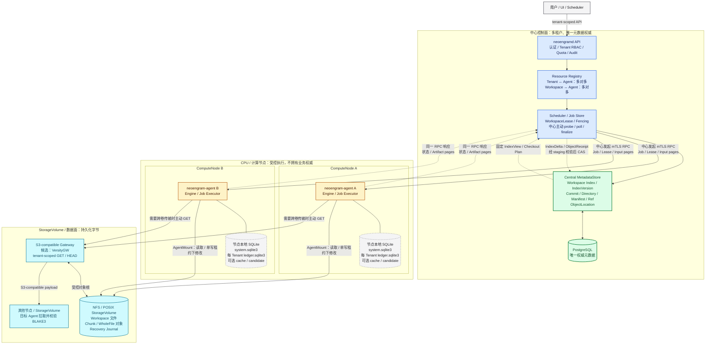

# 中心化多租户控制面与 Agent 架构（设计草案）

> 状态：设计讨论中，尚未实现。
>
> 最后更新：2026-07-23。
>
> 本文统一描述 `neoengramd`、`neoengram-agent`、多租户边界、CPU 计算节点、NFS 存储、
> 多 Agent Workspace、Agent 本地数据库和 S3-compatible Gateway 的目标架构。本文不改变
> 当前 format v7、CLI 或本地仓库行为，也不表示这些远程能力已经实现。

## 1. 结论摘要

目标系统采用以下模型：

- `neoengramd` 是多租户控制面，负责身份、授权、资源目录、调度、租约、最终 CAS 和审计；
- Agent 部署在 CPU/计算节点上，是受控执行器，不拥有 Repository、Workspace 或对象数据；
- 数据归属于 `StorageVolume`。第一类目标后端是挂载到 CPU 节点的 NFS，也可扩展本地 POSIX、
  S3 或其他受控后端；
- Tenant 与 Agent 是多对多关系，一个 Tenant 可跨多个 Agent，一个 Agent 只管理明确分配的
  `TenantAssignment`，绝不默认管理全部租户；
- Workspace 与 Agent 也是多对多关系。多个 Agent 可以同时读取和计算，但同一 Workspace 同一
  时刻最多一个写者；
- 托管模式的 Repository/Workspace 权威元数据全部由中心 PostgreSQL 管理，Agent 不维护可迁移的
  Repository SQLite，也不在 NFS 上保存 SQLite 数据库快照；
- Agent 基于中心 `IndexVersion` 产生结构化 IndexDelta/ObjectReceipt，中心通过 staging + CAS
  只发布一个候选；
- Agent 本地 SQLite 按职责拆分为 Agent system DB、每租户 Ledger、可选 Workspace cache 和每 Job
  candidate；这些数据库均位于 CPU 节点本地且不具备业务权威；
- NFS 文件锁只是进程内/文件系统的第二层保护。跨 Agent 写入必须使用中心租约、单调 fencing
  token，并在强隔离模式下由存储侧撤销过期写权限；
- Gateway 绑定 `StorageVolume`/ObjectStore，而不是天然绑定某个 Agent。多个 Agent 共享同一 NFS
  时，不应各自无协调地暴露同一对象目录；
- 控制面由中心主动调用 Agent，不需要 Agent heartbeat/callback；数据面由目标 Agent 直接访问
  NFS 或从源 Gateway 拉取，不经过中心 API 进程；
- 第一版禁止跨租户对象去重、硬链接、直接 Transfer 和隐式共享凭证。

一句话概括：

```text
中心负责“谁可以在什么 IndexVersion/Ref 上做什么”，
Agent 负责“在某个计算节点执行”，
StorageVolume 负责“数据实际在哪里”。
```

## 2. 设计原则与决策状态

| 主题 | 状态 | 当前结论 |
| --- | --- | --- |
| 控制调用方向 | 已确认 | 中心主动请求 Agent；Agent 不主动发送控制 callback/heartbeat |
| 资源归属 | 已确认 | 数据属于 Tenant/Repository/Workspace/StorageVolume，不属于 Agent |
| Agent 与 Tenant | 已确认 | 多对多；Agent 只管理明确 TenantAssignment |
| Workspace 与 Agent | 已确认 | 多对多；多读、多计算，单写、单发布 |
| 数据传输方向 | 已确认 | 目标 Agent 直接从源 Gateway 拉取，中心不代理 payload |
| 托管 MetadataStore | 已确认 | 中心 PostgreSQL 是 Repository/Workspace 元数据唯一权威；Agent 不直连数据库 |
| SQLite on NFS | 已确认 | 托管模式不在 NFS 打开或同步 SQLite；本地 CLI 的 SQLite 行为保持不变 |
| Workspace Index 权威 | 已确认 | 中心保存 Index 行/分页结构和 IndexVersion；Agent 只生成结构化 Delta |
| Commit/Ref 权威 | 目标决定 | 中心保存租户级已发布图并执行最终 Ref CAS |
| 租户隔离 | 已确认 | tenant-owned 资源全链路隔离，v1 只做租户内去重 |
| Workspace 写并发 | 已确认 | 同一 Workspace 最多一个有效写租约；独立写者使用不同 Workspace |
| Gateway 归属 | 已确认 | Gateway 绑定 StorageVolume/ObjectStore，可由专属服务或受控 Agent 管理 |
| NFS 强 fencing | 待原型 | 优先评估 NFSv4 身份/ACL、RW 挂载切换或存储代理强制 token |
| Agent 本地数据库 | 已确认 | system DB 每 Agent 一个、Ledger 每 Tenant 一个、cache 每 Workspace 可选、candidate 每 Job 可选 |
| 大型不可变元数据 | 待基准 | v1 优先 PostgreSQL；超出目标规模后可外置 Blob，但中心服务仍保持逻辑权威 |
| Agent 传输 | 初步决定 | 第一版中心驱动 HTTPS/gRPC 短 RPC，DTO 与传输实现解耦 |
| Gateway 产品 | 待验证 | 评估 VersityGW，同时保留受限对象 API 方案 |

“中心主动调用”只描述控制请求发起方。Agent 的 HTTP 响应、Job 查询结果，以及 Agent 到
NFS/Gateway 的数据请求仍然是双向网络流量。

## 3. 领域模型

### 3.1 租户与数据资源

```text
Tenant
├── Member / ServicePrincipal / RoleBinding
├── Project
│   └── Repository
│       ├── Ref / Commit / Directory / Manifest ownership
│       ├── RepositoryStorageBinding
│       ├── WorkspaceIndex / IndexVersion
│       ├── IndexUpdateSession / MetadataArtifact
│       └── Workspace
│           ├── WorkspaceAttachment[*]
│           ├── WorkspaceLease[*]（多共享读或单排他写）
│           └── StatusSnapshot[*]
├── Job / Artifact / AuditEvent
├── GatewayCredential / TransferTicket
└── Quota / Usage / RetentionPolicy
```

不变量：

- 每个 Repository 只属于一个 Tenant；Workspace、Job、Ref、对象位置和票据继承相同租户；
- Tenant 迁移是显式导出/导入流程，不能通过更新一列 `tenant_id` 完成；
- 用户或服务身份可以属于多个 Tenant，但一次普通请求只能选择一个已授权租户作用域；
- ID 是定位符，不是授权凭据。知道 Workspace ID、Commit ID 或 BLAKE3 Hash 不产生读取权限；
- 对其他租户资源的普通读取返回 `RESOURCE_NOT_FOUND`，不能泄漏其存在性。

### 3.2 计算与存储资源

```text
ComputeNode
└── AgentInstance[*]
    ├── TenantAssignment[*]
    ├── AgentMount[*] ───────────────┐
    └── WorkspaceAttachment[*]       │
                                     ▼
StorageVolume ───────────────▶ NFS export / POSIX root / future backend
├── Repository object roots
├── Workspace roots
└── recovery journals

GatewayInstance[*] ──────────▶ StorageVolume / ObjectStore
```

核心实体：

| 实体 | 作用 |
| --- | --- |
| `ComputeNode` | CPU 主机、VM 或 Kubernetes Node；只表示执行位置 |
| `AgentInstance` | 一个 Agent 进程身份、Endpoint、证书、版本和 capability |
| `TenantAssignment` | 允许某 Agent 承载某 Tenant 的任务和配额，不授予其他租户权限 |
| `StorageVolume` | 稳定存储身份；包含类型、服务端/export 标识、能力和租户边界 |
| `AgentMount` | Agent 对 StorageVolume 的一次挂载观测；包含本地映射和只读/可写能力 |
| `RepositoryStorageBinding` | Repository 的对象根位于哪个 StorageVolume |
| `Workspace` | Repository 下的逻辑工作区及其 StorageVolume/相对路径 |
| `WorkspaceAttachment` | 某 Agent 能否访问某 Workspace，以及观测到的挂载 generation |
| `WorkspaceIndex` | 中心 PostgreSQL 中的当前已暂存文件状态和 IndexVersion |
| `IndexUpdateSession` | Agent 产生、中心拉取、校验并原子发布 IndexDelta 的幂等会话 |
| `MetadataArtifact` | 大型候选 Delta/Manifest 的临时传输工件，不是权威 MetadataStore |
| `WorkspaceLease` | Workspace 共享读/排他写 holder、Job、fencing token、过期时间和状态 |
| `GatewayInstance` | 为一个或多个受控 StorageVolume 暴露对象 API 的服务实例 |

### 3.3 多对多关系

```text
Tenant A ──▶ Agent 1
         └─▶ Agent 2

Tenant B ──▶ Agent 2

Workspace X ──▶ Agent 1（read/write capable，当前无租约）
            └─▶ Agent 2（read-only）
            └─▶ Agent 3（当前 write lease holder）
```

`WorkspaceAttachment.access_mode = rw_capable` 只表示部署能力，不表示当前拥有写权。真正写权由
中心 `WorkspaceLease` 和 storage-side fencing 共同决定。

### 3.4 ID、路径和挂载身份

中心 API 只传稳定 ID，不传 `/mnt/...` 等物理路径。Agent 本地受控配置保存：

```text
AgentMount(
  agent_mount_id,
  storage_volume_id,
  local_mount_path,
  observed_source,
  observed_fsid,
  access_mode,
  mount_generation
)
```

Agent 根据 `agent_mount_id + repository/workspace relative_path` 解析本地路径，并通过 canonical
path、祖先、设备、inode、symlink 和 mount identity 校验拒绝路径逃逸。不同 CPU 节点可以把同一
NFS export 挂载到不同路径，不影响中心资源身份。

## 4. 总体架构

### 4.1 可视化架构图

交互式 HTML 版本见 [`agent-central-architecture.html`](agent-central-architecture.html)，可切换控制流/
数据流、缩放并点击节点查看职责和边界。



读图规则：

- 蓝色区域是中心控制职责；绿色节点是中心 PostgreSQL 权威元数据，只有中心能完成
  `IndexVersion`/Ref CAS；
- 黄色节点是 Agent 执行器。虚线返回中心的是中心发起 RPC 的响应，不是 Agent callback；
- 灰色 SQLite 只保存本地恢复账本、缓存和临时候选，节点丢失后可从中心重建；
- 青色区域保存真实 Workspace/Object 字节。Agent 直接访问 NFS/Gateway，payload 不经过
  `neoengramd`；
- 多个 Agent 可以共享读取同一 Workspace；修改 Workspace 时，中心只向一个 Agent 签发排他租约和
  fencing token。

一次典型 `add` 的关键闭环是：

```text
中心固定 IndexVersion 并下发 Job
  -> Agent 扫描 NFS、发布对象、生成 IndexDelta/ObjectReceipt
  -> 中心主动拉取 Artifact pages
  -> PostgreSQL staging 完整校验
  -> IndexVersion CAS
  -> 中心 finalize Agent
```

### 4.2 文本拓扑（渲染 fallback）

```text
用户 / UI / Scheduler
          │
          │ tenant-scoped API
          ▼
┌────────────────────────────────────────────┐
│ neoengramd                                 │
│ Auth / Tenant RBAC / RLS / Quota / Audit │
│ Resource Registry / Scheduler / Job Store │
│ Lease & Fencing / IndexVersion & Ref CAS  │
│ Commit Catalog / Ref CAS / Object Catalog │
└───────────────────┬────────────────────────┘
                    │ 中心发起 mTLS RPC
          ┌─────────┴──────────┐
          ▼                    ▼
┌───────────────────┐  ┌───────────────────┐
│ Agent on CPU A    │  │ Agent on CPU B    │
│ local Job Ledger  │  │ local Job Ledger  │
│ local cache/temp  │  │ local cache/temp  │
│ Engine / Executor │  │ Engine / Executor │
└─────────┬─────────┘  └─────────┬─────────┘
          │ AgentMount            │ AgentMount
          └───────────┬───────────┘
                      ▼
          ┌─────────────────────────────┐
          │ StorageVolume: NFS          │
          │ objects / workspaces        │
          │ recovery journal            │
          └──────────────┬──────────────┘
                         │
                         ▼
          ┌─────────────────────────────┐
          │ S3-compatible Gateway       │
          │ tenant-scoped GET / HEAD   │
          └─────────────────────────────┘
```

### 4.3 平面划分

| 平面 | 内容 | 权威/路径 |
| --- | --- | --- |
| 控制面 | Tenant、RBAC、Job、调度、Desired State | 中心 PostgreSQL；中心调用 Agent |
| 发布元数据面 | Workspace Index、Commit catalog、Ref、lease/fence | 中心 PostgreSQL CAS |
| 执行元数据面 | Agent Ledger/cache、IndexDelta/Receipt/Job Artifact | Agent 本地盘或临时 Artifact |
| POSIX 数据面 | NFS Workspace、Object 和 journal | Agent 通过 AgentMount 访问 |
| S3 数据面 | Chunk/WholeFile payload | 目标 Agent 从 Gateway 拉取 |
| 本地恢复面 | WAL、Job Ledger、临时文件 | 当前 Agent 本机；不作为跨节点权威 |

### 4.4 权威边界

| 状态 | 权威方 | 说明 |
| --- | --- | --- |
| Tenant、身份、RBAC、Quota | 中心 | PostgreSQL RLS + 服务层授权 |
| Agent/Node/Volume/Attachment registry | 中心 | Agent 上报 Actual State，中心保存 Desired State |
| Job 意图与最终结果 | 中心 | Agent Ledger 是执行恢复副本 |
| 当前 Workspace Index/IndexVersion | 中心 | PostgreSQL 行/分页结构，通过 expected-version CAS 发布 |
| 已发布 Commit/Ref | 中心 | Ref 只通过 expected-value CAS 更新 |
| Agent system/Tenant Ledger | Agent 本地恢复副本 | 不替代中心 Job/Assignment/Lease 权威 |
| Agent Workspace cache | 无全局权威 | 只缓存某 IndexVersion，可删除并从中心重建 |
| Agent Job candidate | 无全局权威 | 中心尚未接收的临时 Delta/Receipt/Artifact |
| Workspace 当前字节 | StorageVolume | 修改必须受 WorkspaceLease 和 journal 保护 |
| Object 字节 | StorageVolume/ObjectStore | 内容寻址，读取和发布均重新验证 BLAKE3 |
| Workspace 状态快照 | Agent 观测、中心缓存 | 必须携带 observed_at/mount_generation/completeness |

## 5. 中心系统 `neoengramd`

### 5.1 模块职责

建议先实现模块化单体：

```text
services/neoengramd/
├── api/             # 用户/API 与 Agent 调度入口
├── identity/        # OIDC/JWKS、Principal、Service identity
├── tenancy/         # Tenant/Project/Repository、RBAC、RLS context
├── registry/        # ComputeNode、Agent、StorageVolume、Mount、Attachment
├── scheduler/       # Job 选择 Agent、配额、公平队列、重试
├── jobs/            # 中心 Job 状态机、幂等、结果和工件目录
├── leases/          # Workspace/Object maintenance lease 与 fencing
├── metadata/        # Workspace Index、staging、Commit catalog、Ref CAS
├── transfer/        # ObjectLocation、Ticket、Transfer 协调
├── gateway/         # Gateway Desired State、凭证、drain
├── audit/           # append-only 安全和操作审计
└── observability/   # metrics、trace、SLO
```

中心负责：

- 认证主体并建立唯一 tenant context；
- 保存资源归属和多对多绑定，选择具有正确 mount/capability 的 Agent；
- 先持久化 Job，再向 Agent 提交，持续主动查询而不是等待 callback；
- 签发、续期和撤销租约，生成单调 fencing token；
- 主动分页拉取 Agent 产生的 IndexDelta、ObjectReceipt 和临时 MetadataArtifact；
- 把结构化候选导入 PostgreSQL staging，验证 expected IndexVersion、对象依赖和租户归属；
- 在一个 PostgreSQL 事务中发布 Workspace Index/IndexVersion，必要时执行 Ref CAS；
- 管理 ObjectLocation、TransferTicket、retention、lease/pin/hold 和 GC roots；
- 执行租户公平调度和资源配额；
- 保存审计和状态观测时间，不把网络超时解释为业务失败。

中心不能：

- 直接拼接或访问 Agent 的本地/NFS 物理路径；
- 通过 SSH 或 shell 执行用户字符串；
- 在 API 进程中代理大对象 payload；
- 直接打开 Agent 的 SQLite 文件；
- 在对象、引用图或结构化 metadata candidate 未验证前发布 Index/Ref；
- 向 Agent 下发任意 SQL，或允许 Agent 直接连接中心 PostgreSQL；
- 用 system scope 或 `BYPASSRLS` 处理普通租户请求；
- 因 Agent 失联自动把未确认 Job 当作失败并在另一节点重复写入。

### 5.2 调度条件

中心为 Job 选择 Agent 时至少检查：

```text
TenantAssignment matches
WorkspaceAttachment exists
Agent capability/version matches
AgentMount identity and generation match
StorageVolume health is acceptable
requested access <= attachment access
required IndexVersion is available from central MetadataStore
tenant/node concurrency quota has capacity
required Workspace/Object lease can be acquired
```

`Node healthy`、`Agent reachable`、`NFS mounted` 和 `Workspace status fresh` 是四个不同状态，不能
合并成一个绿色标记。

### 5.3 Desired/Actual State

持续配置使用 Desired State，具有开始/结束结果的动作使用 Job。Desired State 包括：

- Agent 允许的 TenantAssignment；
- 允许发现的 StorageVolume/AgentMount ID 和本地配置版本；
- WorkspaceAttachment 和最大 access mode；
- Gateway 实例、Endpoint policy、凭证版本和 drain；
- 节点/租户并发、带宽、临时空间和缓存配额；
- Agent drain、版本约束和证书 generation。

Actual State 由中心定期查询，至少包括 Agent 版本、挂载 fingerprint、读写模式、NFS 错误、磁盘
空间、本地缓存的 IndexVersion、运行 Job、Gateway 状态和最近一次 Workspace 观测。

## 6. Agent 系统 `neoengram-agent`

### 6.1 Agent 定位

Agent 是计算节点上的受控执行器。默认一个 ComputeNode 一个 AgentInstance；高隔离部署可以在同一
节点按 Tenant 启动多个 Agent/Worker。协议模型不假定 Agent 只能绑定一个租户，也不允许 Agent
自动枚举中心全部租户。

Agent 负责：

- 暴露仅供中心访问的 mTLS 管理 API；
- 校验 TenantAssignment、WorkspaceAttachment、AgentMount、IndexVersion、lease 和 capability；
- 在返回 `202 Accepted` 前把 Job 写入本地 Ledger；
- 调用结构化 NeoEngram Engine API，不解析 CLI stdout；
- 执行稳定扫描、切块、Hash、对象发布、checkout 和 journal recovery；
- 生成结构化 IndexDelta、ObjectReceipt 和可分页 MetadataArtifact，等待中心主动拉取；
- 保存 Job 进度、候选、错误和恢复状态，供中心重复查询；
- 主动访问已授权 NFS/Gateway 数据面，但不主动向中心发送控制 callback；
- 监测 mount、storage 和 Gateway Actual State。

Agent 不能：

- 接受任意 shell、绝对路径、环境变量或未注册 cwd；
- 在没有 tenant/repository/workspace 归属校验时执行请求；
- 把本地 cache、candidate 或 Ledger 当成中心已发布状态；
- 在 lease 过期、fence 不匹配或 mount identity 漂移后继续进入新的可变阶段；
- 信任 S3 ETag、NFS 文件名、中心声明或其他 Agent 声称的对象内容；
- 绕过 Local Engine 的 object/worktree/write lock 和持久 journal；
- 因本地存在相同 Hash 就授权另一个租户读取；
- 直接连接中心 PostgreSQL、接收任意 SQL 或自行决定中心 IndexVersion、Ref 和全局 Job 最终结果。

### 6.2 Agent 本地状态

建议布局：

```text
/var/lib/neoengram-agent/
├── system.sqlite3
├── tenants/<tenant-id>/
│   ├── ledger.sqlite3
│   ├── object-cache.sqlite3                 # 可选、可重建
│   ├── workspaces/<workspace-id>/cache.sqlite3  # 可选、可重建
│   └── jobs/<job-id>/candidate.sqlite3      # 可选、临时
└── runtime/
```

- `system.sqlite3` 只保存 Agent 身份、本地配置投影、Mount inventory 和进程恢复状态；
- 每个 Tenant 使用独立 `ledger.sqlite3` 保存本节点已接受 Job、幂等摘要、阶段和恢复线索，避免
  SQLite 缺少 RLS 导致的跨租户误读，并缩小损坏范围；
- Workspace `cache.sqlite3` 只缓存某个中心 IndexVersion、文件 fingerprint 和分页数据，可随时删除
  并从中心重建；它不是该 Workspace 的完整 MetadataStore；
- 大 Job 可使用独立 `candidate.sqlite3` 对 IndexDelta/Manifest 进行分页、排序和断点恢复。中心拉取并
  发布后按 TTL 删除，不能把它当作已发布 Index；
- 不采用“一个 Agent 内所有租户共用一个业务 SQLite”，也不采用“每个 Workspace 一套完整仓库
  SQLite”。前者隔离不足，后者会复制 Repository 历史并放大同步和恢复成本；
- 每个数据库都保存并在打开时验证
  `database_identity(schema_version, agent_id, tenant_id[, workspace_id/job_id])`；
- Bearer Token、S3 secret、完整 Signed URL 和 KMS key 不进入 Ledger；
- CPU 节点本地磁盘丢失时，新 Agent 从中心 PostgreSQL 重建 Index/cache；无法凭空证明旧 Job 对 NFS
  的中间副作用，仍必须结合 Workspace journal 进入 RecoverJob；
- 本地数据库可以删除或重建，不能成为 Ref、lease、IndexVersion 或已发布 Commit 的唯一记录。

### 6.3 Agent 内部结构

```text
crates/neoengram-agent/src/
├── api/              # 中心驱动 RPC adapter
├── authz/            # tenant/resource/lease/fence 校验
├── registry/         # Assignment、Attachment、Mount 本地投影
├── jobs/             # 状态机、scheduler、executor、finalize
├── ledger/           # 本地 Job Ledger 与幂等恢复
├── metadata/         # Index cache、Delta/Receipt、Artifact 分页与校验
├── storage/          # NFS/POSIX mount identity、capability、health
├── workspaces/       # Engine 调用、journal、锁和恢复
├── transfer/         # 缺块、Gateway 下载、Hash、续传
├── gateway/          # 可选 Gateway controller/health adapter
└── observability/    # metrics、trace 和审计上下文
```

CLI 和 Agent 最终共用同一个结构化 Engine：

```text
CLI ──────┐
          ├──▶ NeoEngram Engine ──▶ Repository / Workspace / ObjectStore
Agent ────┘
```

过渡期如必须启动 CLI 子进程，只能使用固定 argv、固定可执行文件、受控 cwd/环境/超时/输出上限，
禁止经过 shell，并且 stdout 文本不能成为稳定协议。

## 7. StorageVolume 与 NFS

### 7.1 StorageVolume 抽象

`StorageVolume` 是中心资源，不等于某个 `/mnt` 路径。NFS 类型至少记录：

```text
storage_volume_id
tenant_scope
backend_type = nfs
server/export identity（凭证不进入普通 DTO）
expected_fsid / mount generation
capability profile
object root policy
workspace root policy
managed metadata policy = central-only
```

同一 StorageVolume 可以挂载到多个 CPU 节点。每个 Agent 通过独立 `AgentMount` 报告本地路径、
实际 source、fsid、挂载参数摘要、读写模式、空间和最近健康时间。

### 7.2 NFS 支持基线

第一版优先认证 NFSv4.1/4.2，不把“能 mount”视为“满足 NeoEngram 语义”。上线前必须对具体服务端、
客户端内核和挂载策略验证：

- 文件创建、`O_EXCL`/no-replace、rename 和目录 rename 的跨客户端可见性；
- file `fsync`、directory `fsync`、服务端 stable storage 和断电后的持久性；
- hardlink、chmod、inode/fsid、root squash、NFSv4 ACL/Kerberos principal；
- advisory shared/exclusive lock 的跨客户端行为；
- attribute/data cache、close-to-open、一致性窗口和 stale file handle；
- 大目录、百万对象、并发 GET/PUT、NFS server failover 和容量耗尽；
- hard mount 下存储故障造成的阻塞，以及 Agent worker 隔离能力。

不允许使用会绕过锁的 `nolock` 配置。数据完整性场景不应为了快速报错盲目使用可能产生不完整 I/O
语义的 soft mount；最终挂载参数需要按 NFS 产品形成认证矩阵，而不是由中心 Job 任意下发。

### 7.3 锁与 NFS 的边界

当前本地实现使用 `fs2` advisory lock，并要求固定顺序：

```text
objects.lock -> Workspace worktree.lock -> write.lock
```

这些锁继续保留，用于同一 Repository 内部进程协调，但不能单独承担跨 Agent/跨主机权威。原因是
NFS 锁语义、租约恢复和网络分区依赖具体实现，而且永久 RW 凭证不能阻止过期 Agent 写入。

分布式层增加：

```text
WorkspaceIndex CAS      # expected IndexVersion 发布
Ref CAS                 # expected Commit 发布
WorkspaceLease          # status/add 共享读，checkout/restore/rm 排他写
ObjectMaintenanceLease  # GC/破坏性维护
Storage-side fence      # 强隔离部署阻止过期 Agent 写 NFS
```

### 7.4 NFS 上允许和禁止的内容

| 内容 | 是否放 NFS | 规则 |
| --- | --- | --- |
| Chunk/WholeFile Object | 是 | 不可变、Hash 验证、no-replace 发布 |
| Workspace 文件 | 是 | 多读；可变操作需要单写租约和 journal |
| checkout/rm journal | 是 | 与 Workspace 同卷，支持新 Agent 恢复 |
| 托管 Repository/Workspace SQLite | 否 | 权威元数据在中心 PostgreSQL，本地 cache 不同步到 NFS |
| Agent SQLite WAL/SHM | 否 | 只放当前 Agent 本地盘 |
| Agent Job Ledger | 否 | 属于 AgentInstance，本地恢复使用 |
| Gateway 临时状态/secret | 否 | 独立受控目录/Secret Manager |

## 8. 多租户隔离

### 8.1 控制面隔离

所有 tenant-owned PostgreSQL 表包含 `tenant_id NOT NULL`，子资源使用带 `tenant_id` 的复合外键。
普通请求事务使用 `SET LOCAL` 设置认证得到的租户上下文并启用 RLS，连接池不能遗留上一个租户的
session 状态。运行角色不得拥有 `BYPASSRLS`。

- 缓存键、幂等键、分页 cursor、唯一约束、搜索索引、Artifact 和 ObjectLocation 都包含租户；
- 后台 scheduler/reconcile/GC/backup 每次在显式租户作用域运行；
- system scope 使用独立端点、角色和审计，不能模拟普通租户请求绕过 RLS；
- RBAC 至少区分 TenantAdmin、ProjectAdmin、RepositoryReader/Writer/Maintainer 和 ServicePrincipal；
- Tenant A 的列表、数量、错误、用量和审计不能包含 Tenant B 信息。

### 8.2 存储隔离

第一版采用：

- 每租户独立 NFS export，或经过验证的独立根目录 + NFSv4 ACL/principal；
- 每租户独立 Gateway Bucket、凭证和本地映射根；
- 不跨租户共享 Loose Object、Pack、hardlink、reflink、cache entry、retention 或计费；
- 相同 BLAKE3 Hash 在不同租户分别存储和授权；
- WholeFile hardlink export 只能在同 Tenant、Repository、StorageVolume 和受管目标根内使用；
- 每租户独立并发、带宽、临时空间、存储和 Gateway 限额。

一个共享 Agent 进程被攻破后可能访问其进程凭证能访问的全部挂载。需要抵御恶意租户、满足强合规
或建立独立密钥边界时，应使用每租户 Unix 用户/Worker、容器、VM 或专属节点。应用层 `tenant_id`
校验不能替代操作系统和存储侧隔离。

### 8.3 跨租户操作

普通 `TransferJob` 只允许源和目标属于同一 Tenant。未来如需要租户间复制，必须设计独立
`CrossTenantCopy`：同时验证源导出和目标导入权限，固定 DatasetSnapshot，在目标租户重新验证并发布独立
对象副本。它不能修改原对象归属、复用源凭证或共享 inode。

### 8.4 Tenant 生命周期

```text
active -> suspended -> deleting -> deleted
```

- `suspended` 拒绝新写 Job、租约和票据，可按策略保留受控只读导出；
- `deleting` 撤销凭证、停止调度、等待安全点、建立包含中心/NFS/Gateway/备份的删除清单；
- 删除按 retention/legal hold 执行，不能运行缺少租户过滤的全局删除；
- 审计按合规期限保留，但与 payload、访问凭证和可恢复 DatasetSnapshot 分离；
- 中心、Agent/Gateway registry 和存储清单完成对账后才能进入 `deleted`。

## 9. Workspace 多 Agent 并发模型

### 9.1 基本规则

一个 Workspace 可以绑定多个 Agent，但不能让多个 Agent 独立推进同一个可变状态：

| 操作 | 多 Agent 行为 | 中心协调 |
| --- | --- | --- |
| health/capability | 并发 | 无 Workspace lease |
| 固定 Commit 的 show/mount/export-copy | 并发 | 固定 Commit + 对象 retention lease |
| Workspace status/diff | 并发观测 | 共享读租约 + 固定 IndexVersion，结果标记时间和完整性 |
| 扫描、Hash、切块 | 可作为一个父 Job 的并行 Worker | 共享读租约；Coordinator 合并，不允许 Worker 发布 Index |
| Object no-replace 发布 | 可并发 | ObjectMaintenanceLease 阻止 GC 竞态 |
| add 的 Index 发布 | 单发布者 | expected IndexVersion CAS |
| Commit | 中心单发布者 | 固定 IndexVersion + expected Ref CAS |
| checkout/restore/rm/recover | 单写者 | WorkspaceLease + fence + journal |
| fsck | 可读并发或受控维护 | 扫描 scope、IndexVersion/Commit 固定 |
| gc | 单维护者 | Repository/ObjectMaintenanceLease |

多个用户需要独立修改同一份数据时，应创建不同 Workspace。一个实时 Workspace 上的“多个 Agent”
主要用于并行读取、计算、调度选择和故障接管，不表示支持无冲突的多主写文件系统。

进入中心管理模式后，禁止用户在共享 NFS 上直接运行会修改 NeoEngram Index/HEAD/ObjectStore 的
本地 CLI 命令，否则会绕过 IndexVersion、lease 和 fence。CLI 如需远程操作，应调用中心 API。
是否允许业务进程直接修改普通 Workspace 文件由 Workspace policy 决定；允许时 add 仍必须通过
稳定输入和文件身份复核处理并发外部写入。

### 9.2 WorkspaceLease 与 fencing

中心为访问实时 Workspace 的操作创建共享读或排他写租约。多个共享读租约可以共存，排他写租约
必须等待全部共享读租约结束并阻止新读租约：

```text
WorkspaceLease(
  lease_id,
  tenant_id,
  workspace_id,
  holder_agent_id,
  holder_job_id,
  mode,
  fencing_token,
  issued_at,
  expires_at,
  state
)
```

排他写租约的 `fencing_token` 在 Workspace 内单调递增；共享读租约记录创建时观测到的 writer
epoch。Agent 在接收、开始、进入不可逆发布前和恢复时校验 Workspace、Agent、Job、mode、token
和到期时间。中心通过主动续租 RPC 延长执行窗口；中心不可用且租约不能续期时，Agent 在安全点
停止，不能自己延长。

仅靠 token 不能阻止持有永久 RW NFS 凭证的失联进程。因此隔离等级分为：

| 等级 | 防护 | 适用范围 |
| --- | --- | --- |
| Cooperative | 中心租约 + Agent 校验 + NFS/Local Engine 文件锁 | 全部 Agent 受信的内部环境 |
| Enforced | Cooperative + 每 Agent NFS principal/ACL、RW mount 切换或存储代理检查 fence | 多租户生产环境 |
| Dedicated | 每租户/Workspace 独立 Worker、凭证、容器/VM/节点和 export | 强合规、恶意租户模型 |

第一版必须明确部署属于哪一等级，不能把 Cooperative 描述成能抵御失陷 Agent 的强 fencing。

### 9.3 并行 Add

多个 Agent 可以加速一次逻辑 Add，但必须由中心创建一个父 Job：

```text
AddCoordinator(expected_index_version)
  ├── ScanWorker Agent A: paths [a..f]
  ├── ScanWorker Agent B: paths [g..m]
  └── ScanWorker Agent C: paths [n..z]
             │
             ▼
  immutable objects + path-scoped Index delta
             │
             ▼
Coordinator 验证路径不重叠、输入身份和 expected IndexVersion
             │
             ▼
生成一个合并后的 IndexDelta + ObjectReceipt Artifact
             │
             ▼
中心导入 staging 并执行一次 IndexVersion CAS
```

Worker 不能各自更新 Index。外部进程在扫描期间修改 NFS Workspace 时，Worker 必须使用稳定输入
快照/复制和文件身份复核；无法证明稳定的路径返回 `WORKTREE_CHANGED_DURING_SCAN`。

## 10. 中心权威元数据与 Agent 本地数据库

### 10.1 Standalone 与 Managed 是两种运行模式

当前 format v7 的本地 CLI 继续使用 Repository 内的 SQLite MetadataStore；托管 Agent 模式使用中心
PostgreSQL，二者复用规范对象模型和 Engine 业务规则，但不共享数据库文件：

```text
Standalone CLI -> Repository format v7 SQLite MetadataStore
Managed Agent  -> neoengramd CentralMetadataStore -> PostgreSQL
```

- Standalone 适合单机/单管理域，SQLite、WAL、锁和 `.neoengram` 目录行为保持兼容；
- Managed 适合多租户、多 Agent 和 NFS 数据卷，中心 PostgreSQL 是唯一权威 MetadataStore；
- Agent 不在 NFS 打开 Repository SQLite，不上传或下载 SQLite 数据库快照，也不把本地数据库同步给
  其他 Agent；
- 不能把 Managed 简化为把 `.neoengram/metadata` symlink 到本地盘。Engine 必须接收结构化
  `RepositoryContext`、MetadataStore/ObjectStore handle 和逻辑 Workspace 身份；
- 从 Standalone 纳管到 Managed、或反向导出，是显式 import/export 流程，不是两个 MetadataStore
  的双向复制。

### 10.2 中心 PostgreSQL 的权威范围

中心至少权威保存：

| 数据 | 关键并发/完整性规则 |
| --- | --- |
| Tenant、Principal、RBAC、Quota | RLS、复合 tenant 外键、独立 system scope |
| Repository、Workspace、StorageBinding | 稳定逻辑 ID，不保存 Agent 本地绝对路径 |
| Workspace Index 与 `IndexVersion` | 行或分页结构；通过 expected-version CAS 发布 |
| IndexUpdateSession、staging rows | 绑定 Job、Tenant、Workspace、base IndexVersion 和完整 digest |
| Commit、Directory、Manifest、Ref | 规范内容 ID；完整引用图验证；Ref expected-value CAS |
| ObjectReceipt、ObjectLocation | 记录 Tenant、Repository、Volume、ObjectSpec、验证结果和时间 |
| Job、Lease、fencing、AuditEvent | 中心意图和最终结果权威，Agent Ledger 只用于本地恢复 |

Index 发布使用 staging table，而不是逐条边验证边改 current 表：中心先完整拉取并导入候选，校验页数、
记录数、路径唯一性、对象引用、配额和 digest，再在一个 PostgreSQL 事务中：

```text
verify expected IndexVersion
apply staged IndexDelta
advance Workspace IndexVersion
record ObjectReceipt/ObjectLocation
update Job publish result
append AuditEvent
```

Commit 发布也在中心事务内完成 immutable catalog insert 和 Ref CAS。IndexVersion 与 Ref 是不同并发
轴：`add` 可以只推进 IndexVersion，`commit` 固定一个 IndexVersion 并推进 Ref；实现不能用单个模糊
的全局 metadata 序号同时代替二者。

### 10.3 Agent 本地数据库如何拆分

推荐布局：

```text
/var/lib/neoengram-agent/
├── system.sqlite3
└── tenants/<tenant-id>/
    ├── ledger.sqlite3
    ├── object-cache.sqlite3                     # 可选
    ├── workspaces/<workspace-id>/cache.sqlite3  # 可选
    └── jobs/<job-id>/candidate.sqlite3          # 可选
```

| 数据库 | 生命周期 | 内容 | 是否权威 |
| --- | --- | --- | --- |
| `system.sqlite3` | AgentInstance | Agent identity、配置版本、Mount inventory、worker 状态 | 否 |
| Tenant `ledger.sqlite3` | TenantAssignment | 本节点 Job、request digest、阶段、恢复线索、Artifact 索引 | 否 |
| Workspace `cache.sqlite3` | 可删除 | 某 IndexVersion 的分页缓存、fingerprint、扫描加速数据 | 否 |
| Job `candidate.sqlite3` | 短期/TTL | 大型 Delta/Manifest 的排序、分页、digest 和断点恢复 | 否 |

采用每租户 Ledger，是因为 SQLite 没有 RLS；物理分库能降低代码漏过滤造成的越权概率，也缩小单库
损坏范围。Workspace cache 和 Job candidate 根据规模按需创建，避免每个 Workspace 都复制完整
Repository 历史。严格隔离部署再配合每租户 Worker、Unix user、目录权限和独立 NFS 凭证。

所有本地数据库打开时必须验证 `database_identity`，至少包含 schema version、Agent ID 和 Tenant ID；
Workspace/Job 库再包含对应资源 ID。把数据库文件移动到另一个租户目录不能改变其身份。

### 10.4 中心主动拉取与发布

```text
1. Central 创建 Job(expected_index_version = V)，取得需要的 WorkspaceLease
2. Central 通过 Job input 分页向 Agent 投递 V；Agent 也可命中经验证的本地 cache
3. Agent 扫描/切块，向 StorageVolume 发布不可变对象并复算 size + BLAKE3
4. Agent 在内存或 candidate DB 生成 IndexDelta + ObjectReceipt Artifact
5. Agent 将 Job 标记 prepared，返回 Artifact 描述符、总页数、记录数和整体 digest
6. Central 主动从 Agent 分页拉取 Artifact，逐页校验 schema、顺序、页 digest 和租户作用域
7. Central bulk load 到 PostgreSQL staging，验证路径、对象依赖、配额和 base IndexVersion
8. Central 事务化 CAS(V -> V+1)；冲突候选不发布
9. Central 幂等调用 finalize；Agent 更新 cache 并按 TTL 清理 candidate
```

Artifact 是受限结构化协议，不是数据库文件。每页至少绑定 tenant、repository、workspace、job、
artifact ID、base IndexVersion、page number 和 digest；中心限制记录数、字段长度、总字节和协议版本。
`ObjectReceipt` 证明某 Agent 在某 StorageVolume 发布并验证过 ObjectSpec，但不是永久可信声明；后续
checkout/export/fsck 仍按完整性策略重新验证对象。

控制方向仍是中心发起：Agent 只在 Job 查询和 Artifact 分页响应中返回结果，不需要 callback。实现
可以使用短 HTTPS/gRPC，也可以以后增加 poll transport；Command/Result/Artifact 契约不依赖连接
方向。

### 10.5 信任边界

- Agent 永远不获得 PostgreSQL 连接串，不直接执行中心事务；
- 中心不接收 Agent 提供的 SQL、SQLite 文件、表名或任意查询表达式；
- DTO 只包含稳定资源 ID、规范 metadata record 和受限分页 cursor，不包含物理 NFS 路径；
- 中心按认证的 AgentInstance、TenantAssignment、WorkspaceAttachment、Job 和 lease 交叉验证每个
  Artifact，不能只相信 payload 内的 tenant ID；
- 内容 ID、引用图、对象归属和 CAS 条件由中心的共享 canonical core 重新计算/校验；
- Agent 本地 cache 命中只能减少传输，不能绕过 expected IndexVersion 或对象完整性检查。

### 10.6 大规模元数据策略

v1 优先把 Workspace Index 和 immutable Commit graph 放入 PostgreSQL，并使用 partition、`COPY`/
bulk load、keyset pagination、staging 和合理的索引控制写放大。不能因为单个 Job 很大就退回传输完整
SQLite 文件。

如果基准证明超大 Manifest/Directory 放在关系库不经济，后续可将规范序列化后的不可变 metadata
blob 放入受控 ObjectStore，PostgreSQL 保存 tenant-scoped ID、Hash、size、位置和引用；中心服务仍是
逻辑权威并负责授权、引用验证和 Ref CAS。Workspace 当前 Index、Job、lease 和 fencing 不外置为
最终一致对象。

### 10.7 WAL、恢复与多 Agent 接管

本地 format v7 和 Agent 各自的本机 SQLite 可以使用 WAL；WAL/SHM 必须留在当前 CPU 节点本地盘。
多个 Agent 绝不能同时打开 NFS 上同一个 SQLite。把 `journal_mode` 改成 DELETE 也不会把 SQLite
变成生产级分布式数据库，因为 NFS 锁、缓存和故障恢复语义仍取决于具体实现。

- 同节点 Agent 重启：各本地 SQLite 通过 WAL 恢复，Tenant Ledger 驱动 Job 进入 recovering；
- CPU 节点永久丢失：新 Agent 从中心按页重建 Index cache，不需要从 NFS 恢复元数据库文件；
- Artifact 尚未被中心完整拉取就丢失：Job 保持未发布，中心重试原 Job，或显式重建候选；
- 中心已导入 staging 但 CAS 冲突：删除/TTL 清理 staging 与 Agent candidate，不改变 current Index；
- 中心 CAS 成功但 finalize 响应丢失：中心状态权威，重复 finalize 只更新本地 cache/清理状态；
- NFS Workspace 存在 journal：新 Agent 获得更高 fence 后先执行 RecoverJob，再接受新的可变 Job。

## 11. 中心驱动 Agent 协议

### 11.1 API 草案

```text
GET  /v1/health
GET  /v1/capabilities
GET  /v1/node/status
GET  /v1/node/storage-mounts
PUT  /v1/node/desired-state

GET  /v1/tenants/{tenant_id}/workspaces
GET  /v1/tenants/{tenant_id}/workspaces/{workspace_id}/status-snapshot

POST /v1/tenants/{tenant_id}/jobs
GET  /v1/tenants/{tenant_id}/jobs/{job_id}
POST /v1/tenants/{tenant_id}/jobs/{job_id}/cancel
POST /v1/tenants/{tenant_id}/jobs/{job_id}/renew-lease
POST /v1/tenants/{tenant_id}/jobs/{job_id}/finalize
PUT  /v1/tenants/{tenant_id}/jobs/{job_id}/inputs/{input_id}/pages
GET  /v1/tenants/{tenant_id}/jobs/{job_id}/artifacts
GET  /v1/tenants/{tenant_id}/jobs/{job_id}/artifacts/{artifact_id}/pages

GET  /v1/tenants/{tenant_id}/gateways
```

`/v1/node/*` 只接受平台 system scope。租户 API 只返回单一 TenantAssignment 下的数据。路径只是
定位信息，Agent 仍需用受保护 Envelope 与本地 registry 交叉验证归属。

大型输入由中心使用幂等 `PUT .../inputs/.../pages` 主动投递，Agent 用 page number/digest 去重；大型
输出由中心主动读取 Artifact pages。两种情况都是中心建立连接，Agent 不需要反向调用中心 API。

### 11.2 请求 Envelope

```json
{
  "protocol_version": 1,
  "request_id": "req-...",
  "trace_id": "trace-...",
  "job_id": "job-...",
  "tenant_id": "tenant-...",
  "repository_id": "repo-...",
  "workspace_id": "workspace-...",
  "agent_mount_id": "mount-...",
  "principal": {
    "type": "service",
    "id": "scheduler"
  },
  "expected_index_version": "index-42",
  "expected_head": "commit-...",
  "lease": {
    "lease_id": "lease-...",
    "fencing_token": 107,
    "expires_at": "2026-07-23T12:00:00Z"
  },
  "deadline": "2026-07-23T12:05:00Z",
  "operation": {
    "type": "add",
    "paths": ["models"],
    "all": true
  }
}
```

不访问实时 Workspace 的操作可以省略 `lease`；`status/diff/add` 使用共享读租约，
`checkout/restore/rm/recover` 使用排他写租约。请求 digest 必须包含 tenant、资源 ID、IndexVersion、
lease/fence、operation 和安全相关选项，不能只对 operation body 做 Hash。

### 11.3 响应 Envelope

```json
{
  "protocol_version": 1,
  "request_id": "req-...",
  "job_id": "job-...",
  "tenant_id": "tenant-...",
  "state": "prepared",
  "base_index_version": "index-42",
  "artifacts": [
    {
      "artifact_id": "artifact-...",
      "kind": "index_delta",
      "schema_version": 1,
      "pages": 16,
      "records": 250000,
      "size": 10485760,
      "blake3": "..."
    }
  ],
  "progress": {
    "phase": "awaiting_center_publish",
    "files_completed": 42,
    "bytes_completed": 1073741824
  },
  "observed_at": "2026-07-23T11:59:00Z",
  "retry_after_ms": 5000
}
```

稳定错误码至少包括：

```text
TENANT_SCOPE_MISMATCH
TENANT_QUOTA_EXCEEDED
AGENT_ASSIGNMENT_MISSING
MOUNT_IDENTITY_MISMATCH
STORAGE_UNAVAILABLE
WORKSPACE_LEASE_REQUIRED
WORKSPACE_LEASE_EXPIRED
FENCING_TOKEN_STALE
INDEX_VERSION_CONFLICT
HEAD_CONFLICT
ARTIFACT_INCOMPLETE
ARTIFACT_DIGEST_MISMATCH
WORKTREE_CHANGED_DURING_SCAN
RECOVERY_REQUIRED
OBJECT_CORRUPT
GATEWAY_UNAVAILABLE
PROTOCOL_UNSUPPORTED
```

对普通租户调用者，跨租户资源查询统一映射为 `RESOURCE_NOT_FOUND`；详细 scope mismatch 只进入
平台安全审计。

### 11.4 Job 状态机

```text
received
   │ Agent 已持久化，返回 202
   ▼
accepted -> running ────────────────> succeeded             # 只读 Job
                │
                └─> prepared -> awaiting_center_publish
                                      │
                     Central CAS 冲突 ├─> conflicted
                     Central CAS 成功 └─> finalizing -> succeeded

任何未发布阶段：execution error -> failed
安全取消点：cancel intent -> cancelled
Agent 重启：received/accepted/running/prepared/finalizing -> recovering -> 稳定状态
```

`prepared` 表示候选已持久化，`awaiting_center_publish` 表示 Agent 等待中心接受或拒绝该候选；二者
都不是成功。中心不能把它们显示为已发布，也不能在 CAS 后因为 finalize 响应丢失而再次发布候选。

### 11.5 幂等与重试

中心先在 PostgreSQL 持久化 Job，再提交 Agent；Agent 先在 Ledger 持久化，再返回 `202`。

- `(tenant_id, job_id)` 相同且 Request digest 相同：返回原状态/结果；
- Job ID 相同而 digest 不同：`JOB_ID_REUSED`；
- 中心请求超时：查询同一 Job，不能生成新 Job 猜测重试；
- Agent 状态丢失但副作用可能存在：进入 recovering，由 journal、ObjectReceipt、Artifact 和中心 CAS
  对账；
- At-least-once 网络重试通过内容 ID、IndexVersion、expected HEAD 和 fence 实现业务幂等；
- finalize、cancel、renew-lease 都必须幂等，并检查当前 Job 状态。

## 12. 关键操作流程

### 12.1 状态查询

中心主动查询 Agent，不要求 Agent heartbeat/callback。状态分层：

```text
ComputeNode health
Agent process/capability
AgentMount / StorageVolume health
Workspace attachment/recovery state
Workspace status snapshot freshness
Gateway health
```

Workspace 状态结果包含：

```text
observed_at
agent_id
agent_mount_id / mount_generation
observed_index_version / head
scan_duration
completeness
stale_reason / error
```

`status`、`diff`、fsck 和 inventory 可能昂贵，使用 Job。中心 UI 默认显示缓存快照及观测时间，不能
在每次页面请求同步扫描 NFS 大型工作区。扫描实时 Workspace 时中心分配共享读租约，避免与受控
checkout/restore/rm 并发；固定 Commit metadata 读取不需要 WorkspaceLease。

### 12.2 Add

```text
1. Central 读取 current IndexVersion，选择可读 WorkspaceAttachment
2. Central 获取共享 Workspace 读租约，创建 AddJob(expected IndexVersion)
3. Agent 校验 Tenant/Repository/Workspace/Mount、read lease 和 recovery state
4. Agent 对 NFS 输入建立稳定副本，流式切块并发布不可变对象
5. Agent 生成 IndexDelta/ObjectReceipt Artifact，Job -> prepared
6. Central 主动分页拉取 Artifact，验证 digest、对象依赖、配额和 base IndexVersion
7. Central bulk load staging 并 CAS IndexVersion
8. Central finalize Agent 并释放读租约；冲突 Artifact 不影响 current Index
```

固定 chunking Repository 拒绝 Job 覆盖策略；mixed Repository 的逐文件策略必须进入 digest、结果和
审计。Add 不修改 Workspace 文件，但会修改对象和 Index，因此不能让多个独立 Add 无条件成功。

### 12.3 Commit

```text
1. Central 固定 current IndexVersion 和 expected Ref HEAD
2. 中心的 canonical core 从权威 Workspace Index 构建 Manifest/Directory/Commit
3. Central 验证 ObjectLocation/ObjectReceipt；必要时主动要求 Agent 重新校验缺失或可疑对象
4. Central 重新计算内容 ID并验证完整引用图、tenant ownership 和配额
5. Central 在一个 PostgreSQL 事务中插入 immutable catalog 并执行 expected Ref CAS
6. Central 记录 Workspace base/head 投影、Job 结果和 AuditEvent
```

Commit 优先做成中心原生操作，因为所需 Index 与 metadata graph 已由中心权威保存。Agent 只补充
对象位置/完整性证明，不生成权威 SQLite。Ref CAS 失败时，已插入的内容寻址 metadata 可以保留为
不可达数据等待 GC，但不能覆盖中心 Ref。中心与本地 CLI 必须复用同一规范序列化和 ID 计算 core。

### 12.4 Checkout、Restore、Rm 与 Recover

```text
1. Central 获取 WorkspaceLease，分配新的 fencing token
2. 强隔离部署把 Workspace RW 权限切换给 holder Agent
3. Central 固定目标 Commit 和 expected IndexVersion，生成分页 Checkout/Mutation Plan
4. Agent 校验 Mount/fence/Plan，并在 NFS Workspace 发布持久 journal
5. Agent 重新验证对象，执行 worktree mutation，fsync 文件、目录和 journal
6. Agent 返回 WorktreeReceipt；Central CAS IndexVersion 并更新 Workspace base/head
7. Central 调用 finalize；Agent 完成/清理 journal，Central 释放 lease
```

如果文件已改变而中心 CAS/确认失败，不能把中心旧 Index 当作事实。Agent 必须根据 journal 回滚，或
由 RecoverJob 扫描并完成到一个中心可确认的 IndexVersion；无法证明安全时保持
`RECOVERY_REQUIRED`，不调度其他写任务。

### 12.5 多 Agent 故障接管

```text
1. Central 判定旧 Agent unreachable，但不立即重放 Job
2. 停止续租，等待/执行 storage-side fence，签发更高 fencing token
3. 选择能挂载同一 StorageVolume 的新 Agent
4. 新 Agent 验证 mount identity，从中心按页重建 current IndexVersion cache
5. 新 Agent 检查 NFS Workspace journal、worktree 和 object 状态
6. Central 创建 RecoverJob，而不是复用未知副作用的普通 Job
7. 恢复完成并对账后，才允许新的可变操作
```

### 12.6 Workspace/Repository 跨 StorageVolume 传输

传输单位是固定 Commit 或带 TTL 的临时不可变 DatasetSnapshot，不复制正在变化的 Workspace：

```text
1. Central 固定源 Commit/DatasetSnapshot，验证 source/destination 属于同一 Tenant
2. 比较 RepositoryStorageBinding/StorageVolume identity
3. 若目标已访问同一 ObjectStore，跳过 payload 复制，只验证依赖和执行 checkout
4. 否则创建目标 TransferJob 和源 ObjectLocation lease
5. 目标 Agent 取得 Manifest/Object 清单并计算本租户缺失对象
6. Central 签发绑定 Tenant/source/destination/object/method/size/TTL 的 Ticket
7. 目标 Agent 从源 Gateway GET 到目标租户临时根
8. 每个对象复算 size + BLAKE3，no-replace 发布
9. 所有依赖验证后，目标 Workspace 通过独占 lease 事务化 checkout
10. Central 保存结果并释放 transfer/Object lease
```

普通 Transfer 不允许跨租户。源损坏、票据过期、目标空间不足或 NFS/Gateway 故障时，保留已验证
对象和可恢复进度，但绝不发布半成品 Workspace。

## 13. Gateway 与对象数据面

### 13.1 归属与部署

Gateway 绑定 StorageVolume/ObjectStore：

```text
GatewayInstance
├── storage_volume_id / object roots
├── tenant bucket mappings
├── endpoint / certificate / credential generation
├── controller_agent_id（可选）
├── active transfer leases
└── desired/actual state
```

可选部署：

```text
模式 A：专属 Gateway 节点挂载 NFS（推荐共享卷）
模式 B：Storage 节点 sidecar
模式 C：选定一个 Agent 作为 controller/host
模式 D：HA Gateway 组，共享只读 Object roots
```

多个 Agent 共享同一 NFS 时，不能每个 Agent 都用同一永久凭证启动无协调 Gateway。Gateway 生命周期
由中心 Desired State 管理；如由 Agent 托管，中心只选一个 controller 或一个明确 HA 组。

### 13.2 对象模型

```text
s3://<tenant-bucket>/tenants/<tenant-storage-id>/repositories/<repository-id>/objects/blake3/ab/cd/<hash>
```

- 第一版每租户独立 Bucket/凭证/本地根，Key 仍保留服务端生成的 tenant/repository 前缀；
- 默认只开放明确 Object ID 的 `HEAD/GET`，不以 `ListObjects` 作为缺块协议；
- Ticket 不允许 delete、任意 prefix、任意 list 或凭证交换；
- 接收方不信任 ETag，始终复算 BLAKE3；
- 禁止暴露 Workspace、SQLite、WAL/SHM、locks、journal、Agent cache 和 secret；
- active TransferJob 建立 retention lease，Gateway drain/GC 必须尊重；
- WholeFile 从 S3 获取后先成为目标租户的已验证 Loose Object，才能考虑 hardlink export。

### 13.3 VersityGW 验证项

VersityGW 是候选而非既定依赖。原型必须验证：

- 已有 NFS/POSIX 文件的对象可见性、metadata/xattr 和权限映射；
- Bucket/IAM、管理 API、缓存和错误是否可靠隔离租户；
- Range GET、HEAD、并发 GET、multipart 和客户端兼容性；
- 百万对象、Hash fanout、冷/热缓存、NFS 双跳的吞吐和 p95/p99；
- 多实例、NFS failover、部分响应、重试、drain 和 active lease；
- symlink/path escape、root squash、Unix/NFSv4 权限和凭证轮换。

## 14. 安全模型

### 14.1 中心与 Agent

- 双向 TLS，证书绑定 AgentInstance/ComputeNode，撤销后不得继续调度；
- Node 证书只证明节点身份，不自动授予全部租户权限；
- 请求携带短期受保护的 principal/tenant/scope、deadline、nonce/request ID 和协议版本；
- Agent 重复验证 Assignment/Attachment/Mount/IndexVersion/lease/fence；
- 管理 API 只在私网监听，不与 Gateway 数据 Endpoint 共用凭证；
- 禁止 shell、任意环境、绝对路径和用户控制 filesystem root；
- Token、Signed URL、NFS/KMS secret 和文件内容不得进入日志。

### 14.2 NFS 与主机

- 共享节点至少使用互不重叠的租户根、独立 NFS 身份和 Gateway 凭证；
- Agent 和 Gateway 使用专用 Unix 用户，严格模式使用每租户 Worker/用户；
- `root_squash`、NFSv4 ACL/Kerberos、export policy 和主机网络策略按隔离等级配置；
- Agent 本地 SQLite、Ledger、证书和 cache 权限最小化；
- mount identity、symlink、bind mount、目录祖先和设备边界启动时及 Job 前复核；
- CPU 节点 root、NFS 管理员、中心数据库/KMS 管理员完全失陷属于单独威胁模型。

### 14.3 租户数据与票据

- TransferTicket 精确绑定 tenant、source/destination、repository、commit/object、method、size 和 TTL；
- 中心授权读取不等于延长 retention，lease/hold 单独建模；
- 已签 Ticket 在 TTL 内的撤销窗口必须记录并限制；
- 存储加密使用租户密钥引用或存储侧隔离，密钥不进入 Agent Job DTO；
- 跨租户拒绝进入平台安全审计，但外部响应不泄漏目标资源。

## 15. 故障与恢复语义

| 故障 | 预期行为 |
| --- | --- |
| 中心提交 Job 超时 | 用同一 `(tenant_id, job_id)` 查询/重试，不创建新 Job |
| Agent 返回 202 前退出 | 无 Ledger 记录时可重新接受同一 Job |
| Agent running 中退出 | 同节点从 Ledger/WAL 恢复；跨节点创建 RecoverJob |
| 中心退出 | Agent完成安全阶段或在租约到期前停在稳定点，保留结果等待查询 |
| 中心 CAS 成功、finalize 丢失 | 中心状态权威；重复 finalize，不重复 CAS |
| Artifact 未被中心完整拉取时 Agent 丢失 | Job 未发布；从 Ledger 恢复或用相同 Job 显式重建 |
| IndexVersion CAS 冲突 | Job conflicted，重新加载 current IndexVersion 后显式重试 |
| PostgreSQL staging/事务失败 | current Index/Ref 不变；同一 Job 幂等重试或清理 staging |
| Artifact 页缺失/digest 错误 | 拒绝整个候选，不部分发布，记录 Agent/Job 安全审计 |
| 旧 Agent 在网络分区后恢复 | stale fence 拒绝；强隔离存储已撤销其写权限 |
| NFS mount source/fsid 漂移 | 停止调度，返回 MOUNT_IDENTITY_MISMATCH |
| NFS stale/hang | StorageVolume degraded；隔离受影响 worker，不宣称 Job 失败原因已知 |
| Workspace journal 存在 | 标记 RECOVERY_REQUIRED，只允许受控 RecoverJob |
| Gateway 不可用 | Transfer 可恢复，不发布目标 Workspace |
| 源对象损坏 | 标记 ObjectLocation corrupt，传输硬失败 |
| 目标空间不足 | 保留已验证对象/进度，不发布 metadata 或 worktree |
| Tenant suspended/deleting | 拒绝新 Job/Ticket，已有 Job 按安全点和删除状态机处理 |
| 配额超限 | 发布前拒绝/暂停，不能侵占其他租户保留资源 |

中心和 UI 必须区分：

```text
Compute node unreachable
Agent process unreachable
TLS/authentication failure
Tenant authorization/scope failure
Mount/storage unavailable
Lease/fence failure
Job rejected
Job execution failure
Job state unknown
Metadata publish conflict
Gateway/data-plane failure
Object/Metadata Artifact integrity failure
```

一次 HTTP 5xx、NFS timeout 或 Agent unreachable 不能统一折叠为“任务失败”。

## 16. 可观测性与审计

### 16.1 关联字段

租户作用域内的中心、Agent、Gateway 请求和 Job 统一携带：

```text
trace_id
request_id
job_id
tenant_id
repository_id
workspace_id
compute_node_id / agent_id
storage_volume_id / agent_mount_id / mount_generation
expected_index_version / observed_index_version / artifact_id
lease_id / fencing_token
source_gateway_id / destination_agent_id
commit_id
```

日志不记录 payload、Authorization header、完整 Signed URL、NFS/KMS secret 或文件内容。原始
`tenant_id` 不应成为无限基数的通用 metrics label；租户明细进入受权限控制的用量表、审计查询或
经过限额的指标维度。

### 16.2 指标

中心至少观测：

- 每租户/节点 Job 队列、调度延迟、状态时间和稳定错误码；
- Agent probe、Job poll、lease renew/fence、finalize 重试；
- IndexVersion/Ref CAS 成功与冲突、staging/Artifact 大小和发布延迟；
- Tenant 配额、限流、公平队列等待和资源使用；
- Gateway Ticket、active transfer、吞吐和失败；
- RLS/授权拒绝和跨租户安全事件。

Agent 至少观测：

- 本地 Ledger、运行/恢复 Job、Engine 阶段和锁等待；
- SQLite WAL 恢复、Ledger 大小、Index cache 命中和 candidate 数量/字节；
- NFS mount source/fsid、读写模式、容量、I/O 延迟、错误和 stale/hang；
- Workspace scan/add 文件、字节、Chunk、稳定输入失败；
- transfer 对象数、字节、重试、Hash 失败和临时空间；
- Gateway health、连接数、吞吐、p95/p99 和 active lease。

### 16.3 审计

中心 append-only 审计记录：

```text
principal / tenant / action / resource
allow or deny / reason code
request_id / job_id / trace_id
selected agent / volume / mount
expected and observed IndexVersion/head
lease/fence issuance, renewal, expiry and revoke
Artifact digest/staging validation and central CAS result
Ticket issuance and Gateway access summary
final result / recovery / deletion reason
```

跨租户拒绝、system scope、强制 failover、存储写权限切换、credential rotation 和 Tenant 删除必须
进入独立安全审计。

## 17. 部署模式

### 17.1 共享计算节点

```text
CPU Node
├── neoengram-agent（多个 TenantAssignment）
├── local SQLite/Job cache
└── NFS mounts（按 Tenant/Volume 隔离）
```

适用于受信内部环境和一般多租户。Agent 进程具有访问多个租户挂载的能力，因此进程失陷的影响范围
是该节点全部 Assignment。

### 17.2 Supervisor + Tenant Worker

```text
CPU Node
├── neoengram-agent-supervisor（管理 API、无数据 root 权限）
├── tenant-worker A（Unix user/credential A）
├── tenant-worker B（Unix user/credential B）
└── isolated mounts/namespaces
```

中心仍调用一个节点 Endpoint，Supervisor 根据 TenantAssignment 把 Job 交给独立 Worker。Worker
拥有最小 NFS/Gateway 权限。该模式提高隔离，但需要定义 Supervisor/Worker Ledger、崩溃和版本协议。

### 17.3 专属租户/节点

一个 AgentInstance 只绑定一个 Tenant，或 Tenant 使用专属 VM/Node/NFS export。协议不变，只是
TenantAssignment 数量为 1。适合合规、独立 KMS key 和恶意租户模型。

### 17.4 Kubernetes

可采用：

- Agent DaemonSet + host/CSI NFS mount；
- 每租户 Worker Pod + 独立 ServiceAccount/CSI secret；
- Gateway Deployment/StatefulSet 绑定 StorageVolume；
- 中心 Deployment + PostgreSQL；
- Pod/Node drain 前由中心停止新 Job、等待 Artifact 拉取/发布和 lease 安全结束，再撤销写能力。

Kubernetes Pod 名和临时 mount path 不是稳定资源 ID。AgentInstance、StorageVolume、AgentMount 和
WorkspaceAttachment 必须使用中心分配/验证的稳定 ID。

## 18. 协议与源码边界

计划新增但尚未创建：

```text
crates/neoengram-protocol/      # DTO、ID、capability、错误码、IndexVersion/lease/fence
crates/neoengram-agent/         # Agent/Supervisor/可选 Worker
services/neoengramd/            # 中心控制面
```

`neoengram-protocol` 不依赖 CLI、SQLite、NFS/S3 SDK 或 HTTP 框架。HTTP JSON、Protobuf/gRPC 或未来
Agent-poll adapter 映射到相同 Command/Result 类型。

Engine 需要逐步拆出：

```text
describe_add(request, index_view) -> IndexDeltaArtifact
build_commit_graph(index_view) -> CanonicalCommitGraph
execute_checkout_plan(request, plan, journal) -> WorktreeReceipt
finalize_job(publish_result)
recover_workspace(journal, expected_state)
load_index_cache(index_version, pages)
page_metadata_artifact(artifact_id, cursor)
open_repository_context(metadata_store, object_store, workspace_root)
```

这些名称只是职责草案，不承诺最终 Rust API。业务层不能依赖“中心一定使用 HTTP 短请求”，也不能
把 CLI 文本、NFS 本地路径或 SQLite connection 暴露为跨进程协议。

## 19. 分阶段实施路线

### A0：冻结模型、威胁边界和 NFS 认证范围

- 冻结 Tenant、ComputeNode、AgentInstance、StorageVolume、AgentMount、WorkspaceAttachment、
  WorkspaceIndex/IndexVersion、IndexUpdateSession、MetadataArtifact、WorkspaceLease、Job 和 Gateway DTO；
- 定义 PostgreSQL RLS、复合外键、RBAC、Quota 和 system scope；
- 定义 Artifact 拉取/staging/IndexVersion CAS/finalize、lease/fence 和 RecoverJob 状态机；
- 明确 Cooperative/Enforced/Dedicated 三种隔离承诺；
- 建立 NFSv4.1/4.2 认证矩阵和故障注入环境；
- 拆分 Engine 结构化 Result 与 CLI 输出。

验收：协议 golden vectors、资源归属图、状态机和故障表通过评审；没有把物理路径、SQLite 或
Gateway secret 放入公共 DTO。

### A1：只读 Agent 与 Storage Registry

- Agent 注册、mTLS、capability、TenantAssignment 和 Desired/Actual State；
- StorageVolume/AgentMount fingerprint、健康、容量和 mount generation；
- WorkspaceAttachment、固定 Commit show 和缓存 status snapshot；
- 本地 Job Ledger、幂等查询、中心主动 probe/poll；
- 跨租户 list/get/status/job/artifact 默认拒绝；
- 不启用远程 mutation、IndexDelta 发布或 Gateway。

验收：同一 NFS 在不同本地路径仍识别为同一 Volume；mount source/fsid 漂移立即停止调度；中心
或 Agent 重启不丢失已接受只读 Job 的可查询结果。

### A2：中心 MetadataStore 与 Agent 本地数据库

- 建立 PostgreSQL Workspace Index/IndexVersion、staging、Commit graph、Ref、ObjectLocation、Job 和
  Audit schema，启用 RLS 和 tenant-scoped 复合约束；
- Agent 实现 system DB、每 Tenant Ledger、可选 Workspace cache/Job candidate 及
  `database_identity` 验证；
- 定义 IndexDelta/ObjectReceipt/MetadataArtifact schema、分页、digest、限制和 golden vectors；
- 实现中心主动拉取、bulk load staging、IndexVersion CAS、幂等 finalize 和 TTL 清理；
- 基准测试千万路径 Delta 的生成、网络分页、PostgreSQL 导入、CAS、缓存重建时间和峰值 RSS。

验收：两个 Agent 从同一 IndexVersion 产生候选时最多一个发布；Agent 不直连 PostgreSQL，NFS 上没有
托管 SQLite/WAL/SHM；节点丢失后可从中心重建 cache；缺页、跨租户记录和 digest 错误都整批拒绝。

### A3：受控本地写任务

- WorkspaceLease、fencing token、续租、过期和安全点；
- add、restore、checkout、rm、recover、fsck Job；
- IndexVersion/HEAD 条件、Local Engine 锁、NFS journal 和 storage-side fence 原型；
- Tenant 公平队列、存储/临时空间配额；
- remote commit 在中心 canonical graph builder、对象验证和 Ref CAS 完成后启用。

验收：多 Agent 同 Workspace 写入最多一个成功；旧 Agent 在 failover 后无法继续发布；每个故障点
要么恢复到完整状态，要么明确停在 `RECOVERY_REQUIRED`。

### A4：Gateway 与对象传输

- VersityGW 与受限对象 API 对比；
- GatewayInstance 绑定 StorageVolume，而不是默认绑定所有 Agent；
- 每租户 Bucket/凭证/root、只读 GET/HEAD、Ticket、限流和 drain；
- 同 Volume 跳过复制、跨 Volume 目标拉取、Hash、续传和原子 checkout；
- WholeFile/FastCDC、NFS 双跳和并发基准。

验收：中心不代理 payload；跨租户、错误 Bucket、过期 Ticket 和损坏对象硬失败；共享 NFS 不会因
多个 Agent 启动重复 Gateway 而扩大暴露面。

### A5：规模、生命周期与高可用

- ObjectLocation/catalog、DatasetSnapshot inventory 和分页；
- generation/cutoff、两阶段 GC、lease/pin/hold；
- Tenant suspend/delete、credential/KMS rotation、备份恢复和删除证明；
- Supervisor/Tenant Worker 隔离模式；
- Agent/Gateway rolling upgrade、drain、NFS failover、SLO 和灾备演练；
- 评估超大 immutable Manifest/Directory 外置为内容寻址 metadata blob，中心保持逻辑权威。

所有阶段在完成前保持“设计/计划”，不得写入 README 当前能力列表。

## 20. 测试与验收

### 20.1 协议与中心

- DTO 版本、未知字段、稳定错误码、deadline 和 capability negotiation；
- PostgreSQL RLS、复合外键、cache/cursor/idempotency key 租户隔离；
- 同 Job 相同 digest 返回原结果，不同 digest 返回冲突；
- IndexVersion、Ref、lease/fence 的并发 CAS；
- system scope 与普通 Tenant scope 完全分离。

### 20.2 多租户

- 伪造 Tenant/Repository/Workspace/Job/Artifact/Mount ID 默认拒绝；
- 相同 Repository 名、Commit ID、Chunk Hash 不能跨租户枚举或下载；
- 两租户相同对象分别存储，不共享 inode/reflink/Pack，删除一方不影响另一方；
- Gateway Credential/Ticket 不能访问另一 Tenant Bucket/root；
- symlink、bind mount、重叠根和 hardlink export 不能越过租户边界；
- 单租户耗尽 CPU、Job、NFS、Gateway 或临时空间时，其他租户仍满足目标 SLO；
- suspend/delete/retention/backup 对账不遗留可访问 payload。

### 20.3 多 Agent 与本地数据库

- 多 Agent 读取中心同一 IndexVersion/Commit 返回相同固定结果；
- 两 Agent 从同一 IndexVersion 产生 candidate 时只有一个 CAS 成功；
- system DB 与每 Tenant Ledger 的文件/目录权限和 `database_identity` 隔离；
- Agent 不会在 NFS 创建/打开托管 SQLite、WAL 或 SHM；
- 本地 Ledger/cache/candidate 的 WAL crash recovery，以及 cache 删除后从中心重建；
- Artifact 生成、分页拉取、staging、中心 CAS 和 finalize 各故障点的进程终止；
- 旧 Agent、stale fence、过期 lease、响应丢失和 Job Ledger 丢失；
- 新 Agent 根据中心 IndexVersion + Workspace journal 完成 RecoverJob；
- 大 IndexDelta 的 candidate 磁盘、峰值 RSS、分页吞吐、PostgreSQL 导入时间和冲突率。

### 20.4 NFS

- 在真实认证 NFS 服务端上测试，不只使用本地临时目录模拟；
- 跨客户端 create/no-replace/rename/fsync/dir-fsync/hardlink/advisory lock；
- attribute cache、stale handle、server restart/failover、网络分区和容量耗尽；
- mount source/fsid/读写模式变化、软硬挂载行为和阻塞 worker 隔离；
- 外部进程在 add/checkout 期间修改 Workspace；
- NFS ACL/principal 或存储代理强制撤销旧写者。

### 20.5 Gateway 与传输

- 同 Volume 不复制、跨 Volume 缺块拉取和断点续传；
- 部分响应、连接中断、Ticket 过期、源下线、对象截断/变长/同大小 Hash 损坏；
- Bucket/IAM、cache、日志、List/Range/multipart 和管理 API 隔离；
- 256 KiB、1 MiB、4 MiB、WholeFile 在 1/8/32/64/128 并发下的吞吐和 p99；
- 相对直接 NFS、VersityGW 双跳和原生 S3 的 CPU/带宽/延迟。

## 21. 当前实现与目标差距

当前代码已经具有本地 format v7、SQLite WAL MetadataStore、内容寻址对象、Local Engine 锁、
checkout/rm journal、WholeFile/FastCDC、copy/hardlink export 和只读 FUSE。相关本地契约见：

- [`storage-architecture.md`](storage-architecture.md)
- [`technical-reference.md`](technical-reference.md)
- [`code-architecture.md`](code-architecture.md)
- [`local/metadata/README.md`](../crates/neoengram/src/local/metadata/README.md)

尚不存在：

- `neoengramd`、Agent daemon 或中心/Agent 协议；
- Tenant/RBAC/RLS、ComputeNode/StorageVolume/Mount registry；
- NFS capability 认证和 storage-side fencing；
- WorkspaceAttachment 多 Agent 调度；
- 中心 Workspace Index/PostgreSQL MetadataStore、Agent 分租户 Ledger/cache 和 Artifact CAS 发布；
- GatewayInstance、Ticket、跨 StorageVolume Transfer；
- 分布式 lease、ObjectLocation、远端 GC 和自动故障接管。

现有 `fs2` 锁、SQLite WAL 和本地 journal 是构建块，不是已经完成的分布式协调机制。

## 22. 实现前未决问题

1. 第一批认证的 NFS 产品、版本、Linux 内核和挂载参数组合是什么？
2. 强 fencing 采用 NFSv4 principal/ACL、RW mount 切换、存储代理，还是仅提供 Cooperative 模式？
3. PostgreSQL Workspace Index 的 partition key、分页结构和每次 Delta 规模上限是什么？
4. immutable Manifest/Directory 达到什么规模后外置 metadata blob，如何保持事务引用与 GC 正确？
5. IndexDelta/MetadataArtifact 的 schema、资源上限和 canonical validation 如何冻结？
6. WorkspaceLease 的 TTL、中心主动续租间隔、安全停止点和最长 publishing 时间是多少？
7. NFS hard mount 阻塞如何与 Agent Job worker/进程隔离，何时判定 StorageVolume degraded？
8. 外部用户/训练进程是否允许直接写 NFS Workspace；若允许，如何与 checkout/add 协调？
9. 同一 Repository 不同 Workspace 的 metadata mutation v1 是否接受 Repository 级串行化？
10. 并行 Add 的 path partition、稳定输入证明、delta 合并和失败重试何时实现？
11. Agent Job Ledger 丢失后，哪些 Job 可从中心状态和 NFS journal 重建，哪些必须人工确认？
12. Gateway 是专属节点、Storage sidecar、Agent controller 还是 HA 组，VersityGW 是否满足隔离和性能？
13. ObjectLocation 使用逐对象记录、Volume inventory 摘要，还是中心 S3 作为权威副本？
14. 哪些租户隔离等级允许共享 Agent 进程，哪些必须使用 Tenant Worker/容器/VM/专属节点？
15. 静态加密是否默认启用；每租户 KMS key 如何轮换并与 NFS/WholeFile hardlink 共存？
16. Tenant suspend/delete 的 retention、legal hold、失败重试和删除证明如何定义？
17. 是否需要 `CrossTenantCopy`；若需要，双边授权、审计和目标计费如何建模？
18. 中心与 Agent 最终使用 HTTPS JSON、gRPC，还是共享 DTO 的多 adapter？
19. 不可入站的边缘 Agent 是否需要 poll transport，第一版是否明确不支持？
20. 中心 PostgreSQL、NFS Object/Workspace journal、Agent 配置和 Gateway 状态如何做租户级灾难恢复？

上述问题没有原型、测试和验收结论前，本文保持“设计草案”状态。
