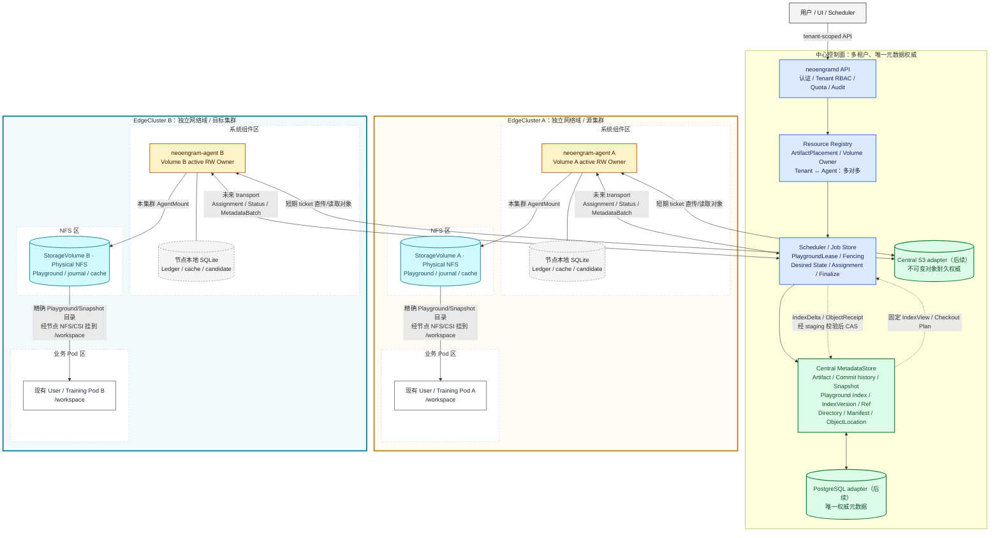

# 中心化多租户控制面与 Agent 架构

> 状态：P0 protocol、Agent 与中心无网络状态机已实现；生产控制面仍为设计。
>
> 最后更新：2026-07-26。
>
> 本文统一描述 `neoengramd`、`neoengram-agent`、多租户/多 EdgeCluster 边界、CPU 计算节点、NFS
> 存储、多 Agent Playground 和中心 S3 的目标架构。当前 `0.2.0`/format v8 只实现 transport- and
> storage-independent library、协议与内存适配器；文中 HTTP、PostgreSQL、mTLS、OIDC、真实 S3、
> NFS fencing、Gateway 和 daemon 均是后续实现目标，不是当前可运行能力。

P0 的 production/runtime 源码依赖主方向已经固定：

```text
neoengram CLI -> standalone -> engine <- agent
                     |          ^       ^
                     +-> fs ----+    protocol <- neoengramd
                         ^             ^
                         +---- core ---+
```

该简图不枚举 CLI 对 core/engine 的直接类型导入。`neoengram-agent` 的生产依赖只有
core/engine/protocol，不依赖 standalone；它对 `neoengramd` 的 `dev-dependency` 仅用于内存端到端
组合测试，不属于上图。`neoengramd` 只依赖 core/protocol，不依赖 engine/fs。两者均为
library-only。协议和状态机不假设某一种 HTTP 框架、数据库 driver、文件系统挂载方式或 S3 SDK。

## 1. 结论摘要

目标系统采用以下模型：

- `neoengramd` 是多租户控制面，负责身份、授权、资源目录、调度、租约、最终 CAS 和审计；
- `Artifact` 是一个版本化的抽象文件系统，也是租户内权限、版本历史和对象归属的领域根；
- `Commit` 是 Artifact 的不可变版本节点：Commit 之间形成版本历史树，每个 Commit 内部再通过
  Directory/Manifest 表示一棵文件系统树；
- `Playground` 是基于某个 Commit 创建的可读写工作区；`Snapshot` 是固定到某个 Commit 的只读快照；
- Agent 部署在 CPU/计算节点上，是受控执行器，不拥有 Artifact、Playground、Index 或对象权威；
- `EdgeCluster` 是网络、调度和故障域。不同 EdgeCluster 之间不假设 Agent 互通、NFS 可跨集群挂载或
  Playground 路径可直接访问；
- Playground 字节归属于 `StorageVolume`。第一类目标后端是挂载到 CPU 节点的 NFS；一个 Tenant
  在一个 EdgeCluster 可以拥有多个 Volume，一个 Volume 可以容纳该
  Tenant 的多个 Artifact，但一个 Artifact 在一个 EdgeCluster 最多只有一个活动 Volume placement；
- Managed 不可变对象的耐久权威是中心 S3-compatible object store。NFS 只保存 Playground、durable
  journal 与可重建 cache/staging，不能用 NFS object/cache 或 Agent receipt 替代中心 durability；
- Tenant 与 Agent 是多对多关系，一个 Tenant 可跨多个 Agent，一个 Agent 只管理明确分配的
  `TenantAssignment`，绝不默认管理全部租户；
- Playground 与 Agent 也是多对多关系。多个 Agent 可以同时读取和计算，但只有所在 Volume 的活动
  RW Owner Agent 能执行可变任务，同一 Playground 同一时刻最多一个写者；
- 托管模式的 Artifact/Playground 权威元数据由中心管理，生产目标适配器是 PostgreSQL；Agent 不
  维护可迁移的 Artifact SQLite，也不在 NFS 上保存 SQLite 数据库快照；P0 目前使用内存 repository；
- Agent 基于中心 `IndexVersion` 产生结构化 IndexDelta/ObjectReceipt，中心通过 staging + CAS
  只发布一个候选；
- Agent 本地 SQLite 按职责拆分为 Agent system DB、每租户 Ledger、可选 Playground cache 和每 Job
  candidate；这些数据库均位于 CPU 节点本地且不具备业务权威；
- NFS 文件锁只是进程内/文件系统的第二层保护。跨 Agent 写入必须使用中心租约、单调 fencing
  token，并在强隔离模式下由存储侧撤销过期写权限；
- 调度和存储侧 fencing 以 `StorageVolume` 为所有权单元：每个 owner generation 最多一个活动 RW
  Agent；同一 Volume 上全部 Artifact/Playground 的可变任务都由该 Agent 执行；
- Gateway 若在后续引入，只能作为受控读取/分发优化，不是 Managed durability authority，也不得
  暴露 Playground、journal、Agent cache 或 NFS 上的可变目录；
- Kubernetes 用户 Pod 可以把单个 Snapshot/Playground 的精确目录挂到容器路径；中心只用
  `PodMountBinding` 描述和校验已有挂载关系，实际 I/O 经节点 NFS/CSI 客户端直达 NFS，不经过 Agent；
- 生产目标中 `neoengramd` 是用户、CLI、UI 和自动化系统的唯一命令入口。分配 Job 时中心先把
  tenant-scoped Assignment ID `reserve` 到不可投递的 outbox 记录，CAS 持久化 Job/Assignment 后才
  `publish` 为可投递消息；P0 只定义 ControlEnvelope 和 ports，未实现 HTTP/2、HTTP/3、mTLS 或任何
  daemon；
- 数据面由 Agent 直接访问 NFS 和中心签发的短期 S3 ticket，大对象 payload 不经过中心 API 进程；
- 跨集群 checkout 只基于固定 Commit/Snapshot：目标 Agent 从中心 S3 耐久副本读取缺失对象并验证，
  再物化目标 Playground；未来 Gateway/中转对象存储只能优化传输，不能改变权威边界；
- 第一版禁止跨租户对象去重/硬链接、跨 Artifact hardlink、Agent-to-Agent 直接 Transfer 和隐式共享凭证。

一句话概括：

```text
中心负责“谁可以在什么 IndexVersion/Ref 上做什么”，
Agent 负责“在某个计算节点执行”，
中心 S3 负责“不可变对象是否 Durable”，
StorageVolume 负责“Playground 字节和恢复 journal 在哪里”。
```

## 2. 设计原则与决策状态

| 主题 | 状态 | 当前结论 |
| --- | --- | --- |
| 控制入口 | 已确认 | 用户、CLI、UI 和自动化系统只调用 `neoengramd`，不能直接向 Agent 下发业务命令 |
| Agent 控制循环 | P0 契约已实现 | ControlEnvelope、hello/heartbeat/assignment/report/failed/decision/finalized 已定义；mTLS/H2/H3 transport 待实现 |
| 领域根 | 已确认 | Artifact 是版本化抽象文件系统；不能再用 Artifact 表示 Job 输出或临时传输文件 |
| 可变/只读视图 | 已确认 | Playground 是读写工作区；Snapshot 固定一个 Commit，始终只读 |
| 集群边界 | 已确认 | EdgeCluster 是网络/调度/故障域；跨集群不直连 Agent、不共享 NFS，对象经中心 S3/受控中转传输 |
| 资源归属 | 已确认 | Index/对象属于 Tenant/Artifact，Playground 属于 StorageVolume placement；均不属于 Agent |
| Artifact 存储位置 | 已确认 | 一个 Tenant 每集群可有多个 Volume；一个 Volume 可放同租户多个 Artifact；一个 Artifact 每集群最多一个活动 placement |
| Volume 写所有权 | 已确认 | StorageVolume 是调度/fencing 单元；每个 owner generation 最多一个活动 RW Agent，其他 Agent 只读或不挂载 |
| Agent 与 Tenant | 已确认 | 多对多；Agent 只管理明确 TenantAssignment |
| Playground 与 Agent | 已确认 | 多对多；多读、多计算，单写、单发布 |
| 数据传输方向 | 已确认 | Agent 使用短期 ticket 直传/读取中心 S3；中心 API 不代理 payload |
| 托管 MetadataStore | P0 内存实现 | 中心是 Artifact/Playground 元数据权威；PostgreSQL adapter 待实现，Agent 不直连数据库 |
| SQLite on NFS | 已确认 | 托管模式不在 NFS 打开或同步 SQLite；本地 CLI 的 SQLite 行为保持不变 |
| Playground Index 权威 | 已确认 | 中心保存 Index 行/分页结构和 IndexVersion；Agent 只生成结构化 Delta |
| Commit/Ref 权威 | 目标决定 | 中心保存租户级已发布图并执行最终 Ref CAS |
| 租户隔离 | 已确认 | tenant-owned 资源全链路隔离，v1 只做租户内去重 |
| Playground 写并发 | 已确认 | 同一 Playground 最多一个有效写租约；独立写者使用不同 Playground |
| Managed 对象权威 | 已确认 | 中心 S3 是不可变对象 durability authority；NFS 仅放 Playground/journal/cache |
| Gateway 归属 | 后续研究 | 仅可作为读取/分发优化，不得成为对象或 metadata 权威，不接触 Playground/journal |
| 用户 Pod 挂载 | 已确认 | 只描述和校验现有 Pod 到精确 Snapshot/Playground 目录的挂载；Pod/NAS/PV/PVC 创建不在范围内，实际 I/O 直达本集群 NFS |
| NFS 强 fencing | 待原型 | 优先评估 NFSv4 身份/ACL、RW 挂载切换或存储代理强制 token |
| Agent Ledger | P0 内存实现 | ledger-first 与重放规则已实现；生产本地持久化 adapter 待实现 |
| 大型不可变元数据 | 待基准 | v1 优先 PostgreSQL；超出目标规模后可外置 Blob，但中心服务仍保持逻辑权威 |
| Agent 传输 | 待实现 | P0 只冻结 JSON DTO/JCS digest；H2/H3、mTLS、session routing 和 daemon 留到后续 |
| Gateway 产品 | 待验证 | 评估 VersityGW，同时保留受限对象 API 方案 |

这里的“中心管控”指中心拥有命令、Desired State、调度、租约和最终状态的决定权，不要求中心主动
建立到计算节点的网络连接。类似 Kubernetes control plane/kubelet 模型，Agent 只主动连接中心；中心
通过该连接返回已调度的命令。除平台 bootstrap 外，Agent 不向用户暴露业务 API。

## 3. 领域模型

### 3.1 规范术语

```text
Artifact（版本化抽象文件系统）
├── Commit history DAG（版本历史）
│   └── Commit[*]（不可变版本节点；v1 每个节点至多一个 parent）
│       └── root Directory / Manifest（该版本内部的文件系统树）
├── Ref[*] ──▶ Commit
├── Playground[*]（读写；从 base Commit 创建，可发布新 Commit）
└── Snapshot[*] ──▶ fixed Commit（只读；Ref 后续移动不影响内容）
```

规范定义：

- `Artifact` 是逻辑文件系统，不是单个普通文件、对象 blob、NFS mount 或 Job 输出；
- `Commit` 发布后不可修改。v1 使用单 parent，因此版本历史是可分支的树；未来如果支持多 parent merge，
  才把历史模型升级为 DAG；
- `Playground` 保存 `base_commit_id + PlaygroundIndex/IndexVersion + placement`，是唯一允许产生
  staged/unstaged 变化的视图；一次 commit 从 Playground 发布新的不可变 Commit；
- `Snapshot` 的内容身份是 `artifact_id + commit_id`，只提供只读访问；读取会话、lease 和可选
  dataset profile 是独立资源，同一 Snapshot 可以同时被多个授权 handle 使用；
- Agent 上传的 IndexDelta/ObjectReceipt 分页结果统一称为 `MetadataBatch`，不得再称为 Artifact。

### 3.2 租户与数据资源

```text
Tenant
├── Member / ServicePrincipal / RoleBinding
├── Project
│   └── Artifact
│       ├── Ref[*] ──▶ Commit history DAG
│       ├── Commit[*] ──▶ root Directory / Manifest
│       ├── Snapshot[*] ──▶ fixed Commit
│       ├── PodMountBinding[*] ──▶ Snapshot / Playground
│       ├── ArtifactPlacement[*]（每 EdgeCluster 最多一个 active）
│       ├── PlaygroundIndex / IndexVersion
│       ├── IndexUpdateSession / MetadataBatch
│       └── Playground[*]
│           ├── PlaygroundAttachment[*]
│           ├── PlaygroundLease[*]（多共享读或单排他写）
│           └── StatusObservation[*]
├── Job / MetadataBatch / AuditEvent
├── GatewayCredential / TransferTicket
└── Quota / Usage / RetentionPolicy
```

不变量：

- 每个 Artifact 只属于一个 Tenant；Commit、Snapshot、Playground、Job、Ref、对象位置和票据继承相同租户；
- Tenant 迁移是显式导出/导入流程，不能通过更新一列 `tenant_id` 完成；
- 用户或服务身份可以属于多个 Tenant，但一次普通请求只能选择一个已授权租户作用域；
- ID 是定位符，不是授权凭据。知道 Playground ID、Commit ID 或 BLAKE3 Hash 不产生读取权限；
- 对其他租户资源的普通读取返回 `RESOURCE_NOT_FOUND`，不能泄漏其存在性。

### 3.3 计算与存储资源

```text
EdgeCluster
├── ComputeNode[*]
│   └── AgentInstance[*]
│       ├── TenantAssignment[*]
│       ├── AgentMount[*] ───────────┐
│       └── PlaygroundAttachment[*]   │
├── StorageVolume[*] ◀───────────────┘
│   ├── tenant_id / active_rw_agent_id / owner_generation
│   ├── ArtifactPlacement[*]
│   │   └── artifacts/<artifact-id>/{playgrounds,journals,cache}
│   └── GatewayInstance[*] ──RO──▶ Central S3 scope / rebuildable cache
└── TransferRoute[*]

EdgeCluster A ──x── EdgeCluster B       # 无 Agent/NFS 直连假设
目标 Agent B ──S3 GET──▶ Central S3 / ready route  # 允许的跨集群对象数据路径
```

核心实体：

| 实体 | 作用 |
| --- | --- |
| `Artifact` | 一个版本化抽象文件系统；拥有 Commit 历史、Ref、Playground、Snapshot 和对象归属 |
| `Commit` | Artifact 的不可变版本节点，包含 parent 和该版本文件系统树的 root Directory |
| `Playground` | Artifact 下基于某个 Commit 的读写工作区；引用所在集群的 ArtifactPlacement，并使用其下相对路径 |
| `Snapshot` | 固定到 Artifact 某个 Commit 的只读快照，可带读取 lease、retention 和 dataset sidecar |
| `EdgeCluster` | 一个边缘/Kubernetes 集群及其网络、调度、凭证和故障域 |
| `ComputeNode` | CPU 主机、VM 或 Kubernetes Node；只表示执行位置 |
| `AgentInstance` | 一个 Agent 进程身份、证书、版本、capability、session 和最近 heartbeat |
| `TenantAssignment` | 允许某 Agent 承载某 Tenant 的任务和配额，不授予其他租户权限 |
| `StorageVolume` | 属于一个 EdgeCluster 的稳定存储身份；包含类型、服务端/export 标识、能力和租户边界 |
| `AgentMount` | Agent 对 StorageVolume 的一次挂载观测；包含本地映射和只读/可写能力 |
| `ArtifactPlacement` | Artifact 在某 EdgeCluster 的唯一活动存储位置；绑定 StorageVolume、相对根、generation 和迁移状态 |
| `PlaygroundAttachment` | 某 Agent 能否访问某 Playground，以及观测到的挂载 generation |
| `PlaygroundIndex` | 中心权威 store 中的当前已暂存文件状态和 IndexVersion；P0 为内存，生产目标为 PostgreSQL |
| `IndexUpdateSession` | Agent 产生/上传、中心校验并原子发布 IndexDelta 的幂等会话 |
| `MetadataBatch` | Manifest/IndexDelta/ObjectReceipt 的临时分页传输工件，不是权威 MetadataStore |
| `PlaygroundLease` | Playground 共享读/排他写 holder、Job、fencing token、过期时间和状态 |
| `GatewayInstance` | 未来在所属 EdgeCluster 代理中心 S3 Durable objects 或可重建 cache 的只读服务实例 |
| `TransferRoute` | 中心验证的 S3/Gateway/中转 ObjectStore 到 destination cluster/Agent 数据路径和策略 |
| `PodMountBinding` | 描述已有 Kubernetes Pod 容器路径与一个 Snapshot/Playground 精确目录之间的挂载关系；不负责创建或下发挂载 |

`Playground` 不是 NFS 挂载抽象，也不按只读/读写拆成两种 Playground。挂载统一建模为
`AgentMount`，其 `access_mode` 表示节点侧实际挂载能力；`PlaygroundAttachment.access_mode` 再限制该
Agent 对特定 Playground 的最大能力。即使两者都允许写，Agent 还必须是当前
`StorageVolume.active_rw_agent_id`，并取得匹配 `owner_generation` 的 Playground 排他租约和 fencing
token，才能执行可变操作。

`PodMountBinding` 也不是 `AgentMount`：前者只记录用户 Pod 所见的单个视图目录，后者记录 Agent 对
StorageVolume 受管根的实际挂载。两者都不代表中心负责创建 NFS、Pod、PV、PVC 或 CSI volume。

### 3.4 多对多关系

```text
Tenant A ──▶ Agent 1
         └─▶ Agent 2

Tenant B ──▶ Agent 2

Playground X ──▶ Agent 1（read-only）
            └─▶ Agent 2（read-only）
            └─▶ Agent 3（Volume Owner + 当前 write lease holder）
```

`PlaygroundAttachment.access_mode = rw_capable` 只表示部署能力，不表示当前拥有写权。真正写权由
StorageVolume RW ownership、中心 `PlaygroundLease` 和 storage-side fencing 共同决定。
上图同一 Playground 的多个 Agent Attachment 必须位于该 Playground 引用的 ArtifactPlacement 所属
EdgeCluster。

Cluster placement 不变量：

- `ComputeNode`、`AgentInstance`、`StorageVolume` 和 `GatewayInstance` v1 都属于一个 EdgeCluster；
- `AgentMount` 和 `PlaygroundAttachment` 只能引用 Agent 所属集群内的 StorageVolume/Playground；
- 一个 Tenant 在一个 EdgeCluster 可以注册多个 StorageVolume；v1 一个 StorageVolume 只属于一个 Tenant，
  但可以容纳该 Tenant 的多个 Artifact；
- `ArtifactPlacement` 至少包含 `artifact_id`、`edge_cluster_id`、`storage_volume_id`、`relative_root`、
  `placement_generation` 和 `lifecycle_state`；
- 同一 `artifact_id + edge_cluster_id` 最多一个 `active` placement，同一
  `storage_volume_id + relative_root` 只能属于一个 Artifact，且同一 Volume 内各 Artifact 根不得相同、
  嵌套或重叠；
- Artifact、StorageVolume 和 ArtifactPlacement 的 `tenant_id` 必须一致；Playground 只能引用其所在
  EdgeCluster 的 ArtifactPlacement，并位于该 Artifact 根下，不能单独选择另一个 Volume；
- 一个 StorageVolume 每个 `owner_generation` 最多一个活动 RW Agent。其他 Agent 只能只读挂载或不挂载，
  该 Volume 上全部 Artifact/Playground 的可变 Job 统一调度给 Owner；
- `active_rw_agent_id` 必须引用同一 EdgeCluster 内具有匹配 TenantAssignment 和 RW AgentMount 的 Agent；
  Owner 切换与 `owner_generation + 1` 必须在中心事务中 CAS；
- 跨 Artifact hardlink 一律禁止，即使两个 Artifact 位于同一 NFS/StorageVolume；
- 一个 Playground 同一时刻只能引用一个活动 ArtifactPlacement，不能把跨集群的两个可变副本视为同一 Playground；
- 跨集群 checkout 的目标必须是目标集群中的新 Playground；改变 Artifact 所在 NFS 必须执行显式
  ArtifactPlacement 迁移，不能直接更新 `storage_volume_id`；
- `ObjectLocation` 可以记录中心 S3 authority 之外的区域 cache/replica，但不能让它们绕过中心
  durability gate。

### 3.5 ID、路径和挂载身份

中心 API 只传稳定 ID，不传 `/mnt/...` 等物理路径。Agent 本地受控配置保存：

```text
AgentMount(
  agent_mount_id,
  storage_volume_id,
  local_mount_path,
  observed_source,
  observed_fsid,
  access_mode,
  mount_generation
)
```

Agent 根据 `agent_mount_id + artifact/playground relative_path` 解析本地路径，并通过 canonical
path、祖先、设备、inode、symlink 和 mount identity 校验拒绝路径逃逸。不同 CPU 节点可以把同一
NFS export 挂载到不同路径，不影响中心资源身份。

## 4. 总体架构

### 4.1 可视化架构图

下图表达目标运行时边界；标注为 PostgreSQL、mTLS/H2/H3 和 S3 的节点均需要后续 adapter。交互式
HTML 版本仍包含早期 Gateway 探索图，仅供方案研究，若与本节冲突以本节和 P0 不变量为准。



读图规则：

- 蓝色区域是中心控制职责；绿色节点是中心 metadata 与对象 durability 权威。P0 使用内存 adapter，
  未来分别接 PostgreSQL 和 S3；只有中心能完成 `IndexVersion`/Ref CAS；
- 黄色节点是 Agent 执行器。P0 不含网络；未来由 Agent 主动连接中心领取 Assignment；
- 灰色 SQLite 只保存本地恢复账本、缓存和临时候选，节点丢失后可从中心重建；
- 青色 NFS 区域只保存 Playground、journal 和可重建 cache。不可变对象由 Agent 使用短期 ticket
  直传中心 S3，payload 不经过 `neoengramd` API 进程；
- 每个用户 Pod 只把本集群 NFS 上一个 Playground/Snapshot 的精确目录挂到 `/workspace`；文件 I/O
  经过节点 NFS/CSI 客户端直达 NFS，不经过 Agent，也不表示中心负责创建 Pod、NAS、PV 或 PVC；
- 每个 EdgeCluster 从上到下分为系统组件区、NFS 区和业务 Pod 区；Agent 与本地 Ledger 位于系统区，
  NFS 居中承接 Agent 和 Pod 的精确 Playground 挂载；
- EdgeCluster A/B 之间没有 Agent 或 NFS 直连；二者通过中心 S3 耐久副本交换不可变对象；
- 多个 Agent 可以共享读取同一 Playground；修改 Playground 时，只能由所属 Volume 的活动 RW Owner
  Agent 执行，中心再向它签发排他 PlaygroundLease 和 fencing token。

一次典型 `add` 的关键闭环是：

```text
PrepareAdd
  -> missing-object negotiation
  -> Agent 使用短期 upload ticket 直传中心 S3
  -> 中心验证并标记对象 Durable
  -> Agent 持久化 TransferReceipt 与 Prepared
  -> 中心先持久化 descriptor-bound JobPrepared
  -> Agent 幂等上传 Manifest / ObjectReceipt / IndexDelta MetadataBatch
  -> 中心 staging 完整校验并重算 publication digest
  -> canonical Manifests + expected IndexVersion CAS 原子发布
  -> decision / finalized 幂等确认
```

### 4.2 文本拓扑（渲染 fallback）

```text
用户 / UI / Scheduler
          │
          │ tenant-scoped API
          ▼
┌────────────────────────────────────────────┐
│ neoengramd                                 │
│ Auth / Tenant RBAC / RLS / Quota / Audit │
│ Resource Registry / Scheduler / Job Store │
│ Lease & Fencing / IndexVersion & Ref CAS  │
│ Commit Catalog / Ref CAS / Object Catalog │
└───────────────────┬────────────────────────┘
                    │ 未来 Agent transport（P0 仅有 protocol/ports）
          ┌─────────┴──────────────────────────┐
          ▲                                    ▲
┌────────────────────────────────────┐       ┌────────────────────────────────────┐
│ EdgeCluster A（源）                 │       │ EdgeCluster B（目标）               │
│ [系统组件区] Agent / local Ledger   │       │ [系统组件区] Agent / local Ledger   │
│        │ Playground / journal       │       │        │ Playground / journal       │
│ [NFS 区] NFS A                      │       │ [NFS 区] NFS B                      │
│ nfs-a:/tenant-a/volume-a1           │       │ nfs-b:/tenant-a/volume-b1           │
│        ▲ 精确视图目录                │       │        ▲ 精确视图目录                │
│ [业务 Pod 区] Pod A: /workspace     │       │ [业务 Pod 区] Pod B: /workspace     │
└────────────────────────────────────┘       └────────────────────────────────────┘
       Agent A/B ────── short-lived ticket ────── Central S3
       集群间不直连 Agent/NFS；中心 S3 是不可变对象耐久权威
```

### 4.3 平面划分

| 平面 | 内容 | 权威/路径 |
| --- | --- | --- |
| 控制面 | Tenant、RBAC、Job、调度、Desired State | 中心权威；P0 内存 adapter，未来 PostgreSQL + Agent transport |
| 集群拓扑面 | EdgeCluster、网络域、placement、TransferRoute | 中心 registry；不从 IP/hostname 隐式推断集群 |
| 发布元数据面 | Playground Index、Commit catalog、Ref、lease/fence | 中心 CAS；P0 内存 publisher，未来 PostgreSQL |
| 执行元数据面 | Agent Ledger/cache、IndexDelta/Receipt/Job MetadataBatch | Agent 本地盘或临时 MetadataBatch |
| POSIX 数据面 | NFS Playground、journal 和可重建 cache | Agent 访问受管根；现有 Pod 经节点 NFS/CSI 客户端直达精确视图目录 |
| S3 数据面 | Managed 不可变 Object payload | 中心 S3 是 durability authority；Agent 使用短期 ticket 直传/读取 |
| 本地恢复面 | WAL、Job Ledger、临时文件 | 当前 Agent 本机；不作为跨节点权威 |

### 4.4 权威边界

| 状态 | 权威方 | 说明 |
| --- | --- | --- |
| Tenant、身份、RBAC、Quota | 中心 | P0 `Authorizer` port；未来 PostgreSQL RLS + 服务层授权 |
| Cluster/Agent/Node/Volume/Attachment registry | 中心 | Agent 上报 Actual State，中心保存 topology/placement/Desired State |
| Job 意图与最终结果 | 中心 | Agent Ledger 是执行恢复副本 |
| 当前 Playground Index/IndexVersion | 中心 | P0 内存 publisher；未来 PostgreSQL 行/分页结构，均通过 expected-version CAS |
| 已发布 Commit/Ref | 中心 | Ref 只通过 expected-value CAS 更新 |
| Agent system/Tenant Ledger | Agent 本地恢复副本 | 不替代中心 Job/Assignment/Lease 权威 |
| Agent Playground cache | 无全局权威 | 只缓存某 IndexVersion，可删除并从中心重建 |
| Agent Job candidate | 无全局权威 | 中心尚未接收的临时 Delta/Receipt/MetadataBatch |
| Playground 当前字节 | StorageVolume | 修改必须受 PlaygroundLease 和 journal 保护 |
| Managed Object 字节 | 中心 S3/ObjectCatalog | 中心标记 Durable 后才允许发布；读取和发布均重新验证 BLAKE3 |
| Playground 状态观测 | Agent 观测、中心缓存 | 必须携带 observed_at/mount_generation/completeness |

## 5. 中心系统 `neoengramd`

### 5.1 模块职责

P0 的 `services/neoengramd` 是 transport/storage-independent library，已实现：

- `CreateAddJob`、`AssignJob`、`ReceiveReport`、`StageMetadataBatch`、外部 `FinalizeAdd` 与内部
  `ResumePublication`；
- `Authorizer`、`JobRepository`、`AssignmentOutbox`、`MetadataBatchStager`、`ObjectCatalog`、
  `IndexPublisher`、`AuditSink`、`Clock` ports；
- 内存 repositories/outbox/stager/object catalog/audit，以及原子发布 canonical Manifest catalog 与
  expected `IndexVersion` CAS 的幂等 publisher；
- Assignment ID 原子 `reserve`、Job/Assignment CAS、outbox `publish` 三阶段边界：reservation 已耐久但
  不可投递，只有 Job/Assignment 持久化后才对 delivery worker 可见；
- 对象 Durable + Batch 完整 + CAS 三重 finalize gate，以及全部 metadata/durability 校验完成后、首次
  `Prepared -> Publishing` 持久化前的当前 deadline/assignment lease gate；同一次 Job CAS 冻结完整
  canonical publication candidate，Publishing 恢复不再读取可 TTL 清理的 staging。

生产阶段仍建议保持模块化单体，在现有 library 外增加以下 adapters/模块；这些目录目前不存在：

```text
services/neoengramd/
├── api/             # 用户、CLI、UI 的唯一业务入口
├── agent_api/       # Agent H2/H3 JSON session、heartbeat、状态/MetadataBatch 上报
├── identity/        # OIDC/JWKS、Principal、Service identity
├── tenancy/         # Tenant/Project/Artifact、RBAC、RLS context
├── registry/        # EdgeCluster、ComputeNode、Agent、StorageVolume、Mount、Attachment
├── scheduler/       # Job 选择 Agent、配额、公平队列、重试
├── jobs/            # 中心 Job 状态机、幂等、结果和工件目录
├── leases/          # Playground/Object maintenance lease 与 fencing
├── metadata/        # Playground Index、staging、Commit catalog、Ref CAS
├── transfer/        # ObjectLocation、Ticket、Transfer 协调
├── gateway/         # Gateway Desired State、凭证、drain
├── audit/           # append-only 安全和操作审计
└── observability/   # metrics、trace、SLO
```

中心负责：

- 认证主体并建立唯一 tenant context；
- 保存 Cluster topology、资源归属和多对多绑定，选择目标集群内具有正确 mount/capability 的 Agent；
- 先建立不可投递的 Assignment reservation，持久化 Job/Assignment 后再 publish，并通过目标 Agent
  已建立的 JSON 双向流交付；
- 签发、续期和撤销租约，生成单调 fencing token；
- 接收 Agent 分页上报的 Manifest、IndexDelta、ObjectReceipt MetadataBatch；
- 把结构化候选导入 PostgreSQL staging，验证 expected IndexVersion、对象依赖和租户归属；
- 只在 `ObjectCatalog` 已确认全部所需对象 Durable 后允许进入 Index CAS；
- 仅在 Job 首次从 `Prepared` 进入 `Publishing` 前重验 deadline 和 assignment lease；该重验位于
  metadata/durability 完整校验之后并紧邻 Publishing 持久化。`Publishing` 已耐久后的恢复继续同一
  Job/冻结候选的幂等 CAS 与终态落库，不再读取 staging/ObjectCatalog，也不因随后发生的壁钟过期或
  principal ACL 撤销而中断收敛；用户侧 `FinalizeAdd` 始终通过 Authorizer，只有不接受 actor 的内部
  `ResumePublication(JobKey)` 可以驱动该恢复路径，未来 transport 不得对外暴露它；
- 在一个 PostgreSQL 事务中发布 canonical Manifests 与 Playground Index/IndexVersion，必要时执行
  Ref CAS；Conflict/Rejected 不得泄漏候选 Manifest，成功后不能依赖可 TTL 清理的 staging；
- 管理 ObjectLocation、TransferTicket、retention、lease/pin/hold 和 GC roots；
- 执行租户公平调度和资源配额；
- 保存审计和状态观测时间，不把网络超时解释为业务失败。

中心不能：

- 直接拼接或访问 Agent 的本地/NFS 物理路径；
- 通过 SSH 或 shell 执行用户字符串；
- 在 API 进程中代理大对象 payload；
- 直接打开 Agent 的 SQLite 文件；
- 假设不同 EdgeCluster 的 Agent/NFS 可以直接互访，或把跨集群 payload 代理进中心 API 进程；
- 在对象未确认 Durable、Batch 不完整或结构化 metadata candidate 未验证前发布 Index/Ref；
- 向 Agent 下发任意 SQL，或允许 Agent 直接连接中心 PostgreSQL；
- 用 system scope 或 `BYPASSRLS` 处理普通租户请求；
- 因 Agent 失联自动把未确认 Job 当作失败并在另一节点重复写入。

### 5.2 调度条件

中心为 Job 选择 Agent 时至少检查：

```text
Agent EdgeCluster matches ArtifactPlacement/StorageVolume
TenantAssignment matches
PlaygroundAttachment exists
Agent capability/version matches
AgentMount identity and generation match
StorageVolume health is acceptable
mutation Agent equals StorageVolume.active_rw_agent_id
Assignment owner_generation matches StorageVolume.owner_generation
external RW Pod mount policy permits the managed operation
requested access <= attachment access
required IndexVersion is available from central MetadataStore
tenant/node concurrency quota has capacity
required Playground/Object lease can be acquired
cross-cluster TransferRoute/Gateway is Ready when source cluster differs
```

`Node healthy`、`Agent reachable`、`NFS mounted` 和 `Playground status fresh` 是四个不同状态，不能
合并成一个绿色标记。

### 5.3 Desired/Actual State

持续配置使用 Desired State，具有开始/结束结果的动作使用 Job。Desired State 包括：

- EdgeCluster placement/network policy 和 Agent 允许的 TenantAssignment；
- 允许发现的 StorageVolume/AgentMount ID、本地配置版本、active RW Owner 和 owner generation；
- ArtifactPlacement、relative root、迁移状态和 placement generation；
- PlaygroundAttachment 和最大 access mode；
- Gateway 实例、跨集群 reachability/route policy、凭证版本和 drain；
- 节点/租户并发、带宽、临时空间和缓存配额；
- Agent drain、版本约束和证书 generation。

`PodMountBinding` 不在 Desired State 中；它是对集群外部已经建立的 Pod/NFS 挂载关系的独立登记和
校验结果，不能触发 Pod、NAS、PV、PVC 或 CSI volume 的创建、变更与回收。

Actual State 由 Agent 在注册后定期 heartbeat/report，至少包括 Agent 版本、挂载 fingerprint、读写模式、
NFS 错误、磁盘空间、本地缓存的 IndexVersion、运行 Job、Gateway 状态和最近一次 Playground 观测。
中心以 `last_heartbeat_at + session_generation` 判断 Agent 是否 Ready；失联只把状态变为 Unknown，不能
直接把运行中的写 Job 判定为失败或在另一节点重放。

## 6. Agent 系统 `neoengram-agent`

### 6.1 Agent 定位

Agent 是计算节点上的受控执行器。默认一个 ComputeNode 一个 AgentInstance；高隔离部署可以在同一
节点按 Tenant 启动多个 Agent/Worker。协议模型不假定 Agent 只能绑定一个租户，也不允许 Agent
自动枚举中心全部租户。

P0 已实现无网络的 `Agent` 状态机及 `Ledger`、`AssignmentValidator`、`AddExecutor`、
`ObjectTransfer`、`ReportSink`、`Clock` ports。Assignment 必须先按
`(tenant_id, job_id, operation_digest)` 写 Ledger 再返回 accepted；相同 digest 重放既有状态，同一
Job 不同 digest 返回 `JOB_ID_REUSED`。正常阶段为：

```text
claimed -> accepted -> running -> prepared -> awaiting_decision
        -> finalizing -> completed
```

错误/恢复分支包含 `failed_reported` 与 `recovering`。内存 Ledger、Fake AddExecutor、Fake
ObjectTransfer 和 Fake ReportSink 仅用于组合测试，不是生产持久化或传输。对象传输 port 返回的
durable `TransferReceipt` 保存 exact MetadataBatch descriptors/pages；Agent 先持久化 Prepared 并发送
`JobPrepared`，再调用幂等 `stage_metadata`，全部成功后才进入 `awaiting_decision`。报告或 staging
响应丢失时状态保持 Prepared，recovery 重放相同材料。Job-scoped 失败统一使用 protocol
`JobFailed`，不再维护 Agent/中心各自不兼容的失败 DTO。TransferReceipt 必须明确包含 Manifest、
IndexDelta、ObjectReceipt 各且仅一个完整 batch；no-op 或纯删除候选也不能省略空 batch。

accepted 时的校验不是一次性通行证。Agent 在首次进入 Engine 执行、以及从 `accepted`/`running`/
`recovering` 恢复到执行前，都会用当前时间重新校验 lease、deadline 和 assignment/placement/mount/
owner generation；持久化到 `Prepared` 后，在首次或恢复重放 `JobPrepared`/metadata staging、进入
`awaiting_decision` 前再次执行同样校验。校验失败不得启动 executor、重放 Prepared 或继续进入新的
可变阶段，而是持久化并上报稳定失败。该本地失败不能推翻已经耐久的中心决定：若同一 Assignment
随后收到匹配的 Publish/Conflict decision，只要 Ledger 中仍有完整 Prepared candidate，Agent 必须能从
`Prepared`、`FailedReported` 或 `Recovering` 进入 finalizing 并发送 finalized acknowledgement。
Publish decision 的 Index digest 必须等于 durable Prepared candidate 的 `result_index_digest`，revision
必须等于 base revision + 1；正常处理、finalize 重试和 recovery 都执行同一校验。

生产 Agent 还需要负责：

- 主动建立到中心 Agent API 的 mTLS H2/H3 JSON session，完成注册、heartbeat、Desired State watch 和
  Job 领取；
- 校验 EdgeCluster、TenantAssignment、PlaygroundAttachment、AgentMount、IndexVersion、lease 和 capability；
- 在向中心确认 accepted 前把 Job 写入本地 Ledger；
- 调用结构化 NeoEngram Engine API，不解析 CLI stdout；
- 执行稳定扫描、切块、Hash、对象直传与 durability 对账、checkout 和 journal recovery；
- 生成结构化 IndexDelta、ObjectReceipt 和可分页 MetadataBatch，并通过 Agent session 分页上报中心；
- 保存 Job 进度、候选、错误和恢复状态，在断线重连后幂等续传；
- 主动访问已授权 NFS Playground 和中心 S3 ticket 数据面；
- 监测 mount、storage 和 Gateway Actual State。

Agent 不能：

- 接受任意 shell、绝对路径、环境变量或未注册 cwd；
- 在没有 tenant/artifact/playground 归属校验时执行请求；
- 把本地 cache、candidate 或 Ledger 当成中心已发布状态；
- 在 lease 过期、fence 不匹配或 mount identity 漂移后继续进入新的可变阶段；
- 信任 S3 ETag、NFS 文件名、中心声明或其他 Agent 声称的对象内容；
- 绕过 Local Engine 的 object/worktree/write lock 和持久 journal；
- 因本地存在相同 Hash 就授权另一个租户读取；
- 直接连接中心 PostgreSQL、接收任意 SQL 或自行决定中心 IndexVersion、Ref 和全局 Job 最终结果。
- 接受绕过中心 Job/Assignment 的用户、CLI、UI 或其他 Agent 业务命令。

### 6.2 Agent 本地状态

以下是未来持久 Ledger/cache adapter 的建议布局；P0 当前只提供内存实现：

```text
/var/lib/neoengram-agent/
├── system.sqlite3
├── tenants/<tenant-id>/
│   ├── ledger.sqlite3
│   ├── object-cache.sqlite3                 # 可选、可重建
│   ├── playgrounds/<playground-id>/cache.sqlite3  # 可选、可重建
│   └── jobs/<job-id>/candidate.sqlite3      # 可选、临时
└── runtime/
```

- `system.sqlite3` 只保存 Agent 身份、本地配置投影、Mount inventory 和进程恢复状态；
- 每个 Tenant 使用独立 `ledger.sqlite3` 保存本节点已接受 Job、幂等摘要、阶段和恢复线索，避免
  SQLite 缺少 RLS 导致的跨租户误读，并缩小损坏范围；
- Playground `cache.sqlite3` 只缓存某个中心 IndexVersion、文件 fingerprint 和分页数据，可随时删除
  并从中心重建；它不是该 Playground 的完整 MetadataStore；
- 大 Job 可使用独立 `candidate.sqlite3` 对 IndexDelta/Manifest 进行分页、排序和断点恢复。中心拉取并
  发布后按 TTL 删除，不能把它当作已发布 Index；
- 不采用“一个 Agent 内所有租户共用一个业务 SQLite”，也不采用“每个 Playground 一套完整 Artifact
  SQLite”。前者隔离不足，后者会复制 Artifact 历史并放大同步和恢复成本；
- 每个数据库都保存并在打开时验证
  `database_identity(schema_version, agent_id, tenant_id[, playground_id/job_id])`；
- Bearer Token、S3 secret、完整 Signed URL 和 KMS key 不进入 Ledger；
- CPU 节点本地磁盘丢失时，新 Agent 从中心权威 store 重建 Index/cache；无法凭空证明旧 Job 对 NFS
  的中间副作用，仍必须结合 Playground journal 进入 RecoverJob；
- 本地数据库可以删除或重建，不能成为 Ref、lease、IndexVersion 或已发布 Commit 的唯一记录。

### 6.3 Agent 内部结构

```text
crates/neoengram-agent/src/
├── agent.rs          # assignment/execute/decision 状态转换
├── state.rs          # Ledger record、receipt、report 与状态
├── ports.rs          # Ledger/validator/executor/transfer/report/clock
├── memory.rs         # 内存 Ledger
├── fakes.rs          # 组合测试 adapters
└── error.rs          # 稳定 Agent 错误
```

CLI/Standalone 和 Agent 共用结构化 Engine：

```text
CLI ──────┐
          ├──▶ NeoEngram Engine ──▶ Artifact / Playground / ObjectStore
Agent ────┘
```

过渡期如必须启动 CLI 子进程，只能使用固定 argv、固定可执行文件、受控 cwd/环境/超时/输出上限，
禁止经过 shell，并且 stdout 文本不能成为稳定协议。

## 7. EdgeCluster、StorageVolume 与 NFS

### 7.1 EdgeCluster 边界

`EdgeCluster` 是中心注册的稳定资源，可以对应 Kubernetes 集群、独立机房或其他网络隔离计算域：

```text
edge_cluster_id
display_name
control_endpoint_policy
network_zone / region
gateway_ingress_policy
allowed_transfer_routes
credential_generation
lifecycle_state
```

中心控制 API 必须能被集群内 Agent 出站访问；集群间普通 Node/Pod/Agent 地址不可路由。跨集群唯一
允许的数据通路是中心登记并健康验证的 S3-compatible Gateway Endpoint。`edge_cluster_id` 来自中心
注册和节点证书绑定，不能根据请求 IP、DNS 名或用户提供字段推断。

### 7.2 StorageVolume 抽象

`StorageVolume` 是中心资源，不等于某个 `/mnt` 路径。NFS 类型至少记录：

```text
storage_volume_id
edge_cluster_id
tenant_id / tenant_scope
backend_type = nfs
server/export identity（凭证不进入普通 DTO）
expected_fsid / mount generation
capability profile
object root policy
playground root policy
managed metadata policy = central-only
active_rw_agent_id（可空）
owner_generation
```

一个 Tenant 在一个 EdgeCluster 可以有多个 StorageVolume；一个 StorageVolume 也可以承载该 Tenant 的
多个 Artifact。v1 不在一个 Volume 内混放不同 Tenant。推荐的受管目录是：

```text
Tenant A / StorageVolume A1
├── artifacts/X/{objects,playgrounds,journals}
├── artifacts/Y/{objects,playgrounds,journals}
└── artifacts/Z/{objects,playgrounds,journals}
```

Artifact 到 Volume 的关系由中心权威 `ArtifactPlacement` 表示：

```text
ArtifactPlacement(
  tenant_id,
  artifact_id,
  edge_cluster_id,
  storage_volume_id,
  relative_root,
  placement_generation,
  lifecycle_state
)

UNIQUE (artifact_id, edge_cluster_id) WHERE lifecycle_state = 'active'
UNIQUE (storage_volume_id, relative_root)
FOREIGN KEY (tenant_id, artifact_id) -> Artifact(tenant_id, artifact_id)
FOREIGN KEY (tenant_id, edge_cluster_id, storage_volume_id)
  -> StorageVolume(tenant_id, edge_cluster_id, storage_volume_id)
```

`UNIQUE` 不能独自发现 `artifacts/X` 与 `artifacts/X/subdir` 的前缀重叠；中心必须对规范化相对路径做
非重叠校验，禁止绝对路径、`..`、symlink 穿越和 bind mount 别名。即使位于同一 Volume，各 Artifact
可以按另行定义的同租户对象归属策略复用内容寻址对象，但不能在两个 Artifact 的受管根之间建立
hardlink 或共享可写 inode。

同一 StorageVolume 可以被所属 EdgeCluster 的多个 CPU 节点发现或只读挂载，但 v1 不允许跨
EdgeCluster 挂载，并且每个 `owner_generation` 只有 `active_rw_agent_id` 可以建立卷级 RW AgentMount 和
执行受管可变 Job。用户 Pod 即使按部署策略 RW 挂载单个 Playground data root，也不属于 AgentMount，
不获得卷级或 Index/Object/journal 发布权限。
Owner 切换会同时 fence 该 Volume 上所有 Artifact/Playground；这正是选择 Volume 而不是单个
Playground 作为调度与故障接管单元的原因。每个 Agent 通过独立 `AgentMount` 报告本地路径、实际
source、fsid、挂载参数摘要、读写模式、空间和最近健康时间。

如果两个注册项解析到同一 server/export + fsid，或它们的物理根重叠，就不能借路径别名注册成两个
独立 RW StorageVolume。v1 应合并为同一个 Volume 所有权域；不能合并时必须共享同一个 Owner/fence
generation 并停止自动调度，直到边界被人工确认。

### 7.3 Kubernetes Pod 的现有目录挂载关系

本设计不负责创建、下发、更新或回收 Kubernetes Pod、NAS/NFS、PV、PVC 或 CSI volume。这些资源和
挂载已经由集群基础设施准备好；中心只描述和校验“现有 Pod 的某个容器路径对应哪个受管视图目录”：

```text
PodMountBinding(
  pod_mount_id,
  tenant_id,
  artifact_id,
  playground_id / snapshot_id,
  edge_cluster_id,
  storage_volume_id,
  storage_relative_root,
  pod_ref / workload_ref,
  container_mount_path,
  access_mode = ro | rw,
  mount_generation
)
```

`PodMountBinding` 是关系记录，不是 Desired State、授权票据、挂载租约或资源创建请求。它必须与
ArtifactPlacement、StorageVolume、EdgeCluster 和实际 mount identity 一致；`storage_relative_root`
必须是单个 Playground/Snapshot 的规范化视图根，不能指向 Volume 根、`objects/`、`journals/`、兄弟
Artifact，或通过绝对路径、`..`、symlink、bind mount 别名逃逸。

以已有 Pod 挂载 Playground `pg-17` 为例：

```text
Existing User Pod
  /workspace
      │ exact directory mount
      ▼
Node NFS/CSI client
      │
      ▼
nfs-a:/tenant-a/volume-a1/
  artifacts/X/playgrounds/pg-17/data/
```

实际文件 I/O 是 `Pod -> Node NFS/CSI client -> local-cluster NFS`，不经过 Agent、Gateway 或中心 API。
这里的 CSI 仅表示现有集群可能使用的节点挂载实现；本文不规定 PV/PVC、CSI driver 或 `subPath` 的
创建方式。`subPath` 只能表达路径选择，不能单独作为租户隔离或授权边界。

同一物理 NFS 上的挂载范围必须强区分：

| 消费者 | 后端可见根 | 模式 | 约束 |
| --- | --- | --- | --- |
| Volume Owner Agent | StorageVolume 受管根 | RW | 唯一 active RW Agent；执行 Playground、journal 和受管 mutation |
| Gateway | 每 Artifact 一个 `objects/` 根，或等价受限视图 | RO | 只提供 Ticket 限定的 HEAD/GET，不见 Playground/journal |
| 用户/训练 Pod | 单个 Snapshot 或 Playground view/data root | Snapshot 为 RO；Playground 按策略 RO/RW | 不见 sibling Artifact、objects、journal 或 Volume 根 |

Snapshot 永远只读；它可以对应预先物化的只读目录或固定 Commit 的只读视图，不能把内部
`objects/` 目录直接作为文件系统视图交给用户 Pod。Playground 是否允许 Pod RW 由部署策略决定；即使
允许，Pod 也只是普通文件写者，受管 Index/Object/journal 的发布仍只由 Volume Owner Agent 完成。
部署侧必须避免 Pod 外部写入与 Agent 的 checkout/restore/rm/add/commit 冲突，但 Pod 的创建、停止、
卸载、凭证撤销及其生命周期协调不属于本文范围。

### 7.4 NFS 支持基线

第一版优先认证 NFSv4.1/4.2，不把“能 mount”视为“满足 NeoEngram 语义”。上线前必须对具体服务端、
客户端内核和挂载策略验证：

- 文件创建、`O_EXCL`/no-replace、rename 和目录 rename 的跨客户端可见性；
- file `fsync`、directory `fsync`、服务端 stable storage 和断电后的持久性；
- hardlink、chmod、inode/fsid、root squash、NFSv4 ACL/Kerberos principal；
- advisory shared/exclusive lock 的跨客户端行为；
- attribute/data cache、close-to-open、一致性窗口和 stale file handle；
- 大目录、百万对象、并发 GET/PUT、NFS server failover 和容量耗尽；
- hard mount 下存储故障造成的阻塞，以及 Agent worker 隔离能力。

不允许使用会绕过锁的 `nolock` 配置。数据完整性场景不应为了快速报错盲目使用可能产生不完整 I/O
语义的 soft mount；最终挂载参数需要按 NFS 产品形成认证矩阵，而不是由中心 Job 任意下发。

### 7.5 锁与 NFS 的边界

当前本地实现使用 `fs2` advisory lock，并要求固定顺序：

```text
objects.lock -> Playground worktree.lock -> write.lock
```

这些锁继续保留，用于同一 Artifact 内部进程协调，但不能单独承担跨 Agent/跨主机权威。原因是
NFS 锁语义、租约恢复和网络分区依赖具体实现，而且永久 RW 凭证不能阻止过期 Agent 写入。

分布式层增加：

```text
PlaygroundIndex CAS      # expected IndexVersion 发布
Ref CAS                 # expected Commit 发布
PlaygroundLease          # status/add 共享读，checkout/restore/rm 排他写
ObjectMaintenanceLease  # GC/破坏性维护
Storage-side fence      # 强隔离部署阻止过期 Agent 写 NFS
```

### 7.6 NFS 上允许和禁止的内容

| 内容 | 是否放 NFS | 规则 |
| --- | --- | --- |
| Managed Chunk/WholeFile Object 权威副本 | 否 | 中心 S3 是 durability authority；NFS cache 可删除重建 |
| Playground 文件 | 是 | 多读；可变操作需要单写租约和 journal |
| Playground mutation journal | 是 | 与 Playground 同卷，覆盖 checkout/rm/restore 并支持新 Agent 恢复 |
| object/materialized cache、staging | 可选 | 只作可重建加速或稳定输入，不能证明中心 durability |
| 托管 Artifact/Playground SQLite | 否 | 权威元数据在中心；生产目标为 PostgreSQL，本地 cache 不同步到 NFS |
| Agent SQLite WAL/SHM | 否 | 只放当前 Agent 本地盘 |
| Agent Job Ledger | 否 | 属于 AgentInstance，本地恢复使用 |
| Gateway 临时状态/secret | 否 | 独立受控目录/Secret Manager |

## 8. 多租户隔离

### 8.1 控制面隔离

所有 tenant-owned PostgreSQL 表包含 `tenant_id NOT NULL`，子资源使用带 `tenant_id` 的复合外键。
普通请求事务使用 `SET LOCAL` 设置认证得到的租户上下文并启用 RLS，连接池不能遗留上一个租户的
session 状态。运行角色不得拥有 `BYPASSRLS`。

- 缓存键、幂等键、分页 cursor、唯一约束、搜索索引、MetadataBatch 和 ObjectLocation 都包含租户；
- 后台 scheduler/reconcile/GC/backup 每次在显式租户作用域运行；
- system scope 使用独立端点、角色和审计，不能模拟普通租户请求绕过 RLS；
- RBAC 至少区分 TenantAdmin、ProjectAdmin、ArtifactReader/Writer/Maintainer 和 ServicePrincipal；
- Tenant A 的列表、数量、错误、用量和审计不能包含 Tenant B 信息。

### 8.2 存储隔离

第一版采用：

- 每租户独立 NFS export，或经过验证的独立根目录 + NFSv4 ACL/principal；
- 每租户独立 Gateway Bucket、凭证和本地映射根；
- 不跨租户共享 Loose Object、Pack、hardlink、reflink、cache entry、retention 或计费；
- 相同 BLAKE3 Hash 在不同租户分别存储和授权；
- WholeFile hardlink export 只能在同 Tenant、Artifact、StorageVolume 和受管目标根内物化只读
  Snapshot；普通可写 Playground 必须使用 copy 或经认证的 reflink/COW，不能直接共享不可变对象 inode；
- 每租户独立并发、带宽、临时空间、存储和 Gateway 限额。

一个共享 Agent 进程被攻破后可能访问其进程凭证能访问的全部挂载。需要抵御恶意租户、满足强合规
或建立独立密钥边界时，应使用每租户 Unix 用户/Worker、容器、VM 或专属节点。应用层 `tenant_id`
校验不能替代操作系统和存储侧隔离。

### 8.3 跨租户操作

普通 `TransferJob` 只允许源和目标属于同一 Tenant。未来如需要租户间复制，必须设计独立
`CrossTenantCopy`：同时验证源导出和目标导入权限，固定 Snapshot，在目标租户重新验证并发布独立
对象副本。它不能修改原对象归属、复用源凭证或共享 inode。

### 8.4 Tenant 生命周期

```text
active -> suspended -> deleting -> deleted
```

- `suspended` 拒绝新写 Job、租约和票据，可按策略保留受控只读导出；
- `deleting` 撤销凭证、停止调度、等待安全点、建立包含中心/NFS/Gateway/备份的删除清单；
- 删除按 retention/legal hold 执行，不能运行缺少租户过滤的全局删除；
- 审计按合规期限保留，但与 payload、访问凭证和可恢复 Snapshot 分离；
- 中心、Agent/Gateway registry 和存储清单完成对账后才能进入 `deleted`。

## 9. Playground 多 Agent 并发模型

### 9.1 基本规则

一个 Playground 可以绑定多个只读 Agent，但不能让多个 Agent 独立推进同一个可变状态。所有受管可变
操作还必须由其 StorageVolume 的活动 RW Owner 执行；PlaygroundLease 只在该 Owner 内进一步串行化
具体 Playground，不能把发布权转交给其他 Agent。7.3 中已有的 RW Pod 只是外部文件写者；
`PodMountBinding` 仅记录这一事实，部署侧必须保证它不与下表受管 mutation/publish 操作并发：

| 操作 | 多 Agent 行为 | 中心协调 |
| --- | --- | --- |
| health/capability | 并发 | 无 Playground lease |
| 固定 Commit 的 show/mount/export-copy | 并发 | 固定 Commit + 对象 retention lease |
| Playground status/diff | 并发观测 | 共享读租约 + 固定 IndexVersion，结果标记时间和完整性 |
| 扫描、Hash、切块 | 可作为一个父 Job 的并行 Worker | 共享读租约；Coordinator 合并，不允许 Worker 发布 Index |
| Object no-replace 发布 | 当前 Volume Owner 内可并发 | ObjectMaintenanceLease 阻止 GC 竞态 |
| add 的 Index 发布 | 单发布者 | expected IndexVersion CAS |
| Commit | 中心单发布者 | 固定 IndexVersion + expected Ref CAS |
| checkout/restore/rm/recover | 单写者 | PlaygroundLease + fence + journal |
| fsck | 可读并发或受控维护 | 扫描 scope、IndexVersion/Commit 固定 |
| gc | 单维护者 | Artifact/ObjectMaintenanceLease |

多个用户需要独立修改同一份数据时，应创建不同 Playground。一个实时 Playground 上的“多个 Agent”
主要用于并行读取、计算和故障接管候选，不表示支持无冲突的多主写文件系统。故障接管按 Volume 切换
Owner，不能只接管其中一个 Playground 后留下两个 Agent 同时写同一 NFS。

进入中心管理模式后，禁止用户在共享 NFS 上直接运行会修改 NeoEngram Index/HEAD、journal 或 cache 的
本地 CLI 命令，否则会绕过 IndexVersion、lease 和 fence。CLI 如需远程操作，应调用中心 API。
是否允许业务进程直接修改普通 Playground 文件由 Playground policy 决定；允许时 add 仍必须通过
稳定输入和文件身份复核处理并发外部写入。Kubernetes 中的 `PodMountBinding` 只用于识别和校验已有
挂载；是否允许 RW 以及如何停止外部写入由部署策略负责，不能把该关系记录误当作 fencing 机制。

### 9.2 PlaygroundLease 与 fencing

中心为访问实时 Playground 的操作创建共享读或排他写租约。多个共享读租约可以共存，排他写租约
必须等待全部共享读租约结束并阻止新读租约：

```text
PlaygroundLease(
  lease_id,
  tenant_id,
  playground_id,
  holder_agent_id,
  holder_job_id,
  mode,
  fencing_token,
  issued_at,
  expires_at,
  state
)
```

排他写租约的 `fencing_token` 在 Playground 内单调递增；共享读租约记录创建时观测到的 writer
epoch。Agent 在接收、开始、进入不可逆发布前和恢复时校验 Playground、Agent、Job、mode、token
和到期时间。Agent 在 heartbeat/report 中请求续租，中心校验 Job、权限和当前 fence 后返回新的到期
时间；中心不可用且租约不能续期时，Agent 在安全点停止，不能自己延长。

仅靠 token 不能阻止持有永久 RW NFS 凭证的失联进程。因此隔离等级分为：

| 等级 | 防护 | 适用范围 |
| --- | --- | --- |
| Cooperative | 中心租约 + Agent 校验 + NFS/Local Engine 文件锁 | 全部 Agent 受信的内部环境 |
| Enforced | Cooperative + 每 Agent NFS principal/ACL、RW mount 切换或存储代理检查 fence | 多租户生产环境 |
| Dedicated | 每租户/Playground 独立 Worker、凭证、容器/VM/节点和 export | 强合规、恶意租户模型 |

第一版必须明确部署属于哪一等级，不能把 Cooperative 描述成能抵御失陷 Agent 的强 fencing。

### 9.3 并行 Add

多个 Agent 可以加速一次逻辑 Add，但必须由中心创建一个父 Job：

```text
AddCoordinator(expected_index_version)
  ├── ScanWorker Agent A: paths [a..f]
  ├── ScanWorker Agent B: paths [g..m]
  └── ScanWorker Agent C: paths [n..z]
             │
             ▼
  immutable objects + path-scoped Index delta
             │
             ▼
Coordinator 验证路径不重叠、输入身份和 expected IndexVersion
             │
             ▼
生成一个合并后的 IndexDelta + ObjectReceipt MetadataBatch
             │
             ▼
中心导入 staging 并执行一次 IndexVersion CAS
```

Worker 不能各自更新 Index。外部进程在扫描期间修改 NFS Playground 时，Worker 必须使用稳定输入
稳定副本/复制和文件身份复核；无法证明稳定的路径返回 `WORKTREE_CHANGED_DURING_SCAN`。

## 10. 中心权威元数据与 Agent 本地数据库

### 10.1 Standalone 与 Managed 是两种运行模式

当前 format v8 的本地 CLI 使用 Standalone SQLite stores；托管 Agent 模式使用中心 authority，
P0 为内存 repository，生产目标为 PostgreSQL。二者复用 core 规范模型和 engine 业务规则，但不共享
数据库文件：

```text
Standalone CLI -> neoengram-standalone -> format v8 SQLite stores
Managed Agent  -> protocol -> neoengramd ports -> memory (P0) / PostgreSQL (future)
```

- Standalone 适合单机/单管理域，SQLite、WAL、锁和 `.neoengram` 目录使用 format v8；不迁移 v7；
- Managed 适合多租户、多 Agent 和 NFS 数据卷，中心是唯一 metadata authority；生产 adapter 目标为 PostgreSQL；
- Agent 不在 NFS 打开 Artifact SQLite，不上传或下载 SQLite 数据库快照，也不把本地数据库同步给
  其他 Agent；
- 不能把 Managed 简化为把 `.neoengram/metadata` symlink 到本地盘。Engine 必须接收结构化
  Request/Result、执行 ports 和逻辑 Playground 身份；
- 从 Standalone 纳管到 Managed、或反向导出，是显式 import/export 流程，不是两个 MetadataStore
  的双向复制。

### 10.2 中心权威范围与未来 PostgreSQL

中心至少权威保存以下数据；P0 由内存 ports/adapters 表达，生产阶段再映射到 PostgreSQL：

| 数据 | 关键并发/完整性规则 |
| --- | --- |
| Tenant、Principal、RBAC、Quota | RLS、复合 tenant 外键、独立 system scope |
| Artifact、Playground、StorageBinding | 稳定逻辑 ID，不保存 Agent 本地绝对路径 |
| Playground Index 与 `IndexVersion` | 行或分页结构；通过 expected-version CAS 发布 |
| IndexUpdateSession、staging rows | 绑定 Job、Tenant、Playground、base IndexVersion 和完整 digest |
| Commit、Directory、Manifest、Ref | 规范内容 ID；完整引用图验证；Ref expected-value CAS |
| ObjectCatalog durability、ObjectReceipt/Location | 中心 S3 Durable 状态为 gate；receipt/location 仅为验证证据和 cache 位置 |
| Job、Lease、fencing、AuditEvent | 中心意图和最终结果权威，Agent Ledger 只用于本地恢复 |

Index 发布使用 staging table，而不是逐条边验证边改 current 表：中心先完整接收并导入候选，校验页数、
记录数、路径唯一性、对象引用、配额和 digest，再在一个 PostgreSQL 事务中：

```text
verify expected IndexVersion
apply staged IndexDelta
advance Playground IndexVersion
record central ObjectCatalog durability and receipt evidence
update Job publish result
append AuditEvent
```

Commit 发布也在中心事务内完成 immutable catalog insert 和 Ref CAS。IndexVersion 与 Ref 是不同并发
轴：`add` 可以只推进 IndexVersion，`commit` 固定一个 IndexVersion 并推进 Ref；实现不能用单个模糊
的全局 metadata 序号同时代替二者。

### 10.3 Agent 本地数据库如何拆分

推荐布局：

```text
/var/lib/neoengram-agent/
├── system.sqlite3
└── tenants/<tenant-id>/
    ├── ledger.sqlite3
    ├── object-cache.sqlite3                     # 可选
    ├── playgrounds/<playground-id>/cache.sqlite3  # 可选
    └── jobs/<job-id>/candidate.sqlite3          # 可选
```

| 数据库 | 生命周期 | 内容 | 是否权威 |
| --- | --- | --- | --- |
| `system.sqlite3` | AgentInstance | Agent identity、配置版本、Mount inventory、worker 状态 | 否 |
| Tenant `ledger.sqlite3` | TenantAssignment | 本节点 Job、request digest、阶段、恢复线索、MetadataBatch 索引 | 否 |
| Playground `cache.sqlite3` | 可删除 | 某 IndexVersion 的分页缓存、fingerprint、扫描加速数据 | 否 |
| Job `candidate.sqlite3` | 短期/TTL | 大型 Delta/Manifest 的排序、分页、digest 和断点恢复 | 否 |

采用每租户 Ledger，是因为 SQLite 没有 RLS；物理分库能降低代码漏过滤造成的越权概率，也缩小单库
损坏范围。Playground cache 和 Job candidate 根据规模按需创建，避免每个 Playground 都复制完整
Artifact 历史。严格隔离部署再配合每租户 Worker、Unix user、目录权限和独立 NFS 凭证。

所有本地数据库打开时必须验证 `database_identity`，至少包含 schema version、Agent ID 和 Tenant ID；
Playground/Job 库再包含对应资源 ID。把数据库文件移动到另一个租户目录不能改变其身份。

### 10.4 Agent 上报与中心发布

```text
1. Central 持久化 Job(expected_index_version = V)；AssignJob reserve 不可投递的 Assignment ID，
   CAS 持久化 Assignment 后 publish outbox
2. Agent 按 `(tenant_id, job_id, operation_digest)` 先 claim Ledger，校验 Assignment 后返回 accepted
3. Agent 在首次或恢复进入执行前重验 lease/deadline/generation；Engine `PrepareAdd` 产生
   `PreparedAdd`，但不发布 Index
4. Central 协商 missing objects，并签发短期 upload ticket
5. Agent 直传中心 S3；Central 校验后在 ObjectCatalog 标记 Durable
6. Agent 持久化含 exact descriptors/pages 的 `TransferReceipt` 和 Prepared 状态
7. Agent 在首次或恢复重放 Prepared、进入 decision 等待边界前重验 lease/deadline/generation
8. Agent 上报 `JobPrepared`；Central 校验可重算 candidate digest 并先持久化报告。Engine、Agent 和
   Central 对同一 scope/base/IndexDelta/Manifest/ObjectSpec 分别重算 publication digest
9. Agent 幂等上传 Manifest/ObjectReceipt/IndexDelta MetadataBatch descriptor/pages
10. Central 校验资源 scope、page sequence/count/bytes/JCS digest 和 base IndexVersion，写入 staging，
    从完整页面重组 publication 并核对 `publication_digest` 与 `result_index_digest`
11. Central 完成 metadata/durability 校验后，在首次 `Prepared -> Publishing` 持久化前紧邻重验
    deadline/assignment lease，并在同一次 Job CAS 中冻结 canonical publication candidate；随后在同一
    publication transaction 中持久化 canonical Manifests 并执行 CAS(V -> V+1)，publisher 独立复算
    最终 Index digest；已耐久的 Publishing 由内部 `ResumePublication` 跳过可变 ACL、壁钟和
    staging/ObjectCatalog 重验，只幂等收敛同一 publication 结果；外部 `FinalizeAdd` 仍始终鉴权
12. Central 写入 decision；Agent 幂等 finalizing/finalized，更新 cache 并按 TTL 清理 candidate
```

MetadataBatch 是受限结构化协议，不是数据库文件。每页至少绑定 tenant、artifact、playground、job、
batch ID、base IndexVersion、page number 和 digest；中心限制记录数、字段长度、总字节和协议版本。
Manifest record 是带 `chunk_start` 的 fragment，可跨多个 records/pages；中心必须按 Manifest ID 和
chunk ordinal 重组并验证无缺口、metadata 一致以及完整 canonical Manifest ID，不能把单页 fragment
误当成完整 Manifest。`JobPrepared.publication_digest` 绑定完整资源 scope、base IndexVersion、含结果
摘要的 IndexDelta、canonical Manifests 和 ObjectSpecs；`candidate_digest` 再绑定 assignment identity、
`result_index_digest`、`publication_digest`、ordered descriptors 和 extensions，任何一层替换都不能沿用
旧 digest。
`ObjectReceipt` 证明 Agent 完成指定上传/校验步骤，但不是 durability authority；只有中心
`ObjectCatalog` 的 Durable 状态允许 finalize，后续读取仍按完整性策略重新验证对象。

控制权仍在中心：只有中心可以创建 Assignment、签发 lease/fence、发布 Index/Ref 和决定 Job 最终
结果。网络连接由 Agent 发起，应用消息统一使用 JSON；HTTP/2 与 HTTP/3 必须实现相同的
session/resource-version、幂等上报、断线重连和 replay 契约。

### 10.5 信任边界

- Agent 永远不获得 PostgreSQL 连接串，不直接执行中心事务；
- 中心不接收 Agent 提供的 SQL、SQLite 文件、表名或任意查询表达式；
- DTO 只包含稳定资源 ID、规范 metadata record 和受限分页 cursor，不包含物理 NFS 路径；
- 中心按认证的 AgentInstance、TenantAssignment、PlaygroundAttachment、Job 和 lease 交叉验证每个
  MetadataBatch，不能只相信 payload 内的 tenant ID；
- 内容 ID、引用图、对象归属和 CAS 条件由中心的共享 canonical core 重新计算/校验；
- Agent 本地 cache 命中只能减少传输，不能绕过 expected IndexVersion 或对象完整性检查。

### 10.6 大规模元数据策略

v1 优先把 Playground Index 和 immutable Commit/Directory graph 放入 PostgreSQL，并使用 partition、`COPY`/
bulk load、keyset pagination、staging 和合理的索引控制写放大。不能因为单个 Job 很大就退回传输完整
SQLite 文件。

如果基准证明超大 Manifest/Directory 放在关系库不经济，后续可将规范序列化后的不可变 metadata
blob 放入受控 ObjectStore，PostgreSQL 保存 tenant-scoped ID、Hash、size、位置和引用；中心服务仍是
逻辑权威并负责授权、引用验证和 Ref CAS。Playground 当前 Index、Job、lease 和 fencing 不外置为
最终一致对象。

### 10.7 WAL、恢复与多 Agent 接管

本地 format v8 和未来 Agent 本机 SQLite adapter 可以使用 WAL；WAL/SHM 必须留在当前 CPU 节点本地盘。
多个 Agent 绝不能同时打开 NFS 上同一个 SQLite。把 `journal_mode` 改成 DELETE 也不会把 SQLite
变成生产级分布式数据库，因为 NFS 锁、缓存和故障恢复语义仍取决于具体实现。

- 同节点 Agent 重启：各本地 SQLite 通过 WAL 恢复，Tenant Ledger 驱动 Job 进入 recovering；
- CPU 节点永久丢失：新 Agent 从中心按页重建 Index cache，不需要从 NFS 恢复元数据库文件；
- MetadataBatch 尚未完整上传就丢失：Job 保持未发布，Agent 从 Ledger/candidate 续传，或显式重建候选；
- 中心已导入 staging 但 CAS 冲突：删除/TTL 清理 staging 与 Agent candidate，不改变 current Index；
- 中心已冻结 Publishing candidate 后进程退出或 staging 被清理：恢复直接读取 Job 中的 candidate，
  内部 `ResumePublication` 重放同一 publisher request；不能重新从 staging 构造另一候选，也不能把
  该内部用例直接映射为外部 API；
- 中心 CAS 成功但 Agent 未收到 finalize：中心状态权威，Agent 重连后读取同一 decision，只更新本地
  cache/清理状态并确认，不重复 CAS；
- NFS Playground 存在 journal：新 Agent 获得更高 fence 后先执行 RecoverJob，再接受新的可变 Job。

## 11. 中心管控、Agent 发起的协议

### 11.1 未来 API 草案

以下路径和认证方式尚未实现，也不是 P0 wire compatibility 承诺；P0 只承诺
`neoengram-protocol` 中的 transport-independent DTO、Schema、digest、错误码和限额。

```text
# 用户/CLI/UI 只访问这些中心业务 API
POST /v1/tenants/{tenant_id}/artifacts
GET  /v1/tenants/{tenant_id}/artifacts/{artifact_id}
GET  /v1/tenants/{tenant_id}/artifacts/{artifact_id}/commits/{commit_id}
GET  /v1/tenants/{tenant_id}/artifacts/{artifact_id}/snapshots/{commit_id}
POST /v1/tenants/{tenant_id}/artifacts/{artifact_id}/playgrounds

POST /v1/tenants/{tenant_id}/jobs
GET  /v1/tenants/{tenant_id}/jobs/{job_id}
POST /v1/tenants/{tenant_id}/jobs/{job_id}/cancel
GET  /v1/tenants/{tenant_id}/playgrounds/{playground_id}/status-observation

GET  /v1/tenants/{tenant_id}/gateways

# Agent 使用节点证书主动访问这些中心 Agent API
POST /v1/agents/bootstrap                                      # 一次性注册/证书签发
POST /v1/agents/{agent_id}/sessions:connect                    # H2/H3 JSON 双向控制流
GET  /v1/agents/{agent_id}/jobs/{job_id}/inputs/{input_id}/pages/{page}
POST /v1/agents/{agent_id}/jobs/{job_id}/metadata-batches
PUT  /v1/agents/{agent_id}/jobs/{job_id}/metadata-batches/{batch_id}/pages/{page}
```

用户 API 与 Agent API 使用不同认证域。用户 API 使用 OIDC principal 和 Tenant RBAC；Agent API 使用
绑定 `AgentInstance/ComputeNode` 的节点证书，只允许访问中心已经分配给该 Agent 的 Assignment。Agent
不能用节点身份代替用户创建业务 Job，也不能读取未分配租户的队列。

heartbeat、Actual State、Assignment、accept、progress、lease renew、publish decision 和 finalize ack 都
通过 `sessions:connect` 双向流传输。大型 Job input 和 MetadataBatch 页面使用同一 H2/H3 连接上的独立 HTTP
stream，避免大页面阻塞 heartbeat 和租约续期。Assignment 只能由中心产生；断线重连必须从最后确认的
resource/page version 继续，不能把重复 delivery 当作新的 Job。

### 11.2 H2/H3 JSON 流与分帧（未来候选）

若后续选择该 transport，Agent 发起一个长生命周期请求：

```http
POST /v1/agents/agent-123/sessions:connect HTTP/2
Content-Type: application/json-seq
Accept: application/json-seq
```

请求 body 是 Agent 到中心的消息流，响应 body 是中心到 Agent 的消息流。两端必须在请求未结束时并发
读取和写入，Ingress、Load Balancer 和反向代理必须禁用响应缓冲。应用层使用 RFC 7464 JSON Text
Sequences：每条消息以 ASCII `RS`（`0x1e`）开始、以 `LF`（`0x0a`）结束，媒体类型为
`application/json-seq`。

```text
\x1e{"type":"agent.heartbeat","protocol_version":1,"message_id":"msg-1",...}\n
\x1e{"type":"job.assignment","protocol_version":1,"message_id":"msg-2",...}\n
```

传输规则：

- HTTP/2 是所有中心和 Agent 必须支持的基线；HTTP/3 通过 ALPN/Alt-Svc 协商，UDP/443 不可用时回退
  H2，二者不能产生不同业务语义；
- 不使用 Protobuf、gRPC、WebSocket 或自定义二进制帧；公共消息由版本化 JSON Schema 定义；
- 控制消息默认不超过 1 MiB；大型 input/MetadataBatch 使用独立分页 HTTP stream，并保留 page digest、
  总页数和整体 digest；
- 每个 Agent 同时只有一个有效 `session_generation`。新 session 成功后旧 session 的 heartbeat、续租和
  Job 上报全部拒绝；
- HTTP PING/QUIC keepalive 只维护连接，不能代替持久化的业务 heartbeat；
- 未知 JSON 字段按兼容规则忽略并保留，未知 `type` 按 capability/version 返回稳定错误；
- 涉及 request digest 或签名的 JSON 使用 RFC 8785 JCS 规范化，数字严格采用 ECMAScript
  `NumberToString`；所有 raw JSON decode 入口递归拒绝重复 object member，不能依赖 parser 的
  last-key-wins 行为；`resource_version`、generation 和 fencing token 使用十进制字符串，避免 JSON
  实现的 53-bit 整数限制。Schema `maxLength` 与 runtime 都按 Unicode code point 计数，控制消息与
  MetadataBatch 页面另有独立 UTF-8 编码字节上限。

### 11.3 Assignment Envelope

```json
{
  "type": "job.assignment",
  "protocol_version": 1,
  "message_id": "msg-...",
  "session_generation": "12",
  "resource_version": "41892",
  "request_id": "req-...",
  "trace_id": "trace-...",
  "sent_at": "2026-07-24T12:00:00Z",
  "payload": {
    "job_id": "job-...",
    "assignment_generation": "3",
    "edge_cluster_id": "cluster-b",
    "tenant_id": "tenant-...",
    "artifact_id": "artifact-...",
    "playground_id": "playground-...",
    "agent_mount_id": "mount-...",
    "principal": {
      "type": "service",
      "id": "scheduler"
    },
    "expected_index_version": "index-42",
    "expected_head": "commit-...",
    "lease": {
      "lease_id": "lease-...",
      "fencing_token": "107",
      "expires_at": "2026-07-24T12:05:00Z"
    },
    "deadline": "2026-07-24T12:10:00Z",
    "operation": {
      "type": "add",
      "paths": ["models"],
      "all": true
    }
  }
}
```

不访问实时 Playground 的操作可以省略 `lease`；`status/diff/add` 使用共享读租约，
`checkout/restore/rm/recover` 使用排他写租约。请求 digest 必须包含 tenant、资源 ID、IndexVersion、
lease/fence、operation 和安全相关选项，不能只对 operation body 做 Hash。

### 11.4 Agent Report Envelope

```json
{
  "type": "job.status",
  "protocol_version": 1,
  "message_id": "msg-...",
  "session_generation": "12",
  "sequence": "815",
  "ack_resource_version": "41892",
  "request_id": "req-...",
  "edge_cluster_id": "cluster-b",
  "job_id": "job-...",
  "tenant_id": "tenant-...",
  "state": "prepared",
  "base_index_version": "index-42",
  "metadata_batches": [
    {
      "batch_id": "batch-...",
      "kind": "index_delta",
      "schema_version": 1,
      "pages": 16,
      "records": 250000,
      "size": 10485760,
      "blake3": "..."
    }
  ],
  "progress": {
    "phase": "awaiting_center_publish",
    "files_completed": 42,
    "bytes_completed": 1073741824
  },
  "observed_at": "2026-07-24T12:01:00Z",
  "retry_after_ms": 5000
}
```

稳定错误码至少包括：

```text
TENANT_SCOPE_MISMATCH
TENANT_QUOTA_EXCEEDED
CLUSTER_SCOPE_MISMATCH
AGENT_ASSIGNMENT_MISSING
MOUNT_IDENTITY_MISMATCH
STORAGE_UNAVAILABLE
PLAYGROUND_LEASE_REQUIRED
PLAYGROUND_LEASE_EXPIRED
FENCING_TOKEN_STALE
INDEX_VERSION_CONFLICT
HEAD_CONFLICT
METADATA_BATCH_INCOMPLETE
METADATA_BATCH_DIGEST_MISMATCH
WORKTREE_CHANGED_DURING_SCAN
RECOVERY_REQUIRED
OBJECT_CORRUPT
GATEWAY_UNAVAILABLE
TRANSFER_ROUTE_UNAVAILABLE
PROTOCOL_UNSUPPORTED
```

对普通租户调用者，跨租户资源查询统一映射为 `RESOURCE_NOT_FOUND`；详细 scope mismatch 只进入
平台安全审计。

### 11.5 中心与 Agent 状态机

```text
CentralJobState（权威）
queued -> assigned -> accepted -> running -> prepared -> publishing -> succeeded
                                              |             └-------> conflicted
                                              ├---------------------> failed/cancelled/timed_out
                                              └---------------------> recovery_required

AgentExecutionState（本地恢复副本）
claimed -> accepted -> running -> prepared -> awaiting_decision -> finalizing -> completed
                         └─ execution error -> failed_reported
任一可恢复阶段 Agent 重启：recovering -> 对账后的稳定状态
```

protocol `JobState` 完整覆盖 `queued`、`assigned`、`accepted`、`running`、`prepared`、`publishing`、
`cancel_requested`、`succeeded`、`conflicted`、`rejected`、`failed`、`cancelled`、`timed_out`、
`recovery_required` 和观测用 `unknown`。中心不能把传输状态或 Agent 局部状态绕过状态机直接映射为
成功。

Agent 的 `prepared/awaiting_decision` 表示候选已在本地持久化并等待中心决定，都不是全局成功。只有
`CentralJobState` 可以对用户返回终态。中心 CAS 成功后即使 Agent 尚未收到 decision，Job 的发布结果
也以中心为准；Agent 重连只能确认和清理，不能再次发布候选。

Agent 恢复到 `execute` 或 Prepared 报告/decision 等待边界时必须使用当前 lease、deadline 和完整
generation 集合重新校验 Assignment，不能沿用 accepted 时的旧结论。中心的时间 gate 则位于首次
`Prepared -> Publishing`：完成 metadata/durability 校验后、持久化 Publishing 前立即重验 deadline 与
assignment lease；一旦 Publishing 已持久化，重试可能是在确认一次已发生但终态未落库的 CAS，因此
恢复路径不再按当前壁钟拒绝，而只允许同一 Job、Assignment、candidate 和 expected IndexVersion 幂等
收敛。相同原因，Agent 的恢复重验失败只能阻止新的可变工作，不能拒绝中心已经耐久且身份匹配的
Publish/Conflict decision；存在 Prepared candidate 时仍须完成本地 finalization/ack。

### 11.6 幂等与重试

AssignJob 先通过 outbox `reserve` 原子占用 tenant-scoped Assignment ID；reservation 此时耐久但不可
投递。`JobRepository` CAS 持久化完整 Assignment 后才 `publish`，因此 ID 冲突不会污染 Job，而 publish
失败可以从已持久化 Assignment 幂等恢复。P0 使用内存 adapter，生产目标使用 PostgreSQL。Agent 先在
Ledger 持久化，再向中心确认 accepted。

- `(tenant_id, job_id)` 相同且 Request digest 相同：返回原状态/结果；
- Job ID 相同而 digest 不同：`JOB_ID_REUSED`；
- 用户提交超时：向中心查询同一 Job/idempotency key，不能生成新 Job 猜测重试；
- Agent 状态丢失但副作用可能存在：进入 recovering，由 journal、ObjectReceipt、MetadataBatch 和中心 CAS
  对账；恢复到执行或 Prepared decision 边界前重新校验 lease/deadline/generation；
- 中心 `Publishing` 恢复只重放同一幂等 publication 并落定原结果，不重新开启候选，也不因 lease 在
  Publishing 持久化后过期而把可能已发生的 CAS 留在未知状态；
- At-least-once 网络重试通过内容 ID、IndexVersion、expected HEAD 和 fence 实现业务幂等；
- status/metadata-batch 上报、cancel intent、lease renewal、decision 和 finalize ack 都必须幂等，并检查当前
  Job/Assignment generation。

## 12. 关键操作流程

### 12.1 状态查询

Agent 定期 heartbeat 并上报 Actual State；中心保存观测时间和 session generation。用户查询只访问
中心缓存/权威状态，不直接访问 Agent。状态分层：

```text
ComputeNode health
Agent process/capability
AgentMount / StorageVolume health
Playground attachment/recovery state
Playground status observation freshness
Gateway health
```

Playground 状态结果包含：

```text
observed_at
agent_id
agent_mount_id / mount_generation
observed_index_version / head
scan_duration
completeness
stale_reason / error
```

`status`、`diff`、fsck 和 inventory 可能昂贵，使用 Job。中心 UI 默认显示缓存观测结果及观测时间，不能
在每次页面请求同步扫描 NFS 大型 Playground。扫描实时 Playground 时中心分配共享读租约，避免与受控
checkout/restore/rm 并发；固定 Commit metadata 读取不需要 PlaygroundLease。

### 12.2 Add

```text
1. Central 读取 current IndexVersion 并持久化 AddJob；reserve 不可投递的 Assignment ID，CAS
   持久化 Assignment 后 publish outbox
2. Agent 先按 tenant/job/digest claim Ledger，校验完整 scope/generation/deadline 后 accepted
3. Agent 在首次或恢复执行前重验 lease/deadline/generation；Engine PrepareAdd 返回 PreparedAdd，
   不直接发布 Index
4. Central 执行 missing-object negotiation，签发短期 upload ticket
5. Agent 直传中心 S3；Central 复核 ObjectSpec 并标记所需对象 Durable
6. Agent 持久化 Prepared，并在首次或恢复上报/进入 decision 等待前再次重验 lease/deadline/generation；
   随后上传 Manifest/ObjectReceipt/IndexDelta MetadataBatch descriptor/pages
7. Central 统一 validator 校验 scope、页序、限额、JCS digest、对象依赖与 base IndexVersion
8. Central 完成 metadata/durability 校验后，仅在首次 `Prepared -> Publishing` 持久化前紧邻重验
   deadline/assignment lease，再执行 expected IndexVersion CAS；Publishing 恢复跳过壁钟重验并收敛
   同一结果
9. Central 持久化 decision；Agent 幂等 finalizing/finalized；冲突或失败 Batch 不影响 current Index
```

固定 chunking Artifact 拒绝 Job 覆盖策略；mixed Artifact 的逐文件策略必须进入 digest、结果和
审计。Add 不修改 Playground 文件，但会修改对象和 Index，因此不能让多个独立 Add 无条件成功。

### 12.3 Commit

```text
1. Central 固定 current IndexVersion 和 expected Ref HEAD
2. 中心的 canonical core 从权威 Playground Index 构建 Manifest/Directory/Commit
3. Central 验证 ObjectCatalog durability；必要时要求 Agent 重新上传/校验缺失或可疑对象
4. Central 重新计算内容 ID并验证完整引用图、tenant ownership 和配额
5. Central 在一个 PostgreSQL 事务中插入 immutable catalog 并执行 expected Ref CAS
6. Central 记录 Playground base/head 投影、Job 结果和 AuditEvent
```

Commit 优先做成中心原生操作，因为所需 Index 与 metadata graph 已由中心权威保存。Agent 只补充
对象位置/完整性证明，不生成权威 SQLite。Ref CAS 失败时，已插入的内容寻址 metadata 可以保留为
不可达数据等待 GC，但不能覆盖中心 Ref。中心与本地 CLI 必须复用同一规范序列化和 ID 计算 core。

### 12.4 Checkout、Restore、Rm 与 Recover

```text
1. Central 验证 ArtifactPlacement、Volume Owner/owner generation，并获取 PlaygroundLease
2. Central 为当前 Volume Owner 分配新的 Playground fencing token；不得按 Playground 切换 RW Agent
3. Central 固定目标 Commit 和 expected IndexVersion，生成分页 Checkout/Mutation Plan
4. Agent 校验 Mount/fence/Plan，并在 NFS Playground 发布持久 journal
5. Agent 重新验证对象，执行 worktree mutation，fsync 文件、目录和 journal
6. Agent 返回 WorktreeReceipt；Central CAS IndexVersion 并更新 Playground base/head
7. Central 写入 finalize decision；Agent watch 到结果后完成/清理 journal、确认，Central 释放 lease
```

如果文件已改变而中心 CAS/确认失败，不能把中心旧 Index 当作事实。Agent 必须根据 journal 回滚，或
由 RecoverJob 扫描并完成到一个中心可确认的 IndexVersion；无法证明安全时保持
`RECOVERY_REQUIRED`，不调度其他写任务。

### 12.5 同集群多 Agent 故障接管

```text
1. Central 判定旧 Agent unreachable，但不立即重放 Job
2. 停止续租，等待/执行 storage-side fence，签发更高 fencing token
3. 冻结该 StorageVolume 上全部新写 Assignment，而不是只冻结故障 Playground
4. 选择能挂载同一 StorageVolume 的新 Agent，CAS 推进 owner_generation 并切换 active_rw_agent_id
5. 新 Agent 验证 mount/owner generation，从中心按页重建相关 IndexVersion cache
6. 新 Agent 检查该 Volume 上 NFS Playground journal、worktree 和可重建 cache 状态
7. Central 为受影响 Playground 创建 RecoverJob，而不是复用未知副作用的普通 Job
8. 全卷恢复完成并对账后，才允许新的可变操作
```

该流程要求新 Agent 位于同一 EdgeCluster 并能挂载同一 StorageVolume。跨集群不属于 Playground 原地
故障接管；必须使用 12.6 的固定 Commit checkout，或显式 ArtifactPlacement 迁移状态机。

### 12.6 跨 EdgeCluster/StorageVolume Checkout

传输单位是固定 Commit 或带 TTL 的临时不可变 Snapshot，不复制正在变化的 Playground，也不从
目标集群直接访问源集群 NFS：

```text
1. Central 固定源 Commit/Snapshot，验证 source/destination 属于同一 Tenant
2. Central 固定中心 S3 中已 Durable 的 Manifest/Object 集合与 destination StorageVolume/Playground
3. 目标 Agent 计算本地可重建 cache 中的缺失对象；cache 命中仍需完整性复核
4. Central 选择可达的中心 S3/区域 Gateway/中转 ObjectStore route，创建 TransferJob
5. Central 签发绑定 Tenant、Artifact、Commit、route、Agent、object、method、size、TTL 的 Ticket
6. 目标 Agent 经允许的集群出口 GET 到目标 cache/staging；中心 API 不代理 payload
7. 每个对象复算 size + BLAKE3，再用于物化；cache 不产生新的 durability authority
8. 若 route cache/Gateway 损坏，回源中心 S3 或硬失败，不能信任 NFS 文件名/ETag
9. 所有依赖验证后，目标 Playground 通过独占 lease 和本地 journal 事务化 checkout
10. Central 保存 Transfer/checkout 结果并释放 transfer/Object lease
```

普通 Transfer 不允许跨租户。禁止源 Agent 主动 push 到目标 Agent、目标 Agent 直连源 NFS，或让中心
API 代理 payload。中心对象损坏、路由不可达、票据过期、目标空间不足或 NFS/Gateway 故障时，保留
目标集群已经验证的 cache 和可恢复进度，但绝不发布半成品 Playground。

### 12.7 ArtifactPlacement 迁移

在同一 EdgeCluster 内改变 Artifact 的 NFS/StorageVolume，或把某个集群的活动副本切到另一 Volume，
必须使用显式状态机：

```text
target: create preparing placement
source: active -> frozen
-> stop new mutable Jobs for the Artifact
-> pin fixed Commit/Snapshot
-> copy and verify Objects to destination Volume
-> rebuild or migrate Playgrounds under destination Artifact root
-> CAS(target preparing -> active, source frozen -> draining)
-> target placement_generation = source generation + 1
-> source placement remains read-only/draining
-> source draining -> retired after leases, journals and retention permit cleanup
```

迁移期间不能存在两个 `active` placement，不能把两个可变 Playground 副本都开放写入。目标 Volume
必须属于同一 Tenant/EdgeCluster、具有唯一且不重叠的 Artifact root，并由其活动 RW Owner 完成落盘和
验证；CAS 失败时保持源 placement 权威，目标仅作为未激活的已验证候选清理或续传。

## 13. 中心 S3 与未来 Gateway 优化

### 13.1 归属与部署

P0 不实现 Gateway 或真实 S3。生产 Managed 模式首先接入中心 S3-compatible object store，并保持其
为唯一 durability authority。若后续为跨地域读取引入 Gateway，它只能代理/缓存中心已 Durable 的
对象，不能只读挂载 NFS object root 并把它升级为权威：

```text
GatewayInstance
├── edge_cluster_id
├── upstream central object-store scope / optional rebuildable cache
├── tenant bucket mappings
├── endpoint / certificate / credential generation
├── reachable_from_cluster_ids / network policy
├── controller_agent_id（可选）
├── active transfer leases
└── desired/actual state
```

可选部署：

```text
模式 A：中心 S3 的区域只读 Gateway
模式 B：EdgeCluster 内只读缓存 Gateway（cache 可删除重建）
模式 C：受控中转 ObjectStore
模式 D：HA Gateway 组，共享中心 catalog 与只读 upstream
```

多个 Agent 不能用永久凭证启动无协调 Gateway。Gateway 生命周期由中心 Desired State 管理；如由
Agent 托管，中心只选一个 controller 或一个明确 HA 组。Gateway 不参与 Volume RW ownership，不得
挂载或暴露 Playground、journal、Agent SQLite、NFS export 或未确认 Durable 的 staging object。

### 13.2 跨集群路由

```text
TransferRoute(
  route_id,
  source_cluster_id,
  source_gateway_id,
  destination_cluster_id,
  allowed_tenant_scope,
  endpoint_policy,
  health_state,
  credential_generation
)
```

`TransferRoute` 表示目标集群 Agent 可以通过受控出口访问中心 S3、区域 Gateway 或中转 ObjectStore，
不表示两个集群网络互通。中心只能为 Ready route 和 Durable object 签发 Ticket；Endpoint 必须位于
明确的数据网络、DMZ 或专用入口。不可达时先复制到双方可达的受控 ObjectStore，再创建下一段
TransferJob，不能回退为中心 API 转发 payload。

### 13.3 对象模型

```text
s3://<tenant-bucket>/tenants/<tenant-storage-id>/artifacts/<artifact-id>/objects/blake3/ab/cd/<hash>
```

- 第一版每租户独立 Bucket/凭证/本地根，Key 仍保留服务端生成的 tenant/artifact 前缀；
- 默认只开放明确 Object ID 的 `HEAD/GET`，不以 `ListObjects` 作为缺块协议；
- Ticket 不允许 delete、任意 prefix、任意 list 或凭证交换；
- 接收方不信任 ETag，始终复算 BLAKE3；
- 禁止暴露 Playground、SQLite、WAL/SHM、locks、journal、Agent cache 和 secret；
- active TransferJob 建立源 ObjectLocation retention lease，Gateway drain/GC 必须尊重；
- WholeFile 从 S3 获取后只能进入目标租户的已验证可重建 cache；Managed NFS cache 不是新权威。

### 13.4 VersityGW 验证项

VersityGW 是后续缓存/分发候选而非既定依赖。原型必须验证：

- 可重建 POSIX cache 的对象可见性、metadata/xattr、权限映射，以及 cache 不被误判为 Durable；
- Bucket/IAM、管理 API、缓存和错误是否可靠隔离租户；
- Range GET、HEAD、并发 GET、multipart 和客户端兼容性；
- 百万对象、Hash fanout、冷/热缓存、NFS 双跳的吞吐和 p95/p99；
- 多实例、NFS failover、部分响应、重试、drain 和 active lease；
- 跨集群出口、DNS/TLS、H2/H3/S3 客户端兼容、route health 和带宽整形；
- symlink/path escape、root squash、Unix/NFSv4 权限和凭证轮换。

## 14. 安全模型

### 14.1 中心与 Agent

- 双向 TLS，证书绑定 EdgeCluster/AgentInstance/ComputeNode，撤销后不得继续调度；
- Node 证书只证明节点身份，不自动授予全部租户权限；
- 请求携带短期受保护的 principal/tenant/scope、deadline、nonce/request ID 和协议版本；
- Agent 重复验证 Assignment/Attachment/Mount/IndexVersion/lease/fence；
- 中心 Agent API 只在受控网络监听；Agent 不暴露入站业务 API，且控制面不与 Gateway 数据 Endpoint
  共用凭证；
- 禁止 shell、任意环境、绝对路径和用户控制 filesystem root；
- Token、Signed URL、NFS/KMS secret 和文件内容不得进入日志。

### 14.2 NFS 与主机

- 共享节点至少使用互不重叠的租户根、独立 NFS 身份和 Gateway 凭证；
- Agent 和 Gateway 使用专用 Unix 用户，严格模式使用每租户 Worker/用户；
- `root_squash`、NFSv4 ACL/Kerberos、export policy 和主机网络策略按隔离等级配置；
- Agent 本地 SQLite、Ledger、证书和 cache 权限最小化；
- mount identity、symlink、bind mount、目录祖先和设备边界启动时及 Job 前复核；
- CPU 节点 root、NFS 管理员、中心数据库/KMS 管理员完全失陷属于单独威胁模型。

### 14.3 租户数据与票据

- TransferTicket 精确绑定 tenant、source/destination cluster、Gateway、Agent、artifact、commit/object、
  method、size 和 TTL；
- 中心授权读取不等于延长 retention，lease/hold 单独建模；
- 已签 Ticket 在 TTL 内的撤销窗口必须记录并限制；
- 存储加密使用租户密钥引用或存储侧隔离，密钥不进入 Agent Job DTO；
- 跨租户拒绝进入平台安全审计，但外部响应不泄漏目标资源。

## 15. 故障与恢复语义

| 故障 | 预期行为 |
| --- | --- |
| 中心提交 Job 超时 | 用同一 `(tenant_id, job_id)` 查询/重试，不创建新 Job |
| Agent 确认 accepted 前退出 | 无 Ledger 记录时可重新接受同一 Job |
| Agent running 中退出 | 同节点从 Ledger/WAL 恢复；跨节点创建 RecoverJob |
| 中心退出 | Agent完成安全阶段或在租约到期前停在稳定点，保留结果等待查询 |
| 中心 CAS 成功、finalize 丢失 | 中心状态权威；重复 finalize，不重复 CAS |
| MetadataBatch 未完整上传时 Agent 丢失 | Job 未发布；从 Ledger/candidate 恢复上传或用相同 Job 显式重建 |
| IndexVersion CAS 冲突 | Job conflicted，重新加载 current IndexVersion 后显式重试 |
| PostgreSQL staging/事务失败 | current Index/Ref 不变；同一 Job 幂等重试或清理 staging |
| MetadataBatch 页缺失/digest 错误 | 拒绝整个候选，不部分发布，记录 Agent/Job 安全审计 |
| 旧 Agent 在网络分区后恢复 | stale fence 拒绝；强隔离存储已撤销其写权限 |
| NFS mount source/fsid 漂移 | 停止调度，返回 MOUNT_IDENTITY_MISMATCH |
| NFS stale/hang | StorageVolume degraded；隔离受影响 worker，不宣称 Job 失败原因已知 |
| Playground journal 存在 | 标记 RECOVERY_REQUIRED，只允许受控 RecoverJob |
| Gateway 不可用 | Transfer 可恢复，不发布目标 Playground |
| 跨集群 TransferRoute 不可达 | 不尝试 Agent/NFS 直连或中心代理；等待 route 恢复或选择可达中转 ObjectStore |
| 源对象损坏 | 标记 ObjectLocation corrupt，传输硬失败 |
| 目标空间不足 | 保留已验证对象/进度，不发布 metadata 或 worktree |
| Tenant suspended/deleting | 拒绝新 Job/Ticket，已有 Job 按安全点和删除状态机处理 |
| 配额超限 | 发布前拒绝/暂停，不能侵占其他租户保留资源 |

中心和 UI 必须区分：

```text
Compute node unreachable
Agent process unreachable
TLS/authentication failure
Tenant authorization/scope failure
Mount/storage unavailable
Lease/fence failure
Job rejected
Job execution failure
Job state unknown
Metadata publish conflict
Gateway/data-plane failure
Object/MetadataBatch integrity failure
```

一次 HTTP 5xx、NFS timeout 或 Agent unreachable 不能统一折叠为“任务失败”。

## 16. 可观测性与审计

### 16.1 关联字段

租户作用域内的中心、Agent、Gateway 请求和 Job 统一携带：

```text
trace_id
request_id
job_id
tenant_id
artifact_id
playground_id
compute_node_id / agent_id
source_cluster_id / destination_cluster_id / transfer_route_id
storage_volume_id / agent_mount_id / mount_generation
expected_index_version / observed_index_version / batch_id
lease_id / fencing_token
source_gateway_id / destination_agent_id
commit_id
```

日志不记录 payload、Authorization header、完整 Signed URL、NFS/KMS secret 或文件内容。原始
`tenant_id` 不应成为无限基数的通用 metrics label；租户明细进入受权限控制的用量表、审计查询或
经过限额的指标维度。

### 16.2 指标

中心至少观测：

- 每租户/集群/节点 Job 队列、调度延迟、状态时间和稳定错误码；
- Agent session/heartbeat、assignment delivery、lease renew/fence、finalize decision/ack 重试；
- IndexVersion/Ref CAS 成功与冲突、staging/MetadataBatch 大小和发布延迟；
- Tenant 配额、限流、公平队列等待和资源使用；
- 按 source/destination cluster 和 TransferRoute 统计 Gateway Ticket、active transfer、吞吐和失败；
- RLS/授权拒绝和跨租户安全事件。

Agent 至少观测：

- 本地 Ledger、运行/恢复 Job、Engine 阶段和锁等待；
- SQLite WAL 恢复、Ledger 大小、Index cache 命中和 candidate 数量/字节；
- NFS mount source/fsid、读写模式、容量、I/O 延迟、错误和 stale/hang；
- Playground scan/add 文件、字节、Chunk、稳定输入失败；
- transfer 对象数、字节、重试、Hash 失败和临时空间；
- Gateway health、连接数、吞吐、p95/p99 和 active lease。

### 16.3 审计

中心 append-only 审计记录：

```text
principal / tenant / action / resource
allow or deny / reason code
request_id / job_id / trace_id
selected cluster / agent / volume / mount / transfer route
expected and observed IndexVersion/head
lease/fence issuance, renewal, expiry and revoke
MetadataBatch digest/staging validation and central CAS result
Ticket issuance and Gateway access summary
final result / recovery / deletion reason
```

跨租户拒绝、system scope、强制 failover、存储写权限切换、credential rotation 和 Tenant 删除必须
进入独立安全审计。

## 17. 部署模式

### 17.1 多 EdgeCluster

```text
                         neoengramd
                    / H2/H3 JSON control \
                   v                      v
       EdgeCluster A                      EdgeCluster B
       Agent / NFS / Gateway A            Agent / NFS / Gateway B
                   ^                      |
                   └──── S3 GET + Ticket ─┘
```

每个集群独立注册、认证、报告健康和维护 StorageVolume/Gateway inventory。集群间不建立 Agent mesh，
不共享 NFS mount，也不把 Pod/Node 地址登记成跨集群数据 Endpoint。跨集群 checkout 只使用中心授权的
TransferRoute 和 Gateway。

### 17.2 共享计算节点

```text
CPU Node
├── neoengram-agent（多个 TenantAssignment）
├── local SQLite/Job cache
└── NFS mounts（按 Tenant/Volume 隔离）
```

适用于受信内部环境和一般多租户。Agent 进程具有访问多个租户挂载的能力，因此进程失陷的影响范围
是该节点全部 Assignment。

### 17.3 Supervisor + Tenant Worker

```text
CPU Node
├── neoengram-agent-supervisor（出站控制 session、无数据 root 权限）
├── tenant-worker A（Unix user/credential A）
├── tenant-worker B（Unix user/credential B）
└── isolated mounts/namespaces
```

Supervisor 仍只建立一个到中心的节点 session，并根据中心 Assignment/TenantAssignment 把 Job 交给
独立 Worker。Worker 拥有最小 NFS/Gateway 权限。该模式提高隔离，但需要定义 Supervisor/Worker
Ledger、崩溃和版本协议。

### 17.4 专属租户/节点

一个 AgentInstance 只绑定一个 Tenant，或 Tenant 使用专属 VM/Node/NFS export。协议不变，只是
TenantAssignment 数量为 1。适合合规、独立 KMS key 和恶意租户模型。

### 17.5 Kubernetes

可采用：

- Agent DaemonSet/Deployment + StorageVolume 根的受控 CSI NFS mount；
- 每租户 Worker Pod + 独立 ServiceAccount/CSI secret；
- 可选 Gateway Deployment/StatefulSet 只读访问中心 S3 scope 或独立可重建 cache，不挂载 Playground；
- 已有用户 Pod 只挂载本集群 NFS 上单个 Snapshot/Playground view/data root；
- 中心 Deployment + PostgreSQL；
- `PodMountBinding` 在中心登记 Pod 容器路径、精确视图目录和 RO/RW 模式，供拓扑校验与调度参考。

每个被管理 Kubernetes 集群注册为一个 EdgeCluster。Pod/NAS/PV/PVC 的创建、更新、下发和回收属于
集群基础设施，不属于本设计。Kubernetes Pod 名和临时 mount path 不是存储资源身份；EdgeCluster、
AgentInstance、StorageVolume、AgentMount 和 ArtifactPlacement 仍使用中心分配/验证的稳定 ID。

## 18. 协议与源码边界

P0 已创建并通过 crate 边界隔离：

```text
crates/neoengram-core/          # typed content IDs、logical paths、canonical digests
crates/neoengram-engine/        # Request/Result、ports、PreparedAdd、mutation/progress/error
crates/neoengram-protocol/      # v1 DTO、Schema、JCS digest、limits、stable errors
crates/neoengram-agent/         # library-only Agent state machine、ports、memory/fake adapters
services/neoengramd/            # library-only central state machine、ports、memory adapters
```

`neoengram-protocol` 只依赖 core 与 Serde/JSON Schema/JCS 支撑库，不依赖 engine、CLI、SQLite、
文件系统、NFS/S3 SDK 或具体 HTTP 框架。它定义：

- Tenant/Project/Artifact/Playground/Cluster/Agent/Volume/Mount/Job/Assignment/Lease/Batch 强类型 ID；
- `ProtocolVersion`、各类 generation/version/fencing token，大整数使用十进制字符串 wire 表达；
- hello、heartbeat、assignment、accepted、progress、prepared、`job.failed`、decision、finalized、
  `protocol.error` envelope；job-bound failure 统一携带 tenant/job/assignment/generation、失败终态、
  时间戳和 extensions，通用协议错误仍独立使用 `protocol.error`；
- 完整 scope/generation/lease/deadline/operation digest 的 Add Assignment；
- `JobPrepared.publication_digest` 使用 core 唯一 canonical 实现绑定资源 scope、base、完整 IndexDelta、
  Manifests 与 ObjectSpecs；Engine、Agent、中心各自重算。`candidate_digest` 再以 JCS + BLAKE3 绑定
  job/assignment identity、assignment generation、base/result/publication digest、完整 MetadataBatch
  descriptors 和 extensions；Agent 构造、protocol 解码和中心接收均重算校验；
- Manifest、IndexDelta、ObjectReceipt MetadataBatch 与 missing/ticket/completion/durability S3 DTO；
- 1 MiB control message、8 MiB/4096 records batch page 的统一 validator；
- RFC 8785 JCS + BLAKE3 digest、ECMAScript 数字格式、递归 duplicate-key 拒绝、未知字段
  `extensions` round-trip 和未知消息稳定错误；metadata/S3 committed Schema 根是实际 wire DTO 的
  `anyOf` 联合，不是要求所有 DTO 同时出现的 catalog wrapper。

Engine 已拆出确定性的执行边界：

```text
PrepareAddRequest + ports -> PreparedAdd
canonical graph builder -> Manifest / Directory / Commit graph
MutationPlan -> durable JournalStore -> WorktreeReceipt
ProgressEvent -> caller-owned ProgressSink
EngineError { code, retry_class, context, source }
```

以上 Engine/fs 契约已经进入 Standalone 生产路径：`checkout`、工作区 `restore` 和工作区 `rm` 把
format-v8 transactional Worktree 组合进 Engine executor，遵循 durable journal、receipt、权威发布、
finalize 的顺序。checkout/rm 用 plan.expected `IndexVersion` 执行 SQLite CAS 后才 finalize；worktree
restore 不发布 Index，`restore --staged` 独立更新 SQLite Index；`recover` 负责本地事务以及
active/finalized Engine journals 的恢复和清理。

当前只读、`add`/`commit`/`gc`、mutation 与 lifecycle facade 全部返回领域化 typed Result，成功文本
由 CLI 生成；Standalone 通用 `CommandResult` 已删除。`add`、`commit`、`mount`、`checkout`、`rm`、
`restore` 和 `recover` 已把 caller-owned `ProgressSink` 接到 CLI。

Standalone publisher 和中心 `IndexPublisher` 分别拥有最终 CAS；engine/fs 不可暗中发布权威状态。
业务层不能依赖“中心一定使用 HTTP”，也不能把 CLI 文本、NFS 本地路径或 SQLite connection 暴露
为跨进程协议。所有命令通过结构化 Request/Result；终端渲染只存在于 `neoengram` CLI。

## 19. 分阶段实施路线

### A0：冻结模型、威胁边界和 NFS 认证范围

状态：**P0 架构与协议部分已完成；生产安全/NFS 认证部分后移**

- 冻结 Tenant、EdgeCluster、ComputeNode、AgentInstance、StorageVolume、AgentMount、
  ArtifactPlacement、PlaygroundAttachment、PlaygroundIndex/IndexVersion、IndexUpdateSession、MetadataBatch、
  PlaygroundLease、PodMountBinding、Job、Gateway 和 TransferRoute DTO；
- 定义一个 Artifact 每 EdgeCluster 一个 active placement、Volume/Artifact root 非重叠、同租户复合外键，
  以及 Volume Owner/owner generation 约束；
- 定义 PostgreSQL RLS、复合外键、RBAC、Quota 和 system scope；
- 已定义 transport-independent ControlEnvelope、JSON Schema、MetadataBatch 上传/staging、IndexVersion
  CAS、finalize decision 和 lease/fence wire 类型；H2/H3 session 尚未实现；
- 明确 Cooperative/Enforced/Dedicated 三种隔离承诺；
- NFSv4.1/4.2 认证矩阵和故障注入环境留到生产存储 adapter 阶段；
- 已拆分 Engine/Standalone 结构化 Result 与 CLI-only 输出。

验收：协议 golden vectors、资源归属图、状态机和故障表通过评审；没有把物理路径、SQLite 或
Gateway secret 放入公共 DTO。

### A1：只读 Agent 与 Storage Registry

- EdgeCluster/Agent 注册、证书绑定、mTLS、capability、TenantAssignment 和 Desired/Actual State；
- 集群内 StorageVolume/AgentMount fingerprint、健康、容量、mount generation、RW Owner 和 owner generation；
- ArtifactPlacement registry、同租户多 Artifact/Volume 布局和 NFS alias/重叠根拒绝；
- PodMountBinding DTO，以及已有 Pod 容器路径到本集群精确视图目录的登记和一致性校验；
- PlaygroundAttachment、固定 Commit show 和缓存 status observation；
- 本地 Job Ledger、Agent heartbeat/watch、断线重连和幂等状态上报；
- 跨租户 list/get/status/job/metadata-batch 默认拒绝；
- 不启用远程 mutation、IndexDelta 发布或 Gateway。

验收：同一集群的 NFS 在不同本地路径仍识别为同一 Volume，同一 export/fsid 不能用别名产生第二个
RW Owner，另一个 EdgeCluster 不能建立该 Volume 的 Mount/Attachment；一个 Artifact 每集群最多一个
active placement，Artifact roots 不重叠；mount source/fsid 漂移立即停止调度；中心或 Agent 重启不
丢失已接受只读 Job 的可查询结果；登记的用户 Pod mount 只指向指定 Snapshot/Playground 根。

### A2：中心 MetadataStore 与 Agent 本地数据库

- 建立 PostgreSQL Playground Index/IndexVersion、staging、Commit/Directory graph、Ref、ObjectLocation、Job 和
  Audit schema，启用 RLS 和 tenant-scoped 复合约束；
- 将 P0 内存 Ledger 替换为 system DB、每 Tenant Ledger、可选 Playground cache/Job candidate 及
  `database_identity` 验证；
- 将已冻结的 IndexDelta/ObjectReceipt/MetadataBatch schema、分页、digest 和限制映射到数据库 staging；
- 为现有内存状态机增加 Agent transport、中心 bulk load、持久 CAS、幂等 decision/ack 和 TTL 清理；
- 基准测试千万路径 Delta 的生成、网络分页、PostgreSQL 导入、CAS、缓存重建时间和峰值 RSS。

验收：两个 Agent 从同一 IndexVersion 产生候选时最多一个发布；Agent 不直连 PostgreSQL，NFS 上没有
托管 SQLite/WAL/SHM；节点丢失后可从中心重建 cache；缺页、跨租户记录和 digest 错误都整批拒绝。

### A3：受控本地写任务

- PlaygroundLease、fencing token、续租、过期和安全点；
- StorageVolume active RW Owner、owner generation、全卷 drain/failover 和 storage-side fence；
- add、restore、checkout、rm、recover、fsck Job；
- IndexVersion/HEAD 条件、Local Engine 锁、NFS journal 和 storage-side fence 原型；
- Tenant 公平队列、存储/临时空间配额；
- remote commit 在中心 canonical graph builder、对象验证和 Ref CAS 完成后启用。

验收：一个 Volume 只有一个活动 RW Agent，多 Agent 同 Playground 写入最多一个成功；旧 Agent 在
全卷 failover 后无法继续发布；跨 Artifact hardlink 被拒绝；每个故障点要么恢复到完整状态，要么
明确停在 `RECOVERY_REQUIRED`。

### A4：Gateway 与对象传输

- 实现中心 S3 ObjectCatalog、短期 upload/download ticket、durability verification 和恢复；
- 评估 VersityGW 与受限对象 API；Gateway 只能读取中心已 Durable 对象或维护可重建 cache；
- 每租户 Bucket/prefix、短期凭证、GET/HEAD/PUT、Ticket、限流和 drain；
- 跨 Cluster/Volume 通过中心 S3 或受控中转 ObjectStore 由目标拉取、Hash、续传和原子 checkout；
- ArtifactPlacement freeze/copy/verify/CAS/drain/cleanup 迁移状态机；
- WholeFile/FastCDC、NFS 双跳和并发基准。

验收：中心 API 不代理 payload；两个网络隔离集群可通过唯一允许的 S3/中转 route 完成固定 Commit checkout；
跨租户、错误 cluster/route/Bucket、过期 Ticket 和损坏对象硬失败；共享 NFS 不会因多个 Agent 启动
重复 Gateway 而扩大暴露面。

### A5：规模、生命周期与高可用

- ObjectLocation/catalog、Snapshot inventory 和分页；
- generation/cutoff、两阶段 GC、lease/pin/hold；
- Tenant suspend/delete、credential/KMS rotation、备份恢复和删除证明；
- Supervisor/Tenant Worker 隔离模式；
- Agent/Gateway rolling upgrade、drain、NFS failover、SLO 和灾备演练；
- 评估超大 immutable Manifest/Directory 外置为内容寻址 metadata blob，中心保持逻辑权威。

所有阶段在完成前保持“设计/计划”，不得写入 README 当前能力列表。

## 20. 测试与验收

### 20.1 协议与中心

- DTO 版本、未知字段、稳定错误码、deadline 和 capability negotiation；
- PostgreSQL RLS、复合外键、cache/cursor/idempotency key 租户隔离；
- 同 Job 相同 digest 返回原结果，不同 digest 返回冲突；
- IndexVersion、Ref、lease/fence 的并发 CAS；
- system scope 与普通 Tenant scope 完全分离。

### 20.2 多租户

- 伪造 Tenant/Artifact/Playground/Job/MetadataBatch/Mount ID 默认拒绝；
- 相同 Artifact 名、Commit ID、Chunk Hash 不能跨租户枚举或下载；
- 两租户相同对象分别存储，不共享 inode/reflink/Pack，删除一方不影响另一方；
- Gateway Credential/Ticket 不能访问另一 Tenant Bucket/root；
- symlink、bind mount、重叠根和 hardlink export 不能越过租户边界；
- 单租户耗尽 CPU、Job、NFS、Gateway 或临时空间时，其他租户仍满足目标 SLO；
- suspend/delete/retention/backup 对账不遗留可访问 payload。

### 20.3 多 Cluster、Agent 与本地数据库

- EdgeCluster ID 与 Agent/Node 证书绑定，伪造 cluster placement 或跨集群 mount/attachment 被拒绝；
- 源/目标集群网络不互通时，目标 Agent 只能通过已登记 TransferRoute 访问中心 S3、区域 Gateway 或中转 ObjectStore；
- 同一 Artifact 在每个 EdgeCluster 最多一个 active ArtifactPlacement；同一 Volume 上 Artifact roots
  唯一且不重叠，跨 Artifact hardlink 被拒绝；
- 一个 StorageVolume 每个 owner generation 最多一个活动 RW Agent；NFS export/fsid/path alias 不能
  产生第二个 Owner，Owner failover 会 fence 全卷旧写者；
- 同一 Playground 不会在两个集群同时成为活动可写 placement；
- 多 Agent 读取中心同一 IndexVersion/Commit 返回相同固定结果；
- 两 Agent 从同一 IndexVersion 产生 candidate 时只有一个 CAS 成功；
- system DB 与每 Tenant Ledger 的文件/目录权限和 `database_identity` 隔离；
- Agent 不会在 NFS 创建/打开托管 SQLite、WAL 或 SHM；
- PodMountBinding 的 cluster、Volume、Artifact、视图 ID、精确目录、容器路径和 access mode 一致；
  跨集群 Volume 或指向 Volume/objects/journal/sibling root 的关系被拒绝；
- Snapshot/Gateway 始终 RO，用户 Pod 不能看到 sibling Artifact、objects、journal 或 StorageVolume 根；
- 既有 RW Playground Pod 与 Agent 受管 mutation 的互斥由部署策略验证；Binding 本身不被误当作 lease/fence；
- 本地 Ledger/cache/candidate 的 WAL crash recovery，以及 cache 删除后从中心重建；
- MetadataBatch 生成、分页上传、staging、中心 CAS 和 finalize 各故障点的进程终止；
- 旧 Agent、stale fence、过期 lease、响应丢失和 Job Ledger 丢失；
- 新 Agent 根据中心 IndexVersion + Playground journal 完成 RecoverJob；
- ArtifactPlacement 迁移在 copy/CAS/drain 各故障点保持单 active placement，失败后可续传或清理；
- 大 IndexDelta 的 candidate 磁盘、峰值 RSS、分页吞吐、PostgreSQL 导入时间和冲突率。

### 20.4 NFS

- 在真实认证 NFS 服务端上测试，不只使用本地临时目录模拟；
- 跨客户端 create/no-replace/rename/fsync/dir-fsync/hardlink/advisory lock；
- attribute cache、stale handle、server restart/failover、网络分区和容量耗尽；
- mount source/fsid/读写模式变化、软硬挂载行为和阻塞 worker 隔离；
- 外部进程在 add/checkout 期间修改 Playground；
- NFS ACL/principal 或存储代理强制撤销旧写者。

### 20.5 Gateway 与跨集群传输

- 同 Cluster/Volume 不复制、跨 Cluster/Volume 缺块拉取和断点续传；
- source/destination cluster、Gateway、Agent 或 route 任一不匹配时 Ticket 硬失败；
- 禁止 Agent-to-Agent、目标直连源 NFS 和中心 API payload relay 的网络策略测试；
- 部分响应、连接中断、Ticket 过期、源下线、对象截断/变长/同大小 Hash 损坏；
- Bucket/IAM、cache、日志、List/Range/multipart 和管理 API 隔离；
- 256 KiB、1 MiB、4 MiB、WholeFile 在 1/8/32/64/128 并发下的吞吐和 p99；
- 相对直接 NFS、VersityGW 双跳和原生 S3 的 CPU/带宽/延迟。

## 21. 当前实现与目标差距

当前代码已经具有本地 format v8、SQLite WAL stores、内容寻址对象、Engine/fs ports 与
mutation executor/adapters、接入 Engine lifecycle 的 checkout/rm/restore durable transactions、
recover、WholeFile/FastCDC、copy/hardlink export 和只读 FUSE；同时已经具有 protocol v1、Agent Ledger
状态机、中心 Job/Assignment/Batch/Finalize 状态机和内存 adapters。相关契约见：

- [`storage-architecture.md`](storage-architecture.md)
- [`technical-reference.md`](technical-reference.md)
- [`code-architecture.md`](code-architecture.md)
- [`local/metadata/README.md`](../crates/neoengram-standalone/src/local/metadata/README.md)

尚不存在：

- `neoengramd`/Agent daemon、HTTP transport、mTLS session 或生产部署；
- PostgreSQL、真实 S3、OIDC/RBAC/RLS、EdgeCluster/ComputeNode/StorageVolume/Mount registry adapters；
- NFS capability 认证和 storage-side fencing；
- PlaygroundAttachment 多 Agent 调度；
- 中心 Playground Index 的 PostgreSQL publisher、Agent 持久 Ledger/cache 和真实 MetadataBatch 上传；
- GatewayInstance、可运行 TransferRoute、真实短期 Ticket 和跨 EdgeCluster/StorageVolume Transfer；
- 分布式 lease、ObjectLocation、远端 GC 和自动故障接管。

现有内存组合测试证明状态机/幂等边界，不证明网络、数据库、S3 或 NFS 故障语义；`fs2` 锁、SQLite
WAL 和本地 journal 也只是构建块，不是已经完成的分布式协调机制。

## 22. 实现前未决问题

1. 第一批认证的 NFS 产品、版本、Linux 内核和挂载参数组合是什么？
2. 强 fencing 采用 NFSv4 principal/ACL、RW mount 切换、存储代理，还是仅提供 Cooperative 模式？
3. PostgreSQL Playground Index 的 partition key、分页结构和每次 Delta 规模上限是什么？
4. immutable Manifest/Directory 达到什么规模后外置 metadata blob，如何保持事务引用与 GC 正确？
5. 已冻结的 IndexDelta/MetadataBatch schema 和限额如何映射为 PostgreSQL staging/COPY 与背压？
6. PlaygroundLease 的 TTL、Agent heartbeat/续租间隔、安全停止点和最长 publishing 时间是多少？
7. NFS hard mount 阻塞如何与 Agent Job worker/进程隔离，何时判定 StorageVolume degraded？
8. v1 是否允许登记 RW Playground Pod；若允许，外部工作负载平台如何保证它与 Agent 的
   add/checkout 等受管 mutation 不并发？
9. 同一 Artifact 不同 Playground 的 metadata mutation v1 是否接受 Artifact 级串行化？
10. 并行 Add 的 path partition、稳定输入证明、delta 合并和失败重试何时实现？
11. Agent Job Ledger 丢失后，哪些 Job 可从中心状态和 NFS journal 重建，哪些必须人工确认？
12. 哪些 EdgeCluster 可直达中心 S3，哪些需要区域 Gateway 或中转 ObjectStore；对应网络/DMZ
    Endpoint 如何认证？
13. 中心 S3 权威下，ObjectCatalog 使用逐对象记录还是 inventory 摘要来高效证明 durability？
14. 哪些租户隔离等级允许共享 Agent 进程，哪些必须使用 Tenant Worker/容器/VM/专属节点？
15. 静态加密是否默认启用；每租户 KMS key 如何轮换并与 NFS/WholeFile hardlink 共存？
16. Tenant suspend/delete 的 retention、legal hold、失败重试和删除证明如何定义？
17. 是否需要 `CrossTenantCopy`；若需要，双边授权、审计和目标计费如何建模？
18. 已冻结 JSON Schema/JCS/限额后，未来版本兼容矩阵和在线协商策略如何演进？
19. H2/H3 双向流经过目标 Ingress/Load Balancer 时，session 路由、连接迁移、背压、断线重放和最长
    离线窗口如何定义？
20. 中心 PostgreSQL、中心 S3、NFS Playground journal、Agent 配置和 Gateway cache 如何做租户级灾难恢复？

P0 架构与协议不因上述问题回退；生产控制面在这些问题没有原型、测试和验收结论前仍保持设计状态。
