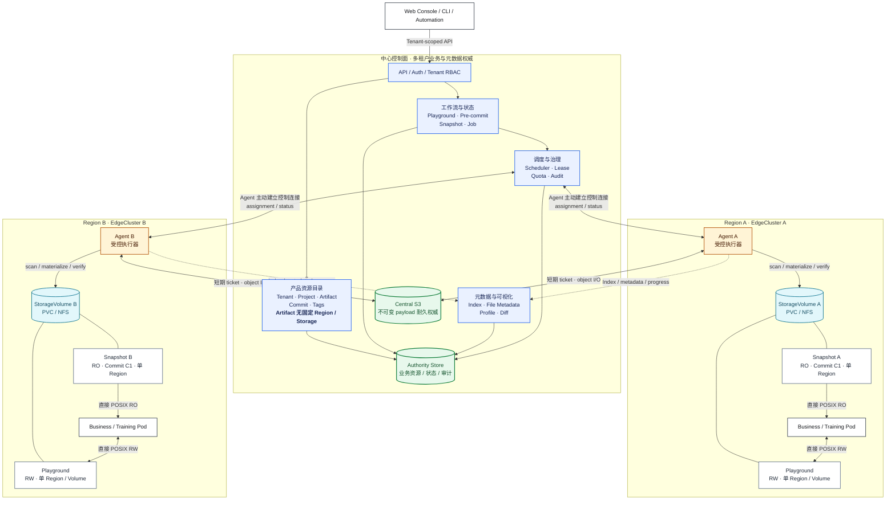

# NeoEngram 中心化 Agent 产品定义

> 状态：基于 2026-07-30 Web Mock 原型冻结第一版产品口径。
>
> 适用对象：产品、设计、前端、OpenAPI、`neoengramd`、Agent 和测试团队。
>
> 能力声明：本文描述目标产品和已经验证的交互语义。当前真正可运行的是本地 Standalone、
> 中心无网络状态机、SQLite authority，以及 MSW 驱动的静态 Web 原型。生产 HTTP、OIDC、Agent
> transport、真实 NFS/S3 和分布式调度仍未实现。

本文回答三个问题：用户在管理什么、各资源之间是什么关系、中心和 Agent 应如何支撑完整的数据
生产与交付流程。技术权威边界和实现细节见
[`agent-central-control.md`](agent-central-control.md)，能力状态和研发顺序见
[`implementation-plan.md`](implementation-plan.md)。

## 1. 产品定位

NeoEngram 是面向大规模训练数据、模型权重和其他文件型数据资产的中心化版本管理与区域交付平台。
它通过中心控制面统一管理租户、资产、版本、元数据、权限和任务，通过部署在计算节点上的 Agent
执行扫描、校验、对象传输和物化，并让业务 Pod 直接从受控存储读取或修改精确的数据视图。

一句话产品定义：

```text
在中心管理逻辑数据资产和不可变版本，在区域存储上提供可写 Playground 和只读 Snapshot，
由受控 Agent 完成元数据采集、版本发布和数据交付。
```

### 1.1 要解决的问题

- 数据散落在多个租户、区域、集群和 PVC/NFS 中，缺少统一身份和版本历史；
- 数据修改发生在计算侧，但中心需要掌握可审计的元数据、变化范围和最终发布结果；
- 训练和评测必须读取固定版本，不能因后续修改得到不可复现的数据；
- 大规模文件无法经中心 API 中转，控制面和数据面必须分离；
- 用户需要理解“这次改了什么、由谁提交、父版本是什么、数据在哪里、是否可读”，而不是理解
  Agent、Ref、fencing token 或对象目录等内部实现。

### 1.2 产品目标

- 从一个 Tenant 视角统一浏览数据资产、工作区、快照、存储和异步活动；
- 让数据生产者从 Playground 发起可解释、可取消、可重跑的 Commit；
- 让消费者为同一固定 Commit 在一个或多个区域创建各自独立、只读且可校验的 Snapshot；
- 把文件、Schema、Dataset Profile、对象摘要和变化统计变成中心可查询元数据；
- 所有创建、检查、Commit、物化、重试和失败都具备稳定身份、状态和审计记录；
- 保持 Artifact、Commit 等逻辑身份与 Agent、节点、路径和存储实现解耦。

### 1.3 非目标

- 不建设训练调度、实验管理、标注平台、特征工程或模型评测平台；
- 不把 Agent 暴露为用户直接操作的数据资源，用户不能绕过中心向 Agent 下发业务命令；
- v1 不提供 branch、merge、rebase、Ref 管理或 Git 式高级版本操作；
- v1 不负责创建 Kubernetes Pod、NAS/NFS、PV、PVC 或 CSI Volume，只登记和使用已准备好的存储；
- 不在中心 API 进程中代理大文件 payload；
- 不把 Add Job、IndexVersion、lease、fencing 或对象票据设计成普通用户的主要心智模型。

## 2. 已冻结的产品原则

| 主题            | 产品结论                                                                                                |
| --------------- | ------------------------------------------------------------------------------------------------------- |
| 中心入口        | UI、CLI 和自动化系统只调用中心，中心决定授权、调度和最终状态                                            |
| Agent 定位      | Agent 是受控执行器和观测者，不拥有 Tenant、Artifact、Commit、Playground 或 Snapshot                     |
| Artifact        | Artifact 是逻辑数据资产，不拥有单一 Region 或 StorageVolume；创建时为空或派生自一个源 Commit            |
| Commit          | 用户的普通版本发布只能从 Playground 产生；派生 Artifact 可创建无 parent、带来源血缘的初始化 root Commit |
| 版本标签        | 用户只看到 Commit ID 和 Tags；Ref 可以作为内部 CAS 实现，但不进入产品界面和用户请求                     |
| Playground      | Playground 是唯一可写数据视图，创建时必须选择一个 StorageVolume，Region 由 Volume 派生                  |
| Playground 状态 | 主状态表达 `Creating`、`Ready` 或 `Abnormal`；Pre-commit 是并列的当前操作状态                           |
| Pre-commit      | 只有用户显式发起或重新发起才扫描，不因打开页面或 Playground Ready 自动触发                              |
| Snapshot        | Snapshot 有独立 ID，固定一个 Commit 和一个 Region/StorageVolume；同一 Commit 可有多个区域 Snapshot      |
| Snapshot 状态   | 主状态表达 `Creating`、`Ready` 或 `Abnormal`；物化、校验等作为 Job/活动阶段展示                         |
| 元数据          | 中心保存权威 Index 和已发布元数据；用户可以查看文件元数据及可视化 Diff                                  |
| Job             | Job 是操作产生的异步执行记录，默认从业务动作进入，不要求用户先创建 Job                                  |
| 数据路径        | Agent 访问区域存储和短期对象票据，业务数据不经过中心 API 进程                                           |

任何实现如果让 Artifact 直接拥有一个存储位置、让一个 Snapshot 同时出现多个 Region、让用户选择
目标 Ref，或者从 Artifact 之外直接制造普通 Commit，都与本产品定义冲突。同一 Commit 在不同区域交付
时，必须创建多个各自拥有 `snapshot_id` 的 Snapshot，而不是向一个 Snapshot 添加 placements 数组。

### 2.1 总体产品架构图

下图从产品视角表达中心控制面、区域执行面和业务数据路径。浏览器版提供更完整的图例和关键流程，见
[`centralized-agent-product-architecture.html`](centralized-agent-product-architecture.html)。



图中的四类路径必须保持分离：UI/CLI 只走中心 API；Agent 通过主动建立的控制连接接收任务并上报
状态与元数据；不可变对象由 Agent 使用短期票据直接读写中心 S3；业务 Pod 直接访问本区域
StorageVolume 上的 Playground 或 Snapshot。Region 之间不建立 Agent-to-Agent 或 NFS-to-NFS 数据通道。

## 3. 用户与角色

| 角色              | 核心诉求                       | 典型权限                                                  |
| ----------------- | ------------------------------ | --------------------------------------------------------- |
| Tenant Admin      | 管理租户边界、成员、存储和策略 | 登记 StorageVolume、管理配额和保留策略、查看全部审计      |
| Data Producer     | 修改数据、检查变化并发布版本   | 创建 Playground、查看元数据、发起 Pre-commit、创建 Commit |
| Data Consumer     | 获取可复现的只读数据           | 浏览 Artifact/Commit、创建或使用 Snapshot、申请读取 Lease |
| Platform Operator | 保证 Agent、存储和任务健康     | 查看基础设施状态、重试任务、处理异常和接管流程            |
| Auditor           | 追溯版本、数据位置和操作主体   | 只读访问 Commit、Diff、Snapshot、活动和审计记录           |

同一用户可以在不同 Tenant 拥有不同角色。所有业务查询和操作都必须明确绑定一个 Tenant，上述角色
不因知道资源 ID 自动获得其他 Tenant 的访问权。

## 4. 领域模型

### 4.1 资源关系

```text
Tenant
├── Project[*]
│   └── Artifact[*]                         逻辑资产，无固定存储位置
│       ├── Commit[*]                       不可变、单 parent、可带 Tags
│       ├── Playground[*]                   可写、单 Region、单 StorageVolume
│       │   └── Pre-commit / Job[*]         当前操作与历史活动
│       └── Snapshot[*]                     独立 ID；同一 Commit 可有多个单区域只读交付
├── StorageVolume[*]                        已登记的区域存储
├── Job / Activity[*]                       租户级异步活动
└── Member / RoleBinding / AuditEvent[*]

EdgeCluster
├── StorageVolume[*]
├── ComputeNode[*]
└── AgentInstance[*]                        内部执行资源
```

### 4.2 规范术语

| 资源          | 用户理解                      | 关键字段                                                               | 可变性                         |
| ------------- | ----------------------------- | ---------------------------------------------------------------------- | ------------------------------ |
| Tenant        | 组织和安全边界                | `tenant_id`、名称、配额、策略                                          | 可配置                         |
| Project       | Artifact 的业务分组和权限范围 | `project_id`、名称                                                     | 可配置                         |
| StorageVolume | Tenant 可用的一块区域存储     | `storage_volume_id`、Region、EdgeCluster、类型、后端引用、健康状态     | 可登记、停用                   |
| Artifact      | 有版本历史的逻辑文件系统      | `artifact_id`、Project、名称、描述、初始化模式、可选来源 Commit        | 元信息可变，内容经 Commit 演进 |
| Commit        | 一次不可变发布                | `commit_id`、parent、可选 derived-from、标题、描述、Tags、创建者、时间 | 不可变                         |
| Playground    | Artifact 的可写工作区         | `playground_id`、base/head Commit、StorageVolume、Region、IndexVersion | 内容可变，放置固定             |
| Pre-commit    | Commit 前的一次检查会话       | 会话 ID、触发者、进度、候选 Index、检查和 Diff                         | 临时，可取消、可重跑           |
| Snapshot      | Commit 的单区域只读交付实例   | `snapshot_id`、fixed Commit、StorageVolume、Region、主状态、Manifest   | 内容和放置不可变               |
| Job           | 一次异步执行的权威记录        | `job_id`、类型、目标、状态、阶段、进度、错误、时间                     | 状态推进                       |
| Tag           | Commit 的人类可读标签         | 名称、Commit、创建者、时间                                             | 显式管理，不代表分支           |

Standalone 模式中的 `repository` 对应 Artifact，`workspace` 对应 Playground。产品 API、界面和新文档
统一使用 Artifact 与 Playground。

### 4.3 放置不变量

1. Artifact 是逻辑资产，创建时不选择 StorageVolume，也不在列表或概览中显示一个虚假的 Region。
2. 一个 Playground 只引用一个 StorageVolume；Region 从 StorageVolume 派生，不能由用户另填。
3. Playground 创建后不能直接更换 StorageVolume。迁移必须是显式、可恢复且可审计的流程。
4. 一个 Snapshot 只引用一个 StorageVolume 和一个 Region，不把副本列表放进同一个 Snapshot。
5. Snapshot 创建后固定 Commit、Region 和 StorageVolume；失败重试不能静默改变目标存储。
6. 同一 Commit 可以创建多个 Snapshot；每个区域/Volume 的交付都是具有独立 `snapshot_id` 的资源。
7. v1 同一 Commit 在同一 StorageVolume 上最多保留一个未删除 Snapshot；相同请求重放返回同一资源。
8. 多个 Artifact、Playground 或 Snapshot 可以在权限和根目录隔离的前提下共享一个 Tenant 的 Volume。
9. Agent、挂载路径、PVC claim、NFS export 和对象位置属于基础设施信息，不参与 Artifact 的逻辑身份。

技术层可以使用 `ArtifactPlacement` 记录某个 Artifact 在特定 EdgeCluster/Volume 上已有的受管根和
generation。它由 Playground、Snapshot、物化或迁移流程创建和维护，一个 Artifact 可以存在多个
区域的内部 placement；它不是 Artifact 的公开字段，也不要求用户在创建 Artifact 时选择唯一存储。

### 4.4 Snapshot 身份决策

Snapshot 必须拥有稳定、独立的 `snapshot_id`。它引用一个 `artifact_id + commit_id` 和一个
`storage_volume_id`，Region 由 Volume 派生。一个 Commit 可以在上海、广州等不同区域分别创建
Snapshot，每一条列表记录仍只代表一个 Region 和一个 Volume。

OpenAPI v1 使用 `tenant_id + snapshot_id` 查询独立资源；创建接口使用稳定 request identity 保证响应
丢失后的幂等重放，并通过 `replayed` 与 `placement_reused` 区分请求重放和同 Commit/Volume 去重。
同一 Commit 在另一个 Volume 上创建时产生新的 Snapshot，而不是更新已有 Snapshot 的放置。

## 5. 信息架构

Tenant 是全局上下文。用户选择 Tenant 后进入以下一级导航：

| 导航       | 主要问题                     | 核心对象                        |
| ---------- | ---------------------------- | ------------------------------- |
| 概览       | 当前租户的数据工作流是否健康 | 汇总、异常、最近活动、容量      |
| 数据资产   | 有哪些数据资产和版本         | Artifact、Commit、Tag           |
| 工作区     | 哪些数据正在被修改           | Playground、Pre-commit          |
| 快照与交付 | 哪些固定版本可被消费         | Snapshot、Region、StorageVolume |
| 活动       | 哪些异步操作正在运行或失败   | Job、阶段、错误、审计关联       |
| 存储资源   | 租户在哪些区域有可用存储     | StorageVolume、Region、健康状态 |

Agent、ComputeNode、EdgeCluster、租约和挂载可作为平台运维视图扩展，但不应混入数据生产者的主导航。

## 6. 页面产品规格

### 6.1 租户概览

概览用于发现问题和继续工作，不是营销首页。第一屏应提供：

- Artifact、Creating/Ready/Abnormal Playground、Creating/Ready/Abnormal Snapshot 和活动 Job 数；
- 按 Region 的 StorageVolume 健康与容量；
- 正在运行或失败的 Pre-commit、物化、扫描和发布任务；
- 最近 Commit、Snapshot 和审计事件；
- 可直接进入异常资源的操作入口。

### 6.2 存储资源

列表至少显示名称、StorageVolume ID、Region、EdgeCluster、后端类型、健康、容量、Owner Agent
观测和最近更新时间。登记流程选择已有基础设施并记录：

- 稳定 StorageVolume ID 和显示名称；
- EdgeCluster 与 Region；
- 类型，例如 NFS 或 Kubernetes PVC；
- NFS server/export，或 PVC namespace/claim 等后端引用；
- 能力和访问模式；
- 租户边界与可选说明。

中心只登记和验证，不在该流程中创建 PVC/NFS。Volume 不 Ready 时不能创建新的 Playground 或
Snapshot，但已有资源的中心元数据仍可查看。

### 6.3 数据资产

Artifact 列表用于按 Project、名称和 ID 查找逻辑资产。不得显示 Artifact 的单一 Region、
StorageVolume 或 Default Ref。

创建 Artifact 要求 Project、Artifact ID、名称和描述，不选择存储，并且只能选择一种初始化方式：

- **创建空 Artifact**：Artifact 初始为空且没有 Commit；首个 Playground 从空基线创建，第一次发布生成
  root Commit；
- **从 Commit 派生**：选择同一 Tenant 内有读取权限的另一个 Artifact 及其明确 Commit。中心为新
  Artifact 创建独立的 root Commit，复用已 Durable 的不可变对象，并记录
  `derived_from_artifact_id + derived_from_commit_id` 血缘；该 root Commit 在新 Artifact 内没有 parent。

派生操作不创建 Playground、Snapshot 或区域 placement，也不选择 StorageVolume。新 Artifact 后续拥有
独立版本历史；跨 Artifact 来源只作为血缘，不能成为普通 parent。Artifact 详情包含：

- **概览**：描述、当前 Commit、Tags、文件/逻辑大小汇总、元数据摘要；
- **版本**：单 parent Commit 历史、父 Commit、标题、描述、Tags、创建者、时间和 Diff 入口；
- **工作区**：该 Artifact 下的 Playground 和创建入口；
- **快照**：该 Artifact 下的 Snapshot，以及从明确 Commit 创建 Snapshot 的入口。

“当前 Commit”是产品层的便捷指针，不向用户暴露 Ref 名称。第一版不提供分支选择和 Ref 管理。

### 6.4 工作区

Playground 列表显示 Artifact、Region、StorageVolume、主可用性、当前操作和更新时间。创建入口位于
Artifact 详情，用户必须选择：

- Playground ID、名称和说明；
- 一个 Ready 且有权限的 StorageVolume；
- 可选当前 Artifact 内的 base Commit。空 Artifact 未选择时从空内容创建；不能把其他 Artifact 的 Commit
  直接作为 Playground base，跨 Artifact 初始化必须走“从 Commit 派生 Artifact”。

Playground 详情是数据生产主工作台，包含：

- **变化**：当前中心 Index 与 Head Commit 的文件 Diff；
- **文件**：中心 Index 文件清单和路径搜索；
- **元数据**：Dataset Profile、Schema、格式、对象和质量摘要；
- **活动**：扫描、Pre-commit、Commit、恢复和异常记录；
- 文件级元数据抽屉：大小、digest、对象分布、Schema Diff、来源和最近扫描时间；
- 顶部主动作：`发起 Pre-commit` 或 `查看 Pre-commit`。

Playground 页面不能直接出现一个绕过检查的“Commit”按钮。

### 6.5 Pre-commit 与 Commit

Pre-commit 页面只承担 Commit 前检查，不扩展成长期工作流设计器。检测完成后同页展示变化摘要、
文件 Diff、元数据变化、阻断项和警告，然后通过弹窗填写 Commit 信息。

Commit 弹窗至少包含：

- Parent Commit 的完整 ID、标题、Tags、创建时间和创建者；
- 候选 IndexVersion 和变化文件/字节摘要；
- 必填 Commit 标题；
- 可选详细描述；
- 可选 Tags；
- expected Head 和 IndexVersion 冲突提示。

Commit 成功页提供返回 Playground、查看版本历史和为该 Commit 创建 Snapshot 的入口。

### 6.6 快照与交付

Snapshot 必须从一个明确 Commit 发起并生成独立 `snapshot_id`。用户选择一个 StorageVolume，Region
自动显示且不可独立修改。同一 Commit 可以重复选择其他区域的 Volume，创建多个彼此独立的 Snapshot。
创建流程分为：

1. 确认固定 Commit、用途、保留策略和 Dataset Profile；
2. 单选 Snapshot 所在 Region/StorageVolume；
3. 查看该单一区域的物化、完整性校验和 Ready 状态。

Snapshot 列表的每一行只代表一个区域交付，显示 Snapshot ID、Artifact、Commit、Tags、唯一 Region、
唯一 StorageVolume、主状态、逻辑大小和创建时间。同一 Commit 的上海和广州 Snapshot 必须显示为两行，
不能合并成一行多区域记录。
Snapshot 详情包含：

- Snapshot ID、主状态、当前阶段、文件数、逻辑大小、所在 Region 和创建时间；
- 固定 Commit、Tags、父 Commit，以及跳转 Commit Diff；
- 唯一 StorageVolume、物化方式、完整性和最近校验时间；
- Manifest digest、对象数、访问模式、保留策略和 Dataset Profile；
- 可搜索的只读文件清单；
- 创建、物化、校验、重试和 Ready 活动，以及为相同 Commit 创建其他区域 Snapshot 的入口。

详情页不得把跨区域副本显示成同一 Snapshot 的第二个 Region。

### 6.7 活动

活动页是所有异步业务操作的统一观测入口，按 Tenant、资源、Job 类型、状态和时间筛选。每条活动
至少能够回答：谁在何时对哪个资源发起了什么、当前到哪一步、是否可重试、最终改变了什么。

`Add Job` 是 Agent 扫描并发布 IndexDelta 的内部任务类型。普通用户应从 Playground 的“扫描变化”
或 Pre-commit 动作进入；独立“创建 Add Job”页面只作为开发或高级运维入口，不进入默认导航。

## 7. 关键用户流程

### 7.1 首次配置

```text
创建/选择 Tenant
  -> 登记一个或多个区域 StorageVolume
  -> 确认 Volume Ready
  -> 创建 Project
  -> 创建空 Artifact，或从另一个 Artifact 的明确 Commit 派生
  -> 从 Artifact 创建 Playground 并选择一个 Volume
```

Artifact 创建不依赖存储。空 Artifact 没有初始 Commit；派生 Artifact 获得记录来源血缘的独立 root
Commit。只有需要可写或只读文件视图时才选择 Volume。

### 7.2 数据修改与 Commit

```text
业务 Pod/工具修改 Playground 文件
  -> Playground 展示中心最近一次观测的变化和元数据
  -> 发起 Pre-commit
  -> Agent 执行新一轮扫描并上报元数据候选
  -> 中心生成候选 IndexVersion，执行摘要和一致性检查
  -> 展示 Index 与 Parent Commit 的 Diff
  -> 填写标题、描述和 Tags
  -> 中心复核 expected Head + IndexVersion
  -> 创建不可变 Commit
  -> Playground 回到 Ready/空闲，Head Commit 更新
```

用户发布普通 Commit 只能从 Playground 发起。派生 Artifact 时由中心创建的无 parent root Commit 是初始化
结果，不是绕过 Pre-commit 的普通发布入口。Artifact 详情可以展示 Commit，也可以从 Commit 创建
Playground、Snapshot 或派生 Artifact，但不能直接编辑内容并 Commit。

### 7.3 Pre-commit 触发、重跑与取消

- 用户点击 `发起 Pre-commit` 时创建新的检查会话并触发扫描；
- 用户点击 `重新检测` 时废弃旧候选并创建新的会话身份；
- 用户点击 `取消 Pre-commit` 时停止后续检查，丢弃未发布候选，Playground 保持 Ready；
- 页面刷新或重新进入只恢复当前会话，不自动创建新扫描；
- 扫描失败不会把 Playground 主状态改成 Scanning，只把当前操作标记为 Failed；
- Commit 成功或取消后清除当前操作，历史仍进入活动和审计。

### 7.4 Snapshot 交付

```text
选择 Commit
  -> 确认用途/保留策略/Profile
  -> 单选一个 Ready StorageVolume
  -> 创建 Snapshot 资源
  -> Agent 在该 Region 物化缺失对象
  -> 校验 Manifest、对象和只读视图
  -> Snapshot Ready
  -> 业务 Pod 通过只读挂载或读取 Lease 消费
  -> 可为同一 Commit 选择其他区域 Volume，再创建独立 Snapshot
```

Snapshot 创建失败后资源进入 Abnormal，可以对同一 Snapshot 幂等重试。重试不得换 Region 或 Volume；
需要其他放置时应创建新的 Snapshot。删除某一区域 Snapshot 不影响同一 Commit 的其他区域 Snapshot，
也不影响 Commit 本身。

## 8. 状态模型

### 8.1 Playground 主状态与当前操作

Playground 使用两个正交字段，避免把资源可用性和临时任务混在一个枚举里。

| 维度     | 状态         | 含义                                                | 允许行为                          |
| -------- | ------------ | --------------------------------------------------- | --------------------------------- |
| 主可用性 | `Creating`   | 中心已接受资源，正在初始化目标 Volume 上的工作目录  | 查看创建进度、取消或重试创建任务  |
| 主可用性 | `Ready`      | Storage、Agent、Mount 和中心 Index 满足当前操作条件 | 浏览、扫描、发起 Pre-commit       |
| 主可用性 | `Abnormal`   | 至少一个基础条件不可用或观测过期                    | 查看元数据和活动；禁止新 mutation |
| 当前操作 | `Idle`       | 没有运行中的前台操作                                | 可发起 Pre-commit                 |
| 当前操作 | `Pre-commit` | 检查会话正在运行或等待确认                          | 查看进度、重跑、取消              |
| 当前操作 | `Mutation`   | 正在执行受控恢复、checkout 等任务                   | 查看进度；按任务策略取消          |

创建任务成功后 Playground 从 `Creating` 进入 `Ready`；创建或基础设施校验失败进入 `Abnormal`，重试时
回到 `Creating`。`Scanning` 不是 Playground 主状态。只有显式扫描/Pre-commit Job 才具有 scanning phase。

### 8.2 Pre-commit 状态

| 状态        | 页面行为                         | 可用动作                         |
| ----------- | -------------------------------- | -------------------------------- |
| `Scanning`  | 显示文件进度和当前阶段           | 取消、重新检测                   |
| `Checking`  | 显示摘要、元数据和一致性检查进度 | 取消、重新检测                   |
| `DiffReady` | 展示 Diff、阻断项和警告          | 填写 Commit 信息、重新检测、取消 |
| `Blocked`   | 展示阻断原因，不允许 Commit      | 重新检测、取消                   |
| `Failed`    | 展示稳定错误码和可重试性         | 重试、取消                       |
| `Cancelled` | 返回 Playground，历史保留        | 再次发起                         |
| `Committed` | 展示新 Commit                    | 查看历史、创建 Snapshot          |

原型可以快速推进状态，但真实 API 必须提供稳定会话 ID、阶段、进度、候选 IndexVersion 和错误结构。

### 8.3 Snapshot 主状态与当前阶段

| 维度     | 状态            | 含义                                              | 可用动作                   |
| -------- | --------------- | ------------------------------------------------- | -------------------------- |
| 主可用性 | `Creating`      | Snapshot 已有稳定 ID，区域只读视图尚未通过校验    | 查看阶段、取消或等待       |
| 主可用性 | `Ready`         | 单一区域只读视图已完整物化并通过校验              | 浏览文件、申请 Lease、挂载 |
| 主可用性 | `Abnormal`      | 创建、物化、校验、Storage 或 Agent 条件发生异常   | 查看错误、幂等重试、删除   |
| 当前阶段 | `Planning`      | 中心正在固定 Commit、Manifest、目标 Volume 和 Job | 查看活动                   |
| 当前阶段 | `Materializing` | Agent 正在目标 Volume 物化缺失对象                | 查看进度                   |
| 当前阶段 | `Verifying`     | 正在校验 Manifest、对象和只读视图                 | 查看校验进度               |
| 当前阶段 | `Idle`          | 当前没有执行中的交付或恢复任务                    | 按主状态提供操作           |
| 当前阶段 | `Deleting`      | 正在撤销该 Snapshot 的视图、Lease 和保留关系      | 只读查看活动               |

创建流程成功时主状态从 `Creating` 进入 `Ready`；Job 失败时 Job 为 `Failed`，Snapshot 主状态进入
`Abnormal`；重试时同一 `snapshot_id` 回到 `Creating`。Snapshot 状态不改变 Commit 或同一 Commit 下
其他区域 Snapshot 的有效性。Dataset Profile 也应有独立状态，Profile Rejected 不等同于 Snapshot 文件损坏。

### 8.4 Job 状态

Job 对外至少统一为 `Queued -> Assigned -> Running -> Succeeded/Failed/Cancelled`，内部阶段可按
Add、Pre-commit、Commit、Materialize 和 Verify 细分。资源页面展示业务语言，活动详情再展示 Job
阶段、Agent、重试和诊断信息。

## 9. 元数据与 Diff

### 9.1 中心元数据分层

| 层级             | 主要内容                                                            | 展示位置                   |
| ---------------- | ------------------------------------------------------------------- | -------------------------- |
| Artifact         | 当前 Commit、版本数、文件/大小汇总、Profile 摘要                    | Artifact 概览              |
| Commit           | parent、标题、描述、Tags、作者、时间、内容摘要                      | 版本详情                   |
| Playground Index | 文件路径、格式、大小、digest、对象数、扫描时间                      | Playground 文件/变化       |
| Dataset Profile  | Schema、source、分片参数、质量规则和验证状态                        | Playground/Snapshot 元数据 |
| Snapshot         | Snapshot ID、fixed Commit、Manifest、Region、Volume、主状态、完整性 | Snapshot 详情              |
| Job/Audit        | 主体、动作、资源、阶段、错误、request/trace ID                      | 活动与审计                 |

元数据必须标注来源、对应 IndexVersion/Commit 和观测时间。Agent 观测过期时继续展示最近数据，但明确
标记 stale，不能伪装成当前状态。

### 9.2 Diff 类型

- Playground Diff：当前 IndexVersion 与 Head/Parent Commit；
- Commit Diff：目标 Commit 与其唯一 parent，根 Commit 与空基线；
- 可选比较 Diff：两个明确 Commit，由高级入口发起，不改变默认 parent 语义；
- Metadata Diff：Schema、字段类型、分区、Profile 和对象分布变化。

默认 Diff 必须展示新增、修改、删除、重命名文件数，增减字节、对象复用率和代表路径。文件详情可以
进一步展示 before/after 元数据，但不能未经授权暴露物理对象路径、签名 URL 或其他租户信息。

## 10. 一致性、幂等与冲突体验

- 所有 mutation 使用稳定 request identity，响应丢失后相同请求返回同一结果；
- Playground Commit 必须同时校验 expected IndexVersion 和 expected Head；
- 冲突时不自动覆盖，页面保留用户填写的 Commit 信息并引导重新检测；
- Commit 一旦创建不可修改；描述和 Tags 是否允许后置管理需要独立权限和审计策略；
- Snapshot 的 fixed Commit、Region 和 StorageVolume 一旦创建不可修改；
- Agent 失联只把状态变为 Unknown/Abnormal，不能直接推断任务失败并在其他节点重复执行 mutation；
- 所有时间线必须来自权威事件，不用浏览器本地计时推导最终状态。

## 11. 权限、审计与可观测性

### 11.1 最小权限动作

建议至少拆分：`artifact.read/create/update`、`commit.read/create`、`playground.read/create/mutate`、
`snapshot.read/create/delete`、`storage.read/register/admin`、`job.read/retry/cancel`、`metadata.read` 和
`audit.read`。从 Commit 派生 Artifact 同时要求目标范围的 `artifact.create` 和源 Commit 的读取权限；
创建 Snapshot 同时要求读取目标 Commit 和使用目标 StorageVolume 的权限。

### 11.2 审计事件

至少记录 Tenant 切换以外的所有 mutation，以及敏感读取和授权结果：

- StorageVolume 登记、停用和 Owner 变化；
- Artifact、Playground、Pre-commit、Commit、Tag 和 Snapshot 创建；
- Pre-commit/Job 重跑、取消和失败；
- Snapshot Lease、挂载关系、保留和删除；
- 权限拒绝、跨租户隐藏和管理员操作。

事件至少关联 `tenant_id`、主体、资源 scope、`request_id`、`trace_id`、`job_id`、Agent/assignment
身份、结果、错误码和时间。不得记录 JWT、Signed URL、凭证、数据内容或物理绝对路径。

### 11.3 产品指标

- Time to First Playground；
- Pre-commit P50/P95 时长、取消率、重跑率和阻断率；
- Commit 成功率、CAS 冲突率和幂等重放率；
- Snapshot Time to Ready、物化吞吐、对象复用率和校验失败率；
- Playground 元数据新鲜度和 Abnormal 持续时间；
- StorageVolume 容量、健康和 Owner 切换次数；
- 从失败活动进入正确资源并完成恢复的比例。

## 12. 当前原型覆盖

| 产品能力                          | Web Mock 状态 | 备注                                                           |
| --------------------------------- | ------------- | -------------------------------------------------------------- |
| Tenant 切换与创建                 | 已交互验证    | MSW 假数据，无生产 OIDC/RBAC                                   |
| StorageVolume 登记与区域展示      | 已交互验证    | PVC/NFS 不真实创建或探测                                       |
| Artifact 创建与详情               | 已交互验证    | 支持空 Artifact 和从同 Tenant 明确 Commit 派生，并展示来源血缘 |
| Playground 创建和详情             | 已交互验证    | 单 Volume，覆盖 Creating/Ready/Abnormal 与元数据假数据         |
| Pre-commit                        | 已交互验证    | 支持恢复、重跑、取消和检测后 Commit；状态存在浏览器原型层      |
| Commit 描述、Tags、parent 和 Diff | 已交互验证    | 文件和元数据可视化大部分是静态数据                             |
| Snapshot 单区域交付               | 已交互验证    | 独立 Snapshot ID；同一 Commit 可在多个区域各有一个 Snapshot    |
| Snapshot 文件和活动详情           | 已交互验证    | 三种主状态、阶段、Manifest、完整性和活动均为原型假数据         |
| Managed Add Job                   | 已交互验证    | 对应中心/Agent 内存状态机，无真实 transport                    |
| 桌面与移动端                      | 已 E2E 验证   | 仍需真实 API 的加载量、分页和错误测试                          |

原型是产品需求的可执行说明，不是后端已经完成的证据。任何静态数量、时间、digest、文件路径和
Agent 名称都只能作为展示样例。

## 13. OpenAPI 对齐清单

OpenAPI v1 现提供 34 个认证业务方法，并已覆盖 Tenant、StorageVolume、Project、Artifact、Commit
graph/diff、Playground、Pre-commit、分页元数据、Snapshot 交付和 Managed Add Job。

### P0：公开契约已对齐

1. Artifact 已去除 placement 与 Default Ref，使用 `initialization` discriminator 表达空创建或同 Tenant
   明确 Commit 派生，并返回逻辑血缘与可选 head Commit。
2. 公开 Commit graph/node 只提供 head Commit、父 Commit 和 `tag_names`；正式 Commit 消费 Ready
   Pre-commit 与候选 IndexVersion。
3. Pre-commit 已提供 start/query/restart/cancel 以及 attempt、阶段、进度、checks、warnings、blockers
   和冻结 Diff 摘要。
4. Playground 已提供文件、变化、文件元数据和 Dataset Profile 的拆分页查询。
5. Snapshot 已使用独立 ID、单 Region/Volume 状态模型，并提供创建去重、交付重试、Ready 文件清单、
   完整性、活动和 Dataset Profile。

这些条目表示公开契约和 Web Mock 已对齐，不表示 Rust HTTP 服务、Agent transport 或生产数据面已经实现。

### P1：完整运营闭环

1. StorageVolume health/capacity/capability、更新、停用和详情；
2. Playground 删除、恢复、迁移、扫描和 mutation Job；
3. Snapshot 删除、保留策略、Lease 和挂载关系；
4. Tag 创建/删除策略、Artifact 元信息更新/归档；
5. Job list、retry、cancel、阶段事件和诊断；
6. Audit list/detail、Project 管理、成员和 RoleBinding；
7. Dashboard 汇总与异常查询，避免前端拉取全部列表计算。

所有新接口继续使用 Tenant-scoped body、版本 header、稳定 request identity、结构化 Problem Details、
分页上限和幂等语义。前端不得为了原型兼容而手写 OpenAPI 之外的生产字段。

## 14. 产品验收场景

### 14.1 主链路

1. Tenant Admin 登记上海和广州两个 Volume；
2. Data Producer 创建不带存储位置的空 Artifact；
3. Producer 选择上海 Volume 创建 Playground；
4. Agent 扫描后，中心展示文件、Schema 和当前 Commit 的 Diff；
5. Producer 发起 Pre-commit，取消一次，再重新检测；
6. 检测完成后填写标题、描述和 Tags，创建单 parent Commit；
7. Consumer 从该 Commit 选择上海 Volume 创建 Snapshot A，再选择广州 Volume 创建 Snapshot B；
8. Snapshot 列表显示两行独立 Snapshot ID，每行只有自己的 Region/Volume，并分别从 Creating 推进到 Ready；
9. Consumer 用该 Commit 派生一个新 Artifact；新 Artifact 无固定 Region，拥有独立 root Commit 和来源血缘；
10. Auditor 能从任一 Snapshot 追溯 Commit、parent、Tags、Diff、来源 Playground、Job 和操作主体。

### 14.2 必须覆盖的异常

- Volume 不 Ready 时禁止创建 Playground/Snapshot，但仍可浏览中心元数据；
- Pre-commit 期间 Agent 失联，状态可恢复且不会产生重复 Commit；
- Pre-commit 取消后 Playground 保持 Ready，旧候选不能被提交；
- Commit 前 IndexVersion 或 Head 变化，返回冲突且不覆盖；
- Snapshot 创建响应丢失，相同 request identity 重放返回同一 `snapshot_id`；
- 同一 Commit 选择另一个 Volume 时创建新的 Snapshot，不修改已有 Snapshot 的 Region/Volume；
- 同一 Commit 和 Volume 的重复主动创建返回已有未删除 Snapshot，避免重复物化；
- Snapshot 校验失败时主状态进入 Abnormal，不把资源标记 Ready，也不影响其他区域 Snapshot；
- Playground 创建失败时进入 Abnormal，重试期间回到 Creating；
- 用户不能通过 URL 或 ID 读取其他 Tenant 的资源存在性；
- 桌面和移动端的长路径、Commit ID、Tag 和错误信息不溢出。

## 15. 产品交付顺序

产品纵切应与 [`ROADMAP.md`](ROADMAP.md) 的技术迭代配合，按以下体验顺序验收：

1. **契约对齐**：先冻结本文的资源、放置、状态和身份语义，再修改 OpenAPI 和生成类型；
2. **只读浏览**：接入真实 Tenant、Storage、Artifact、Commit、Diff、Playground、Snapshot 查询；
3. **存储与工作区**：完成 StorageVolume 登记、空/派生 Artifact 创建、Playground 创建和真实元数据浏览；
4. **发布闭环**：完成 Pre-commit、Commit 描述/Tags、parent Diff、冲突和审计；
5. **交付闭环**：完成独立 Snapshot ID、同 Commit 多区域 Snapshot、单区域物化、校验、读取和失败恢复；
6. **运营闭环**：完成 Job、审计、权限、配额、保留、删除、可观测性和灾备。

每个纵切都必须同时具备权限、租户隔离、幂等、重启恢复、错误状态、桌面/移动端 E2E 和审计证据，
不能只以页面可点击作为完成条件。

## 16. 尚待产品决策

1. Snapshot 用途和保留策略创建后是否可修改，修改是否改变审计或计费身份？
2. Tag 是否租户/Artifact 内唯一，移动和删除 Tag 需要什么权限与审计？
3. 用户 Pod 是否允许 RW 挂载 Playground；若允许，外部写与受管 mutation 如何协调？
4. 第一批支持的 PVC/NFS 产品、能力探测和强 fencing 等级是什么？
5. Dataset Profile 的最小规范和元数据可视化哪些进入 v1，哪些后置？
6. Project、成员和权限管理由 NeoEngram 提供页面，还是接入现有企业平台？
7. 派生 Artifact 是否需要支持跨 Tenant 授权复制；若支持，对象去重、计费和来源可见性如何隔离？

这些问题不会改变已经冻结的核心语义：Artifact 无固定放置且只能为空或从明确 Commit 派生、普通
Commit 从 Playground 发布、同一 Commit 可有多个独立 Snapshot、每个 Snapshot 仍为单 Region、Agent
不拥有业务资源、用户界面不出现 Ref。
