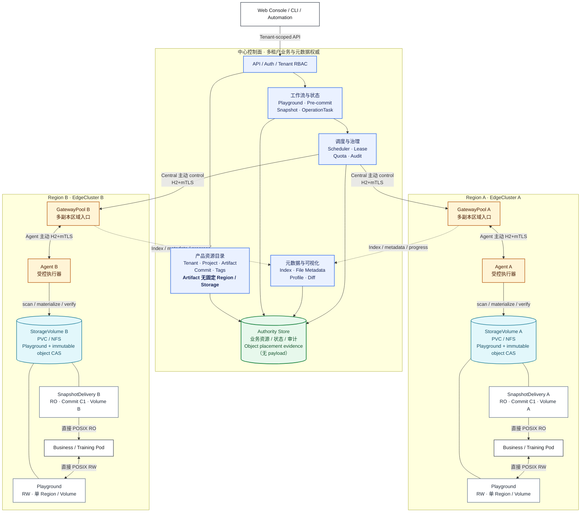

# NeoEngram 中心化 Agent 产品定义

> 状态：目标产品语义；2026-08-24 已按源码、action registry、OpenAPI 和 Web 实现校准资源边界。
> 公开契约是 P0 Web 的字段权威，Central 是否真正安装 handler 还要以
> [`current-state.md`](current-state.md) 和 `routed_by_central` 为准。
>
> 适用对象：产品、设计、前端、OpenAPI、`neoengram-central`、Agent 和测试团队。
>
> 能力声明：本文同时描述目标体验和已经冻结的产品语义。当前实现基线、运行配置开关以及“只有
> OpenAPI/Mock、尚无 Central handler”的接口必须先看 [`current-state.md`](current-state.md)。
> 特别是 Snapshot 创建时会绑定一个目标 EdgeCluster/StorageVolume 和交付模式，并原子创建唯一的
> SnapshotDelivery；Snapshot 只有在该 Delivery 完成并进入 `Ready` 后才可读取或启用 S3。

本文回答三个问题：用户在管理什么、各资源之间是什么关系、中心和 Agent 应如何支撑完整的数据
生产与交付流程。技术权威边界和实现细节见
[`architecture/control-plane.md`](architecture/control-plane.md)，能力状态和研发顺序见
[`roadmap.md`](roadmap.md)。Gateway 的专项权威边界见
[`architecture/gateway.md`](architecture/gateway.md)。

## 0. 实现校准

本文的目标体验必须服从以下已经由代码和契约冻结的边界：

- `Snapshot` 固定 `artifact_id + commit_id`，创建请求同时选择目标 EdgeCluster、StorageVolume 和
  `fuse/copy/hardlink` 模式；Central 原子创建 Snapshot 与唯一 Delivery，Snapshot 初始为 `Creating`；
- `SnapshotDelivery` 是该 Snapshot 唯一的物理只读投影，要求目标 Volume 已有可用 Commit 对象，并独立经历
  `Requested -> Validating/Materializing -> Ready` 或失败状态；Delivery `Ready` 后 Snapshot 才进入 `Ready`；
- 一个 Snapshot 只能有一个 Delivery；目标区域、Volume 和模式在创建时确定，失败只能重试同一 Delivery，不能
  通过创建第二个 Delivery 切换目标；
- Snapshot 文件、活动和 Dataset Profile 三个公开路径目前保留在 action registry/OpenAPI 作为契约-only
  Web surface，尚无 Central controller，不能写成真实后端能力；
- Web Mock 证明页面交互和 DTO 形状，不证明真实 Agent、Gateway 或存储执行链已经完成。

## 1. 产品定位

NeoEngram 是面向大规模训练数据、模型权重和其他文件型数据资产的中心化版本管理与区域交付平台。
它通过中心控制面统一管理租户、资产、版本、元数据、权限和任务，通过与区域 StorageVolume 常驻
绑定的 Agent 执行扫描、校验、对象传输和物化，并让业务 Pod 直接从受控存储读取或修改精确的数据
视图。

一句话产品定义：

```text
在中心管理逻辑数据资产和不可变版本，在区域存储上提供可写 Playground 和只读 Snapshot，
由受控 Agent 完成元数据采集、版本发布和数据交付。
```

### 1.1 要解决的问题

- 数据散落在多个租户、区域、集群和 PVC/NFS 中，缺少统一身份和版本历史；
- 数据修改发生在计算侧，但中心需要掌握可审计的元数据、变化范围和最终发布结果；
- 训练和评测必须读取固定版本，不能因后续修改得到不可复现的数据；
- 大规模文件无法经中心 API 中转，控制面和数据面必须分离；
- 用户需要理解“这次改了什么、由谁提交、父版本是什么、数据在哪里、是否可读”，而不是理解
  Agent、Ref、fencing token 或对象目录等内部实现。

### 1.2 产品目标

- 从一个 Tenant 视角统一浏览数据资产、工作区、快照和存储；
- 让数据生产者从 Playground 发起可解释、可取消、可重跑的 Commit；
- 让消费者为固定 Commit 在选定区域创建 Snapshot，并由系统为其建立唯一、只读且可校验的 SnapshotDelivery；
- 把逻辑文件、Schema、Dataset Profile、质量和变化统计变成中心可查询元数据；
- 所有创建、检查、Commit、物化、重试和失败都具备稳定身份、状态和审计记录；
- 保持 Artifact、Commit 等逻辑身份与 Agent、节点、路径和存储实现解耦。

### 1.3 非目标

- 不建设训练调度、实验管理、标注平台、特征工程或模型评测平台；
- 不把 Agent 暴露为用户直接操作的数据资源，用户不能绕过中心向 Agent 下发业务命令；
- v1 不提供 branch、merge、rebase、Ref 管理或 Git 式高级版本操作；
- v1 不负责创建 Kubernetes Pod、NAS/NFS、PV、PVC 或 CSI Volume，只登记和使用已准备好的存储；
- 不在中心 API 进程中代理大文件 payload；
- 不把 Add Job、IndexVersion、lease、fencing 或对象票据设计成普通用户的主要心智模型。

## 2. 已冻结的产品原则

| 主题            | 产品结论                                                                                                |
| --------------- | ------------------------------------------------------------------------------------------------------- |
| 中心入口        | UI、CLI 和自动化系统只调用中心，中心决定授权、调度和最终状态                                            |
| Agent 定位      | Agent 是受控执行器和观测者，不拥有 Tenant、Artifact、Commit、Playground 或 Snapshot                     |
| Artifact        | Artifact 是逻辑数据资产，不拥有单一 Region 或 StorageVolume；产品目标支持空创建或从源 Commit 派生，当前 Central 仅实现空创建 |
| Commit          | 用户的普通版本发布只能从 Playground 产生；派生 Artifact 的无 parent、带来源血缘 root Commit 是目标能力，当前尚未实现 |
| 版本标签        | 用户只看到 Commit ID 和 Tags；Ref 可以作为内部 CAS 实现，但不进入产品界面和用户请求                     |
| Playground      | Playground 是唯一可写数据视图，创建时必须选择一个 StorageVolume，Region 由 Volume 派生                  |
| Playground 状态 | 主状态表达 `Creating`、`Ready` 或 `Abnormal`；Pre-commit 是并列的当前操作状态                           |
| Pre-commit      | 只有用户显式发起才创建会话；失败重试复用会话 ID 并递增 attempt，打开页面绝不自动触发                    |
| Snapshot        | Snapshot 有独立 ID，固定一个 Commit 及一个目标 EdgeCluster/StorageVolume/交付模式；物理读取视图由唯一 SnapshotDelivery 管理 |
| SnapshotDelivery | Snapshot 的唯一物理只读投影；固定一个目标 StorageVolume 和一种交付模式，可异步物化、校验、重试和删除 |
| Snapshot 状态   | 聚合状态表达 `Creating`、`Ready` 或 `Abnormal`；Delivery `Ready` 后 Snapshot 才 `Ready`，物化和校验属于 Delivery 阶段 |
| 元数据          | 中心保存权威 Index 和已发布元数据；用户可以查看文件元数据及可视化 Diff                                  |
| OperationTask   | 所有写操作产生统一任务；即时操作也记录 `queued -> running -> succeeded`，领域明细仍留在各自表中         |
| 数据路径        | Agent 直接读写获批 StorageVolume 中的 Playground 和对象 CAS，Chunk 不经过中心 API 进程                         |
| Agent 放置      | 0.0.1 Kubernetes 部署中一个业务 PVC 对应一个 StorageVolume 和一个常驻 AgentInstance                    |
| 区域入口        | 每个 EdgeCluster 一个多副本 GatewayPool；Central 主动连接 Gateway，Agent 只连接本集群 Gateway          |
| Agent 接入      | Agent 经本集群 Gateway 主动出站注册；首次接入必须经 TenantAdmin 审批，审批前不能成为 Volume Owner 或领取 Job |
| Gateway 边界    | Gateway 不挂载 Volume、不保存 metadata/object 权威；所有 Volume I/O 仍由 Owner Agent 执行               |
| S3 暴露         | Gateway/Central 已有 `SnapshotDelivery=Ready` 的固定 Commit/Snapshot 只读 Access Point 代码与契约；生产凭据、Gateway readiness、Agent route 和真实 E2E 仍受能力开关约束；Bucket 不等于 Volume/CAS，首版不支持写入 |

任何实现如果让 Artifact 直接拥有一个存储位置、让 Snapshot 在创建后修改目标 Volume/Region、让用户选择
目标 Ref，或者从 Artifact 之外直接制造普通 Commit，都与本产品定义冲突。每个 Snapshot 创建时必须确定
一个目标 Delivery；需要其他区域时应为同一 Commit 创建新的 Snapshot，而不是给已有 Snapshot 追加 Delivery。

### 2.1 总体产品架构图

下图从产品视角表达中心控制面、区域执行面和业务数据路径。交互式 HTML 原型已从主文档树移除；当前
产品状态以本文和实际 [`apps/neoengram-web`](../apps/neoengram-web) 实现为准。



图中的路径必须保持分离：UI/CLI 只走中心 API；Central 主动连接区域 GatewayPool，Agent 只主动连接
本集群 Gateway，并通过该链路接收任务、上报状态和元数据；不可变对象由 Agent 写入用户
StorageVolume 上 tenant/artifact 隔离的 CAS；业务 Pod 直接访问本区域 StorageVolume 上的 Playground
或 SnapshotDelivery。Gateway Registry、管理面、Replica activation、H2/mTLS、命令签名和一跳 forwarding 已进入
G1；双 Replica listener/H2/peer harness 和真实 Registry RouteLease 接管契约已分别通过，但完整业务
E2E、外部生产 issuer/KMS-HSM、真实集群故障/就绪与切换尚未完成，控制面仍按失败关闭策略运行；旧
Agent 直连 Server 已删除。后续跨
区域复制固定经源 Agent -> 源 Gateway -> 目标 Gateway -> 目标 Agent，不得经过中心 API 代理 payload。

## 3. 用户与角色

| 角色              | 核心诉求                       | 典型权限                                                  |
| ----------------- | ------------------------------ | --------------------------------------------------------- |
| Tenant Admin      | 管理租户边界和存储             | 登记和查看 StorageVolume；配额、保留策略和完整审计属于 P1 |
| Data Producer     | 修改数据、检查变化并发布版本   | 创建 Playground、查看元数据、发起 Pre-commit、创建 Commit |
| Data Consumer     | 获取可复现的只读数据           | 浏览 Artifact/Commit，创建 Snapshot 并查看逻辑文件与元数据 |
| Platform Operator | 保证 Agent、存储和任务健康     | 查看基础设施状态、重试任务、处理异常和接管流程            |
| Auditor           | 追溯版本和公开交付活动         | 只读访问 Commit、Diff、Snapshot 和 Snapshot 活动；审计为 P1 |

同一用户可以在不同 Tenant 拥有不同角色。所有业务查询和操作都必须明确绑定一个 Tenant，上述角色
不因知道资源 ID 自动获得其他 Tenant 的访问权。

## 4. 领域模型

### 4.1 资源关系

```text
Tenant
├── Project[*]
│   └── Artifact[*]                         逻辑资产，无固定存储位置
│       ├── Commit[*]                       不可变、单 parent、可带 Tags
│       ├── Playground[*]                   可写、单 Region、单 StorageVolume
│       │   └── Pre-commit / OperationTask[*] 当前操作与历史活动
│       └── Snapshot[*]                     独立 ID；固定 Commit + 一个目标 Volume/模式
│           └── SnapshotDelivery[1]         唯一目标 Volume + 模式 + 物化状态
├── StorageVolume[*]                        已登记的区域存储
├── OperationTask / Activity[*]             租户级写操作与审计活动
└── Member / RoleBinding / AuditEvent[*]

EdgeCluster
├── GatewayPool[1] ── GatewayReplica[*]          区域控制和后续数据/S3 入口
├── StorageVolume[*] ── AgentInstance[1]         0.0.1：一个业务 PVC/Volume 一个常驻 Agent
├── ComputeNode[*]
└── Pod / Node[*]                              只表示基础设施运行位置
```

### 4.2 规范术语

| 资源          | 用户理解                      | 关键字段                                                               | 可变性                         |
| ------------- | ----------------------------- | ---------------------------------------------------------------------- | ------------------------------ |
| Tenant        | 组织和安全边界                | `tenant_id`、名称、配额、策略                                          | 可配置                         |
| Project       | Artifact 的业务分组和权限范围 | `project_id`、名称                                                     | 可配置                         |
| StorageVolume | Tenant 可用的一块区域存储     | `storage_volume_id`、Region、EdgeCluster、类型、后端引用、健康状态     | 可登记、停用                   |
| Artifact      | 有版本历史的逻辑文件系统      | `artifact_id`、Project、名称、描述、初始化模式、可选来源 Commit        | 元信息可变，内容经 Commit 演进 |
| Commit        | 一次不可变发布                | `commit_id`、parent、可选 derived-from、标题、描述、Tags、创建者、时间 | 不可变                         |
| Playground    | Artifact 的可写工作区         | `playground_id`、base/head Commit、StorageVolume、Region、IndexVersion | 内容可变，放置固定             |
| Pre-commit    | Commit 前的一次检查会话       | 会话 ID、触发者、进度、候选 Index、检查和 Diff                         | 临时，可取消、可重跑           |
| Snapshot      | Commit 的只读交付聚合          | `snapshot_id`、fixed Commit、目标 EdgeCluster/StorageVolume/模式、主状态、完整性摘要 | Commit 与目标绑定不可变；状态由 Delivery 驱动 |
| SnapshotDelivery | Snapshot 的唯一物理只读交付 | `delivery_id`、Snapshot、StorageVolume、模式、物化状态、完整性摘要      | 目标和模式固定；状态可推进       |
| OperationTask | 一次写操作的统一生命周期与审计记录 | `task_id`、类型、scope、状态、Attempt、进度、错误、主体和时间      | 状态推进；事件追加写入         |
| Tag           | Commit 的人类可读标签         | 名称、Commit、创建者、时间                                             | 显式管理，不代表分支           |

Standalone 模式中的 `repository` 对应 Artifact，`workspace` 对应 Playground。产品 API、界面和新文档
统一使用 Artifact 与 Playground。

### 4.3 放置不变量

1. Artifact 是逻辑资产，创建时不选择 StorageVolume，也不在列表或概览中显示一个虚假的 Region。
2. 一个 Playground 只引用一个 StorageVolume；Region 从 StorageVolume 派生，不能由用户另填。
3. Playground 创建后不能直接更换 StorageVolume。迁移必须是显式、可恢复且可审计的流程。
4. Snapshot 引用一个固定 Commit，并在创建时绑定一个目标 EdgeCluster/StorageVolume/模式；这些字段创建后不可修改。
5. 一个 Snapshot 只能有一个 SnapshotDelivery；Delivery 固定同一目标 StorageVolume 和模式，重试不能静默改变目标或模式。
6. 跨区域交付通过为同一 Commit 创建另一个 Snapshot 表示；不能向已有 Snapshot 追加第二个 Delivery。
7. Snapshot 创建请求和 Delivery mutation 都使用稳定 request identity；相同 payload 重放返回同一资源。
8. 多个 Artifact、Playground 或 SnapshotDelivery 可以在权限和根目录隔离的前提下共享一个 Tenant 的 Volume。
9. Agent、挂载路径、PVC claim、NFS export 和对象位置属于基础设施信息，不参与 Artifact 的逻辑身份。
10. 只有 `state=ready` 的 StorageVolume 可以承接新 Playground、Commit replication 或 Snapshot 创建的
    SnapshotDelivery；`degraded` 和 `unavailable` 均禁止新的物理放置，
    但不影响已有资源的公开元数据查询。
11. 0.0.1 Kubernetes 部署中，一个已准备好的业务 PVC 只登记为一个 StorageVolume，并由一个常驻
    AgentInstance 完整挂载；Agent 的独立状态 PVC 不属于业务 StorageVolume。
12. Pod 重建复用同一 Agent 状态盘和 AgentInstance；状态盘丢失或人工接管必须注册新的 AgentInstance，
    不能仅凭相同 PVC 名称继承旧身份或 generation。

技术层可以使用 `ArtifactPlacement` 记录某个 Artifact 在特定 EdgeCluster/Volume 上已有的受管根和
generation。它由 Playground、Commit replication、SnapshotDelivery 物化或迁移流程创建和维护，一个 Artifact 可以存在多个
区域的内部 placement；它不是 Artifact 的公开字段。Snapshot 的目标 Volume 是本次物理交付的固定选择，
不代表 Artifact 拥有唯一存储。

### 4.4 Snapshot 身份决策

Snapshot 必须拥有稳定、独立的 `snapshot_id`。它引用一个 `artifact_id + commit_id`，并在创建时绑定
`edge_cluster_id`、`storage_volume_id` 和一种物化模式。每个 Snapshot 恰好对应一个 Delivery 记录，
该记录代表同一目标 Volume 和模式；需要在上海、广州等区域分别读取时，为同一 Commit 创建不同 Snapshot。

OpenAPI 使用 `tenant_id + snapshot_id` 查询独立资源；创建接口使用稳定 request identity 保证响应
丢失后的幂等重放，并在同一请求中确定目标 Volume 和 Delivery 模式。Delivery 使用独立 `delivery_id`
查询、重试和删除；同一 Snapshot 的第二个 Delivery 会被拒绝。

## 5. 信息架构

Tenant 是全局上下文。用户选择 Tenant 后进入以下一级导航：

| 导航       | 主要问题                     | 核心对象                        |
| ---------- | ---------------------------- | ------------------------------- |
| 概览       | 当前租户和服务是否可用       | Tenant、系统健康、资源导航      |
| 数据资产   | 有哪些数据资产和版本         | Artifact、Commit、Tag           |
| 工作区     | 哪些数据正在被修改           | Playground、Pre-commit          |
| 快照与交付 | 哪些固定版本可被消费、如何物化 | Snapshot、SnapshotDelivery、Region、StorageVolume |
| 活动（P1） | 哪些异步操作正在运行或失败   | Job、阶段、错误、审计关联       |
| 存储资源   | 租户在哪些区域有可用存储     | StorageVolume、Region、健康状态 |

Dashboard 聚合、Agent、ComputeNode、租约和挂载属于 P1 平台运维视图，不应混入 P0 数据生产者的
主导航。EdgeCluster 只作为 StorageVolume 的公开逻辑归属展示，不暴露 Agent 或挂载身份。

## 6. 页面产品规格

### 6.1 租户概览

P0 概览不是聚合报表。第一屏只展示当前 Tenant、系统健康状态，以及进入数据资产、工作区、
快照与交付和存储资源的导航。资源数量、关注项、区域统计、最近版本和跨资源活动必须等待 P1
Dashboard 聚合 API，前端不得通过静态数据或拉取全部列表伪造。

### 6.2 存储资源

P0 列表只显示公开契约提供的名称、StorageVolume ID、Region、EdgeCluster、后端类型、访问模式、
`ready/degraded/unavailable` 状态和最近更新时间。容量、Owner Agent、挂载、fencing 和底层诊断属于
P1 运维信息。存储页分为“已登记”和“待审批”：TenantAdmin 默认拥有
`storage.enrollment.create/read/review`，普通数据用户不读取或审核 Agent 接入。登记流程选择已有基础
设施并记录：

- 稳定 StorageVolume ID 和显示名称；
- EdgeCluster 与 Region；
- 类型，例如 NFS 或 Kubernetes PVC；
- NFS server/export，或 PVC namespace/claim 等后端引用；
- 访问模式和 Tenant 边界。

中心只登记和验证，不在该流程中创建 PVC/NFS。只有 `ready` Volume 可以创建新的 Playground、Commit
replication 或 Snapshot（Snapshot 创建会原子创建对应 Delivery）；`degraded` 与 `unavailable` 均不可
作为新的放置目标，但已有资源的中心元数据仍可查看。

0.0.1 的 Kubernetes 基础设施接入采用固定运行剖面：一个业务 PVC 对应一个 StorageVolume 和一个
`replicas=1`、`strategy=Recreate` 的常驻 Agent Deployment。Agent 完整挂载业务卷到 `/volume`，并把
身份、证书和 Ledger 保存在独立的 Agent 状态 PVC；Web、中心 API 和 Agent 状态数据库都不挂业务卷。
Agent 不使用 Kubernetes ServiceAccount token，不调用 Kubernetes API，也不依赖 Operator、Service、
Ingress 或 HPA。

Agent 首次启动时使用一次性 bootstrap credential 主动连接本集群 GatewayPool，由 Gateway 转发到
Central，持久化稳定的注册请求身份并进入 `pending_approval`。TenantAdmin 在存储页核对 Tenant、EdgeCluster、StorageVolume 和脱敏探测摘要后首次
审批；审批完成且 Agent 以获批身份重连、挂载校验和 heartbeat 均正常后，Volume 才能进入 `ready`。
bootstrap credential 只允许申请注册，不能领取 Job 或直接成为 Volume Owner。普通用户页面仍只展示
StorageVolume 的公开状态，不展示 Agent、审批、挂载路径或 generation。

首次审批只是 NeoEngram 控制面的身份信任门，不是 Kubernetes 挂载或 POSIX 文件权限授予。按 0.0.1
单阶段 Deployment 模板启动时，Pod 在审批前已经获得 `/volume`；拒绝、过期或撤销控制面身份不会自动
卸载 PVC，也不能阻止该进程直接读写文件。由于 bootstrap 必须提交真实 mount marker 和 RW 探针，
0.0.1 不支持“审批前无数据访问”的两阶段流程；该策略需要后续独立的 pre-mount enrollment 契约和部署能力。

bootstrap token 自创建起 15 分钟有效且只允许成功消费一次；成功消费后产生的 enrollment 最多等待
审批 24 小时，之后进入 `expired`。生成 token 不会提前创建 StorageVolume 或伪造 Agent bootstrap；
Agent 提交后才出现待审批记录。批准事务创建或精确绑定 StorageVolume，并固定先返回
`unavailable`；`approved` enrollment 只有在证书、session 和健康 RW probe 建立后才进入 `enrolled`。
尚未 bootstrap 的 token 过期后只需签发新的 token/enrollment request。candidate 已进入审批后若被拒绝或
审批超时，0.0.1 会永久退休该 installation identity 与公钥；重新接入必须初始化新的 Agent 状态身份，
并使用新的 token 和注册 request identity。状态盘丢失同样必须产生新的安装身份，不能复用旧密钥。

0.0.1 只承诺 cooperative fencing：`replicas=1`、Recreate、中心 session/lease、单调
`owner_generation` 和人工停旧验活共同降低双写风险，但不能阻止仍持有 RW PVC 权限的失陷或网络分区
旧进程继续写。人工接管必须先冻结全卷新写、停止并确认旧实例退出，再撤销旧身份、推进 generation、
审批新 Agent 并执行 journal 恢复；强制存储侧 fencing 后续单独实现。

### 6.3 数据资产

Artifact 列表用于按 Project、名称和 ID 查找逻辑资产。不得显示 Artifact 的单一 Region、
StorageVolume 或 Default Ref。

创建 Artifact 要求 Project、Artifact ID、名称和描述，不选择存储，并且只能选择一种初始化方式：

- **创建空 Artifact**：Artifact 初始为空且没有 Commit；首个 Playground 从空基线创建，第一次发布生成
  root Commit；
- **从 Commit 派生**：选择同一 Tenant 内有读取权限的另一个 Artifact 及其明确 Commit。目标产品要求中心为新
  Artifact 创建独立的 root Commit，复用已 Durable 的不可变对象，并记录
  `derived_from_artifact_id + derived_from_commit_id` 血缘；该 root Commit 在新 Artifact 内没有 parent。
  当前 OpenAPI 已冻结该 discriminator，但 Central 对 `derived` 初始化返回
  `409 ARTIFACT_DERIVED_INITIALIZATION_UNSUPPORTED`，只能创建空 Artifact。

派生操作不创建 Playground、Snapshot 或区域 placement，也不选择 StorageVolume。新 Artifact 后续拥有
独立版本历史；跨 Artifact 来源只作为血缘，不能成为普通 parent。Artifact 详情包含：

- **概览**：描述、当前 Commit、Tags、文件/逻辑大小汇总、元数据摘要；
- **版本**：可分叉的单 parent Commit 树、父 Commit、标题、描述、Tags、创建者、时间和 Diff 入口；
- **工作区**：该 Artifact 下的 Playground 和创建入口；
- **快照**：该 Artifact 下的 Snapshot，以及从明确 Commit 创建 Snapshot 的入口。

“当前 Commit”是产品层的默认基线便捷指针，不向用户暴露 Ref 名称，也不限制其他 Playground
从历史 Commit 形成兄弟分支。第一版不提供命名分支选择、merge 或 Ref 管理。

### 6.4 工作区

Playground 列表显示 Artifact、Region、StorageVolume、持久生命周期、实时存储可达性、当前操作和更新时间。创建入口位于
Artifact 详情，用户必须选择：

- Playground ID 和名称；
- 一个 Ready 且有权限的 StorageVolume；
- 可选当前 Artifact 内的 base Commit。空 Artifact 未选择时从空内容创建；不能把其他 Artifact 的 Commit
  直接作为 Playground base，跨 Artifact 初始化的目标入口必须走“从 Commit 派生 Artifact”；当前 Central
  对该初始化返回 `409 ARTIFACT_DERIVED_INITIALIZATION_UNSUPPORTED`。

Playground 详情是数据生产主工作台，包含：

- **变化**：当前中心 Index 与 Head Commit 的文件 Diff；
- **文件**：中心 Index 文件清单和路径搜索；
- **元数据**：只读 Dataset Profile、Schema、格式、逻辑统计、质量和 freshness；
- 文件级元数据抽屉：逻辑路径、大小、格式、Schema、统计、质量和 freshness；
- 顶部主动作：`发起 Pre-commit` 或 `查看 Pre-commit`。

Playground 页面不能直接出现一个绕过检查的“Commit”按钮。

### 6.5 Pre-commit 与 Commit

Pre-commit 页面只承担 Commit 前检查，不扩展成长期工作流设计器。用户点击“发起 Pre-commit”时
调用 start 并获得新的 `precommit_id`；仅刷新或直接进入页面只恢复 `active_precommit_id`，不能自动
start。检测完成后同页展示变化摘要、文件 Diff、元数据变化、阻断项和警告，然后填写 Commit 信息。

“重新检测”和“失败重试”是两个不同动作：running/ready 会话重新检测时先 cancel，再调用 start
创建新的 `precommit_id`；abnormal/cancelled 会话的失败重试调用 restart，保持 `precommit_id` 并使
`attempt + 1`。start、restart 和 cancel 各自使用稳定 request identity，响应丢失后的网络重试必须
复用相同 ID 和 payload。

Commit 弹窗至少包含：

- Parent Commit 的完整 ID、标题、Tags、创建时间和创建者；
- 候选 IndexVersion 和变化文件/字节摘要；
- 必填 Commit 标题；
- 可选详细描述；
- 可选 Tags；
- 候选 IndexVersion 与 Head CAS 冲突提示。Head 由服务端在 Pre-commit attempt 内部冻结，不作为
  公开请求字段。

Commit 成功页提供返回 Playground、查看版本历史和为该 Commit 创建 Snapshot 的入口。

版本历史中的 Commit 节点进入独立的 Commit 详情页，而不是在 Artifact 页面内展开一个短期抽屉。
详情页固定在 `/tenants/:tenantId/projects/:projectId/artifacts/:artifactId/commits/:commitId`，集中展示：

- Commit 基本信息、父版本和相对 parent 的文件 Diff；
- `content_presence`、`source_serving`、`durability`、`target_coverage` 和 `view_readiness` 五个可用性维度；
- 每个 StorageVolume 的对象级 Coverage、generation、已验证对象/字节数和最近检查时间；
- 手动刷新某个副本的 Central Coverage/Availability 观测；该动作不等同于立即触发 Agent 物理 scrub；
- 选择 Gateway 集群下的目标 StorageVolume 创建副本，以及对部分/异常目标发起修复。

创建副本和修复副本必须复用同一套 `MaterializationJob`、checkpoint、来源选择和校验路径。
新目标调用 materialize；已有活动任务保持幂等；Coverage 降级或任务处于可重试状态时调用 retry，
不再维护独立的“复制实现”和“修复实现”。这些副本操作需要 `artifact.commit.replicate` 权限。

### 6.6 快照与交付

Snapshot 必须从一个明确 Commit 发起并生成独立 `snapshot_id`，同时选择目标 EdgeCluster、StorageVolume
和允许的 `fuse/copy/hardlink` 模式。Central 在一个事务中创建 Snapshot 与唯一 SnapshotDelivery。
创建流程分为：

1. 确认固定 Commit、parent、Tags 和逻辑 Diff 摘要；
2. 选择一个 `ready` StorageVolume、EdgeCluster 和允许的交付模式；
3. 创建 Snapshot，得到 `Snapshot=Creating` 与 `SnapshotDelivery=Requested`；
4. 等待 SnapshotDelivery 完成校验、物化并进入 `Ready`，随后 Snapshot 才进入 `Ready`，可浏览、挂载或启用 S3。

用途和保留策略属于 P1，不得作为 P0 创建参数；Dataset Profile 的目标语义是 Snapshot 创建后的派生只读元数据，
当前 Snapshot Profile 查询仍为 contract-only，
也不得写入创建请求。

Snapshot 列表的每一行代表一个 Snapshot 聚合，显示 Snapshot ID、Artifact、Commit、目标 Delivery、逻辑主状态、
数据健康、逻辑大小和创建时间。详情页显示其唯一 SnapshotDelivery 的 delivery ID、目标 Region/StorageVolume、
模式、物化状态和完整性摘要。
Snapshot 详情包含：

- Snapshot ID、逻辑主状态、数据健康、文件数、逻辑大小和创建时间；
- 固定 Commit、Tags、父 Commit，以及跳转 Commit Diff；
- 唯一 Delivery、目标 EdgeCluster/StorageVolume、模式、公开完整性摘要和最近校验时间；
- 只读 Dataset Profile、Schema、质量和 freshness；
- 可搜索的只读文件清单；
- 创建 Snapshot、复制 Commit、Delivery retry/delete 的活动。

详情页应明确展示 Snapshot 创建时绑定的 Delivery 目标区域和 Volume，并区分 Snapshot 聚合状态与 Delivery
物化状态；不得在尚无对应 Central handler 时把 Snapshot 文件、活动和 Dataset Profile 的 contract-only 路径
宣称为真实 API。

只读 S3 Access Point 是 `SnapshotDelivery=Ready` 的 Snapshot/固定 Commit 的另一种读取协议，不是新的数据资产、
存储放置或中心归档副本。代码和契约已具备首版 SigV4、预签名读取、LIST、HEAD、GET 和 Range；生产凭据、
readiness、route 和 E2E 仍需验收。产品不得展示 PUT、DELETE、
Multipart、Versioning 或内部 Chunk key。

### 6.7 操作任务与活动

统一任务页通过 `/api/task/list/query` 和 `/api/task/summary/query` 按 Tenant、Project、Artifact、Commit、
任务类型和状态查询，不使用页面静态数组。任务详情通过 `/api/task/query` 展示父子任务、Attempt 和事件
时间线；重试与取消复用同一 `task_id`。资源详情链接到相同任务视图，物化不再使用专用公开查询接口。

`control_jobs`、`MaterializationJob` 和 Pre-commit 记录仍是领域执行明细，不是并列的用户任务入口。
Agent 扫描等动作从 Playground 或 Pre-commit 业务动作进入，由根 OperationTask 关联对应子任务。

## 7. 关键用户流程

### 7.1 首次配置

```text
创建/选择 Tenant
  -> 平台管理员确认所属 EdgeCluster 的 GatewayPool Ready，并核对 observed readiness/failover 证据
  -> 登记一个或多个区域 StorageVolume
  -> 确认 Volume Ready
  -> 创建 Project
  -> 创建空 Artifact（当前可用；Derived 为目标能力，当前返回 409），或从另一个 Artifact 的明确 Commit 派生
  -> 从 Artifact 创建 Playground 并选择一个 Volume
```

Artifact 创建不依赖存储。空 Artifact 没有初始 Commit；目标产品中的派生 Artifact 获得记录来源血缘的独立
root Commit，但当前 Central 尚未接通该初始化分支（请求返回稳定 409）。只有需要可写或只读文件视图时才选择 Volume。

GatewayPool 是平台基础设施，不要求普通租户用户手工选择 Replica。Agent enrollment/status 经本集群
Gateway 转发，Central 仍执行审批和权限判定；Gateway 的 TLS 身份本身不授予 Tenant 权限。

### 7.2 数据修改与 Commit

```text
业务 Pod/工具修改 Playground 文件
  -> Playground 展示中心最近一次观测的变化和元数据
  -> 发起 Pre-commit
  -> Agent 执行新一轮扫描并上报元数据候选
  -> 中心生成候选 IndexVersion，执行摘要和一致性检查
  -> 展示 Index 与 Parent Commit 的 Diff
  -> 填写标题、描述和 Tags
  -> 中心复核候选 IndexVersion，并对 Pre-commit 内部冻结的 Head 执行 CAS
  -> 创建不可变 Commit
  -> Playground 回到 Ready/空闲，Head Commit 更新
```

用户发布普通 Commit 只能从 Playground 发起。派生 Artifact 时由中心创建的无 parent root Commit 是目标初始化
结果（当前 Central 尚未实现），不是绕过 Pre-commit 的普通发布入口。Artifact 详情可以展示 Commit，也可以从 Commit 创建
Playground、Snapshot 或派生 Artifact，但不能直接编辑内容并 Commit。

### 7.3 Pre-commit 触发、重跑与取消

- 用户点击 `发起 Pre-commit` 时调用 start，创建新的检查会话并触发扫描；服务端同时内部冻结当前
  Head，但不在请求或公开视图中增加 `source_head_commit_id`；
- running/ready 会话点击 `重新检测` 时先 cancel 旧会话，再以新的 request identity 调用 start，获得新的
  `precommit_id`；
- abnormal/cancelled 会话点击 `失败重试` 时调用 restart，保持 `precommit_id`、递增 attempt，并为新
  attempt 重新冻结当前 IndexVersion 与内部 Head；
- 用户点击 `取消 Pre-commit` 时停止后续检查，丢弃未发布候选，Playground 保持 Ready；
- 页面刷新或重新进入只恢复当前会话，不自动创建新扫描；
- 扫描失败不会把 Playground 主状态改成 Scanning；Pre-commit 进入 `abnormal/idle`；
- Commit 成功或取消后清除当前操作，历史仍进入活动和审计。

### 7.4 Snapshot 交付

```text
选择 Commit、EdgeCluster、StorageVolume 和交付模式
  -> 确认 parent、Tags 和逻辑 Diff 摘要
  -> 创建 Snapshot + 唯一 SnapshotDelivery（Snapshot Creating / Delivery Requested）
  -> Agent 物化并校验只读视图
  -> SnapshotDelivery Ready / Snapshot Ready
  -> 用户通过 Delivery 浏览或挂载固定版本
  -> 需要其他区域时，为同一 Commit 创建另一个 Snapshot
```

Snapshot 创建失败会使该 Snapshot 聚合进入 Abnormal；Delivery 失败会使 Snapshot 保持不可读并可按
delivery mutation 语义重试，不能改变目标 Volume 或模式。删除唯一 Delivery 会使 Snapshot 不再可读，也不影响
Commit。本流程的文件浏览/活动/Profile API 仍须以 Central handler
是否接入为准，不能仅因 Web Mock 存在就视为完成。

## 8. 状态模型

### 8.1 Playground 生命周期、存储可达性与当前操作

Playground 使用三个正交维度，避免把资源生命周期、实时存储可达性和临时任务混在一个枚举里。

| 维度       | 状态          | 含义                                                | 允许行为                                 |
| ---------- | ------------- | --------------------------------------------------- | ---------------------------------------- |
| 持久生命周期 | `Creating`    | 中心已接受资源，正在初始化目标 Volume 上的工作目录  | 查看状态、等待                           |
| 持久生命周期 | `Ready`       | 工作区目录已经成功物化，中心 Index 可查询           | 结合实时存储可达性决定依赖 Agent 的操作  |
| 持久生命周期 | `Abnormal`    | 工作区创建或物化本身失败                            | 查看元数据和错误；禁止新 mutation        |
| 存储可达性   | `Ready`       | 当前 Owner Agent、心跳、mount 和健康检查均有效      | 允许扫描、Pre-commit 和新放置            |
| 存储可达性   | `Degraded`    | 存储仍有观测但不满足完整操作条件                    | 保留中心只读查询；暂停依赖 Agent 的操作  |
| 存储可达性   | `Unavailable` | Agent、心跳、Owner 或 mount 当前不可用               | 保留中心只读查询；暂停依赖 Agent 的操作  |
| 存储可达性   | `Unknown`     | 当前服务组合无法确认实时存储状态                    | 失败关闭依赖 Agent 的操作                 |
| 当前操作     | `Idle`        | `active_precommit_id` 为空                          | 可在生命周期和存储均 Ready 时发起检查    |
| 当前操作     | `Pre-commit`  | 存在活动检查会话，可能正在运行或等待 Commit         | 详情页查询会话后决定动作                  |

创建任务成功后 Playground 从 `Creating` 进入 `Ready`；创建或基础设施校验失败进入 `Abnormal`。
Playground 创建取消、重试和通用 Mutation 属于 P1，P0 不伪造相应动作。`Scanning` 不是 Playground
生命周期状态，只有显式 Pre-commit 才具有 scanning phase。Agent 心跳超时或重启不会把已经物化的
Playground 从 `Ready` 改成 `Abnormal`；此时只把存储可达性派生为 `Unavailable`，恢复心跳后可自动回到
`Ready`。已经冻结且满足提交条件的候选保存在中心，可以继续审查和 Commit；重新扫描、重试和新放置仍需
实时存储可达。

### 8.2 Pre-commit 状态

Pre-commit 使用正交的 `state + phase`，页面标签不得把 `ready` 当作 phase，也不得创造 API 枚举之外的
服务端状态。

| state       | 合法 phase                                            | 页面行为与动作                                             |
| ----------- | ----------------------------------------------------- | ---------------------------------------------------------- |
| `running`   | `queued/scanning/hashing/persisting/validating`        | 展示权威进度；可取消；重新检测执行 cancel 后 start         |
| `ready`     | `idle`                                                | 展示候选、Diff、checks 和 warnings；可 Commit 或重新检测    |
| `abnormal`  | `idle`                                                | 有 blockers 时显示 Blocked，否则显示失败 issue；可 restart |
| `cancelled` | `idle`                                                | 候选不可提交；可 restart，或显式 start 新会话              |
| `committed` | `idle`                                                | 展示已创建 Commit；不能再次提交                             |

只有 `state=ready`、`phase=idle`、存在 candidate IndexVersion 且 blockers 为空时允许 Commit。产品标签
`Blocked` 精确表示 `state=abnormal + phase=idle + blockers 非空`，不是新的 state 或 phase。真实 API
必须提供稳定会话 ID、attempt、进度、候选 IndexVersion 和脱敏错误结构。

### 8.3 Snapshot 与 SnapshotDelivery 状态

Snapshot 和 Delivery 各有独立状态字段，但 Snapshot 的 `Ready` 由唯一 Delivery 的 `Ready` 结果驱动：

| 资源 | 状态 | 当前语义 | 可用动作 |
| --- | --- | --- | --- |
| Snapshot | `Creating` | Snapshot 与唯一 Delivery 已创建，物化尚未完成 | 查询或等待 |
| Snapshot | `Ready` | 唯一 Delivery 已完成校验并在目标 Volume 上可读 | 浏览、挂载、启用 S3 或删除 |
| Snapshot | `Abnormal` | Snapshot 或唯一 Delivery 物化失败 | 查看脱敏错误或重试 Delivery |
| SnapshotDelivery | `Requested` | 已接受目标 Volume/模式，等待执行 | 查询或等待 |
| SnapshotDelivery | `Validating`/`Materializing` | 正在校验对象集合或物化只读视图 | 查询阶段 |
| SnapshotDelivery | `Ready` | 目标 Volume 上的固定只读视图可读 | 浏览、挂载或删除 |
| SnapshotDelivery | `Failed` | 交付失败；是否可重试由 issue 标记决定 | 查询错误或重试 |
| SnapshotDelivery | `Deleting`/`Deleted` | 正在或已经删除该物理投影 | 查询最终状态 |

当前 Central `create_snapshot` 会校验 Commit、目标 EdgeCluster/Volume 和模式，在同一事务中写入 Snapshot
`Creating` 与唯一 `SnapshotDelivery=Requested`；只有 Delivery 完成目标 Coverage、物化和视图校验后才将
Snapshot 转为 `Ready`。Delivery 执行和进入 `Ready` 还要求目标 Volume Ready、对象 Coverage 满足读取条件、
模式符合 Volume 策略，并由 coordinator/Agent 执行。Dataset Profile、文件清单和活动如果没有对应
Central handler，只能作为目标/contract-only Web surface，不能从 Snapshot 状态推断其已可查询。

### 8.4 OperationTask 状态

公开任务状态统一为 `queued -> running -> waiting/verifying -> succeeded`，异常进入 `stalled`、`failed`
或终态 `cancelled`。只有 `retryable=true` 的失败任务可重试；重试增加 Attempt，不更换 `task_id`。
资源页面和任务详情只展示脱敏阶段、进度、错误与审计事件；Agent、assignment、Mount、lease 与 fencing
只存在于内部控制协议或后续 operator API。

## 9. 元数据与 Diff

### 9.1 中心元数据分层

| 层级             | 主要内容                                                            | 展示位置                   |
| ---------------- | ------------------------------------------------------------------- | -------------------------- |
| Artifact         | 当前 Commit、版本数、文件/大小汇总、Profile 摘要                    | Artifact 概览              |
| Commit           | parent、标题、描述、Tags、作者、时间、内容摘要                      | 版本详情                   |
| Playground Index | 逻辑路径、格式、大小、行数和观测时间                               | Playground 文件/变化       |
| Dataset Profile  | Schema、source、分片参数、质量规则和验证状态                        | Playground/Snapshot 元数据 |
| Snapshot         | Snapshot ID、fixed Commit、逻辑主状态、数据健康和完整性摘要       | Snapshot 详情              |
| SnapshotDelivery | delivery ID、目标 Region/Volume、模式、物化状态和完整性摘要        | Snapshot 详情              |
| OperationTask/Audit | 主体、动作、资源、Attempt、阶段、错误、request/trace ID           | 操作任务与审计             |

元数据必须标注来源、对应 IndexVersion/Commit 和观测时间。Agent 观测过期时继续展示最近数据，但明确
标记 stale，不能伪装成当前状态。

### 9.2 Diff 类型

- Playground Diff：当前 IndexVersion 与 Head/Parent Commit；
- Commit Diff：目标 Commit 与其唯一 parent，根 Commit 与空基线；
- 可选比较 Diff：两个明确 Commit，由高级入口发起，不改变默认 parent 语义；
- Metadata Diff：Schema、字段类型、Profile 和逻辑统计变化。

默认 Diff 必须展示新增、修改、删除、重命名文件数，增减字节和代表逻辑路径。文件详情可以进一步
展示契约支持的 before/after 逻辑元数据，但不得展示文件内容 digest、Manifest/Chunk、对象数量或位置、
物理路径、签名 URL 或其他租户信息。

## 10. 一致性、幂等与冲突体验

- 所有 mutation 使用稳定 request identity，响应丢失后相同请求返回同一结果；
- Playground Commit 必须校验请求中的 candidate IndexVersion，并对服务端在对应 Pre-commit attempt
  内部冻结的 Head 执行 CAS；公开请求不增加 `source_head_commit_id`；
- 冲突时不自动覆盖，页面保留用户填写的 Commit 信息并引导重新检测；
- Commit 一旦创建不可修改；描述和 Tags 是否允许后置管理需要独立权限和审计策略；
- Snapshot 的 fixed Commit、目标 Region/StorageVolume/模式及唯一 Delivery 一旦创建不可修改；
- Agent 失联只把状态变为 Unknown/Abnormal，不能直接推断任务失败并在其他节点重复执行 mutation；
- 所有时间线必须来自权威事件，不用浏览器本地计时推导最终状态。

## 11. 权限、审计与可观测性

### 11.1 最小权限动作

建议至少拆分：`artifact.read/create/update`、`commit.read/create`、`playground.read/create/mutate`、
`snapshot.read/create/delete`、`storage.read/register/admin`、`job.read/retry/cancel`、`metadata.read` 和
`audit.read`。从 Commit 派生 Artifact 同时要求目标范围的 `artifact.create` 和源 Commit 的读取权限；
创建 Snapshot 要求读取目标 Commit、使用目标 StorageVolume 的权限；创建后只能重试或删除其唯一 Delivery。

### 11.2 审计事件

完整 Audit list/detail 属于 P1。中心实现仍应记录 Tenant 切换以外的所有 mutation，以及敏感读取和
授权结果，包括：

- StorageVolume 登记、停用和内部 ownership 变化；
- GatewayPool/Replica 创建、激活、drain、撤销、证书轮换和 Agent route generation 变化；
- Artifact、Playground、Pre-commit、Commit、Tag 和 Snapshot 创建；
- Pre-commit/Job 重跑、取消和失败；
- Snapshot 的 P1 Lease、挂载关系、保留和删除；
- 权限拒绝、跨租户隐藏和管理员操作。

内部事件可以关联 `tenant_id`、主体、资源 scope、`request_id`、`trace_id`、`job_id`、Agent/assignment
身份、结果、错误码和时间；P0 普通用户 DTO 不得回显 Agent/assignment。任何事件都不得记录 JWT、
TransferTicket、数据端点凭证、数据内容或物理绝对路径。

### 11.3 产品指标（P1）

- Time to First Playground；
- Pre-commit P50/P95 时长、取消率、重跑率和阻断率；
- Commit 成功率、CAS 冲突率和幂等重放率；
- SnapshotDelivery Time to Ready、物化吞吐、对象复用率和校验失败率；
- Playground 元数据新鲜度和 Abnormal 持续时间；
- StorageVolume 容量、健康和 Owner 切换次数；
- GatewayPool/Replica readiness、Agent RouteLease/fencing、跨 Replica forwarding 和连接背压；
- 从失败活动进入正确资源并完成恢复的比例。

## 12. P0 Web 覆盖与验收口径

| 产品能力                          | P0 Web 口径   | 备注                                                              |
| --------------------------------- | ------------- | ----------------------------------------------------------------- |
| Tenant 切换与创建                 | 公开 API 驱动 | MSW 与真实模式使用相同 query/mutation；真实 server 已注册对应路由   |
| StorageVolume 登记与区域展示      | 公开 API 驱动 | 只展示公开字段，只有 ready Volume 可用于新放置                    |
| Artifact 创建与详情               | 公开 API 驱动 | 契约支持空/derived discriminator；当前 Central 仅实现空 Artifact，derived 返回稳定 409 |
| Playground 创建和详情             | 公开 API 驱动 | 单 Volume；文件、变化、元数据和 Profile 来自拆分查询               |
| Pre-commit                        | 公开 API 驱动 | 浏览器不推进状态；start/restart/cancel/query 使用服务端会话        |
| Commit 描述、Tags、parent 和 Diff | 公开 API 驱动 | 消费 ready/idle 候选；Head 由服务端内部冻结并执行 CAS              |
| Snapshot 逻辑与物理交付           | 公开 API 驱动 | 创建时绑定目标 Volume/模式并原子生成唯一 Delivery；Delivery Ready 后 Snapshot 才可读       |
| Snapshot 文件、活动和 Profile     | Contract-only | OpenAPI/Web Mock 已有路径；当前 Central 尚无对应 controller        |
| OperationTask 查询与控制          | 公开 API 驱动 | 统一 list/query/summary/event/retry/cancel；领域执行仍依赖对应 coordinator 和 Agent 链路 |
| 桌面与移动端                      | E2E 验收      | 覆盖加载、分页、错误和长内容；不以静态业务数据作为成功路径         |

原型是产品需求的可执行说明，不是后端已经完成的证据。P0 页面必须只渲染公开 DTO；Manifest/Chunk、
对象分布、文件内容 digest、Agent/Mount、lease/fencing、物理路径、用途和保留策略等旧原型样例均不属于
P0 契约，不能继续作为生产字段或页面级静态业务数据。

## 13. OpenAPI 对齐清单

OpenAPI v1 当前冻结 85 个公开路径（含 health probe）；action registry 另明确标记 3 个
Snapshot 文件/活动/Profile 路径为 `routed_by_central = false`。Central controller 当前安装其余公开路径，
但 Agent enrollment、storage execution、S3 和 lifecycle 仍由运行时配置决定。

### P0：公开契约已对齐

1. Artifact 已去除 placement 与 Default Ref，使用 `initialization` discriminator 表达空创建或同 Tenant
   明确 Commit 派生，并返回逻辑血缘与可选 head Commit；当前 Central 只执行空初始化，derived 分支仍返回
   `ARTIFACT_DERIVED_INITIALIZATION_UNSUPPORTED`。
2. 公开 Commit graph/node 只提供 head Commit、父 Commit 和 `tag_names`；正式 Commit 消费
   `ready/idle` Pre-commit 与候选 IndexVersion，并对服务端内部冻结的 Head 执行 CAS。
3. Pre-commit 已提供 start/query/restart/cancel 以及 attempt、阶段、进度、checks、warnings、blockers
   和冻结 Diff 摘要；start 创建新 ID，restart 仅对 abnormal/cancelled 会话复用 ID 并递增 attempt。
4. Playground 已提供文件、变化、文件元数据和 Dataset Profile 的拆分页查询。
5. Snapshot 已使用独立 ID 固定 Commit，并在创建时绑定目标 Volume/模式；系统原子生成唯一
   SnapshotDelivery，提供交付重试、状态和完整性摘要。Snapshot 文件清单、活动和 Dataset Profile 仍是
   contract-only Web surface。

这些条目表示公开契约与 Web Mock 已对齐；其中 `routed_by_central = false` 的 action 不代表 Rust server
已经可调用。Rust server 已注册 Tenant、StorageVolume、Enrollment、Artifact、Playground、Snapshot、OperationTask
与 Gateway 管理纵切，Agent 已实现 bootstrap/status、session、Job/metadata transport 和 Gateway 转发基础
链路。它们仍不能证明完整公开 API、生产凭据、双 Replica 业务 E2E、切换或生产数据面已经完成。

### P1：完整运营闭环

1. StorageVolume 容量、capability、底层诊断、更新、停用和 operator 详情；
2. Playground 删除、恢复、迁移、扫描和 mutation Job；
3. Snapshot 删除、保留策略、Lease 和挂载关系；
4. Tag 创建/删除策略、Artifact 元信息更新/归档；
5. OperationTask 的跨领域状态聚合、批次诊断和系统任务补齐；
6. Audit list/detail、Project 管理、成员和 RoleBinding；
7. Dashboard 数量、关注项、区域统计、最近版本和异常查询，避免前端拉取全部列表计算。

所有新接口继续使用 Tenant-scoped body、版本 header、稳定 request identity、结构化 Problem Details、
分页上限和幂等语义。前端不得为了原型兼容而手写 OpenAPI 之外的生产字段。

## 14. 产品验收场景

### 14.1 主链路

1. TenantAdmin 为上海和广州两个既有业务 PVC 分别生成一次性 enrollment token；此时尚不创建
   StorageVolume，也不会凭空出现待审批记录；
2. 平台管理员先确认两个 EdgeCluster 的多副本 GatewayPool 已声明 Ready，并核对 observed
   readiness/failover 证据，再准备 Volume marker，并为每个
   PVC 部署一个使用独立 state PVC 的常驻 Agent；Agent 经本集群 Gateway 主动 bootstrap 后产生待审批
   记录，TenantAdmin 审批事务创建或绑定 Unavailable Volume；获批 Agent 的证书、
   session、健康 RW mount 和 heartbeat 完成后 Volume 才进入 Ready；
3. Data Producer 创建不带存储位置的空 Artifact；
4. Producer 选择上海 Volume 创建 Playground；
5. Agent 扫描后，中心展示文件、Schema 和当前 Commit 的 Diff；
6. Producer 发起 Pre-commit，取消后通过 start 创建新会话；失败样例则通过 restart 保持会话 ID 并
   递增 attempt；
7. 检测完成后填写标题、描述和 Tags，创建单 parent Commit；
8. Consumer 为该 Commit 选择目标 EdgeCluster/Volume/模式并创建 Snapshot；系统原子创建唯一 Delivery，
   Snapshot 从 `Creating` 开始；
9. Agent 在选定目标 Volume 上物化并校验 Delivery；完成后 Delivery 和 Snapshot 进入 `Ready`，才允许读取或启用 S3；
10. Snapshot 列表显示该 Snapshot 及其唯一 Delivery；如果需要其他区域，应为同一 Commit 创建另一个 Snapshot；
11. Consumer 用该 Commit 派生一个新 Artifact（目标场景；当前 Central 返回 `409 ARTIFACT_DERIVED_INITIALIZATION_UNSUPPORTED`）；
    新 Artifact 无固定 Region，目标上拥有独立 root Commit 和来源血缘；
12. Auditor 能从 Snapshot/Delivery 追溯 Commit、parent、Tags、Diff、来源 Playground、OperationTask 和操作主体。

### 14.2 必须覆盖的异常

- Volume 为 `degraded` 或 `unavailable` 时均禁止创建 Playground/Snapshot（以及其 Delivery），但仍可浏览中心元数据；
- Pre-commit 期间 Agent 失联，状态可恢复且不会产生重复 Commit；
- Agent 首次注册未审批、被拒绝或凭证已撤销时，Volume 不得 Ready，Agent 不得成为 Owner 或领取 Job；
- 单个 GatewayReplica 退出时 Agent 可重连同 Pool 其他 Replica；旧 RouteLease 失效或撤销前不得产生
  第二个活动 owner，GatewayPool 整体不可用时该集群操作失败关闭但 Volume 数据不受损；
- Agent Pod 重建并复用原状态 PVC 时保持同一 AgentInstance；状态盘丢失时必须创建新的 pending 身份；
- 人工接管未确认旧 Agent 停止时不得推进 owner generation；cooperative 模式不宣称抵御失陷旧写者；
- Pre-commit 取消后 Playground 保持 Ready，旧候选不能被提交；
- Commit 前 IndexVersion 或 Head 变化，返回冲突且不覆盖；
- Snapshot 创建响应丢失，相同 request identity 重放返回同一 `snapshot_id`；
- SnapshotDelivery 创建响应丢失，相同 request identity 重放返回同一 `delivery_id`；
- 同一 Snapshot 只能有一个 SnapshotDelivery；不能在另一个 Volume 追加第二个 Delivery；
- SnapshotDelivery 校验/物化失败时 Delivery 进入 Failed、Snapshot 保持 Abnormal/不可读，不能误标为 Ready；
- Playground 创建失败时进入 Abnormal，重试期间回到 Creating；
- 用户不能通过 URL 或 ID 读取其他 Tenant 的资源存在性；
- 桌面和移动端的长路径、Commit ID、Tag 和错误信息不溢出。

## 15. 产品交付顺序

产品纵切应与 [`roadmap.md`](roadmap.md) 的技术迭代配合，按以下体验顺序验收：

1. **契约对齐**：先冻结本文的资源、放置、状态和身份语义，再修改 OpenAPI 和生成类型；
2. **Gateway 控制面**：完成每集群 GatewayPool、Agent 经 Gateway enrollment/session 和一次性切换；
3. **只读浏览**：接入真实 Tenant、Storage、Artifact、Commit、Diff、Playground、Snapshot 查询；
4. **存储与工作区**：完成 StorageVolume 登记、空 Artifact 创建、Playground 创建和真实元数据浏览；另行实现并验收派生 Artifact 初始化；
5. **发布闭环**：完成 Pre-commit、Commit 描述/Tags、parent Diff、冲突和审计；
6. **交付闭环**：完成独立 Snapshot ID、目标 Volume 物化、唯一 SnapshotDelivery、校验、读取和失败恢复；
7. **运营闭环**：完成 OperationTask、审计、权限、配额、保留、删除、可观测性和灾备。

每个纵切都必须同时具备权限、租户隔离、幂等、重启恢复、错误状态、桌面/移动端 E2E 和审计证据，
不能只以页面可点击作为完成条件。

## 16. 尚待产品决策

1. P1 Snapshot 用途和 SnapshotDelivery 保留策略是否可修改，修改是否改变审计或计费身份？
2. Tag 是否租户/Artifact 内唯一，移动和删除 Tag 需要什么权限与审计？
3. 用户 Pod 是否允许 RW 挂载 Playground；若允许，外部写与受管 mutation 如何协调？
4. 第一批支持的 PVC/NFS 产品、能力探测和强 fencing 等级是什么？
5. Dataset Profile 的最小规范和元数据可视化哪些进入 v1，哪些后置？
6. Project、成员和权限管理由 NeoEngram 提供页面，还是接入现有企业平台？
7. 派生 Artifact 是否需要支持跨 Tenant 授权复制；若支持，对象去重、计费和来源可见性如何隔离？

这些问题不会改变已经冻结的核心语义：Artifact 无固定放置，产品目标上只能为空或从明确 Commit 派生（当前仅空初始化可运行），普通
Commit 从 Playground 发布、Snapshot 固定 Commit 并绑定一个目标交付、一个 Snapshot 只有一个 SnapshotDelivery、Agent
不拥有业务资源、用户界面不出现 Ref。
